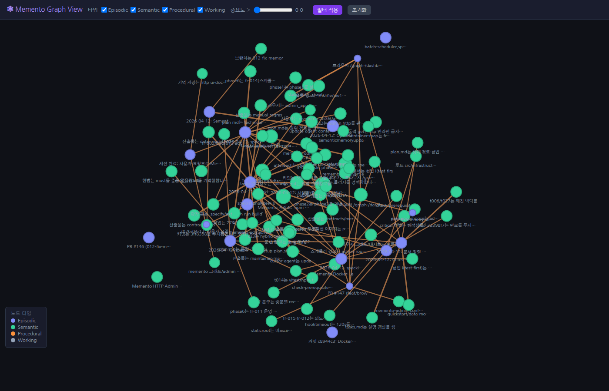

# Memento MCP Server

<div align="center">
  
  
  [🇰🇷 한국어](README.md) | [🇺🇸 English](README.en.md)
</div>

AI Agent Memory Assistant MCP Server - Storage+Search+Summary+Forgetting mechanisms modeled after human memory structure

## 🎯 Project Overview

Memento MCP Server is a Model Context Protocol (MCP) server that helps AI Agents store and manage long-term memory. It simulates human memory structure (working memory, episodic memory, semantic memory, procedural memory) to provide an efficient memory management system.

## ✨ Key Features

### 🧠 Core Memory Management (MCP Client)
- **Memory Storage**: Store 4 types of memories (working, episodic, semantic, procedural)
- **Memory Search**: Hybrid search (text + vector)
- **Memory Neighbors**: Vector similarity-based automatic recommendation of similar memories
- **Memory Pinning**: Pin/unpin important memories
- **Memory Deletion**: Soft/hard deletion
- **Anchor System**: Set important memories as anchors for context management
> **Note**: Anchor recovery, embedding migration, Episodic → Semantic conversion, and meta memory statistics are exposed through the HTTP Management API, not MCP tools.

### 🔍 Advanced Search
- **FTS5 Text Search**: SQLite's Full-Text Search
- **Vector Search**: OpenAI embedding-based semantic search (falls back to lightweight embeddings when unavailable)
- **Hybrid Search**: Combination of text and vector search
- **Multi-provider Support**: TF-IDF, MiniLM, OpenAI, Gemini with automatic selection
- **Lightweight Embedding**: TF-IDF + keyword matching fallback solution
- **Tag-based Filtering**: Metadata-based search

### 🧹 Forgetting Policy
- **Forgetting Algorithm**: Forgetting score calculation based on recency, usage, duplication ratio
- **Spaced Repetition**: Review scheduling based on importance and usage
- **TTL Management**: Type-specific lifespan management
- **Auto Cleanup**: Automated soft/hard deletion

### 📊 Performance Monitoring (HTTP Management API)
- **Security**: HTTP server splits browser-session and header-based trust. `/auth/session` starts the cookie-backed browser flow; `/admin` and `/api` require a browser session or `ADMIN_API_KEY`; `/tools` and `/mcp` require `Authorization: Bearer` or `X-API-Key`. See [docs/reference/en/security.md](docs/reference/en/security.md).
- **Real-time Metrics**: Database, search, memory performance monitoring
- **Real-time Alerts**: Automatic performance checks every 30 seconds with threshold-based alerts
- **Error Logging**: Structured error logging and statistics collection
- **Database Optimization**: Automatic index recommendation and creation
- **Cache System**: LRU + TTL based caching
- **Async Processing**: Worker pool based parallel processing

### 🔗 Memory Graph View (Browser)

After starting the HTTP server, visualize semantic relationships between memories as an interactive graph in your browser.

```
http://localhost:9001/graph
```



## 🚀 Quick Start

### 🥇 **One-click Installation (Recommended)**
```bash
# Run automatic installation script
curl -sSL https://raw.githubusercontent.com/jee1/memento/main/install.sh | bash
```

### 🥈 **npx Method (For Developers)**
```bash
# Run immediately (without installation)
npx memento-mcp-server@latest dev

# Auto setup then run
npx memento-mcp-server@latest setup
npx memento-mcp-server@latest start
```

### 🥉 **Docker Method (For Production)**
```bash
# Development environment
docker-compose -f docker-compose.dev.yml up -d

# Production environment
docker-compose -f docker-compose.prod.yml up -d
```

### 🛠️ **Source Code Method (For Developers)**
```bash
# Clone repository
git clone https://github.com/jee1/memento.git
cd memento

# One-click installation and run
npm run quick-start
```

### 📚 **Detailed Installation Guide**
For detailed installation methods, see [INSTALL.en.md](INSTALL.en.md).

## 🛠️ Usage

### MCP Client Connection

```typescript
import { Client } from "@modelcontextprotocol/sdk/client/index.js";

const client = new Client({
  name: "memento-client",
  version: "0.1.0"
}, {
  capabilities: {
    tools: {},
    resources: {},
    prompts: {}
  }
});

// stdio connection
await client.connect({
  command: "node",
  args: ["dist/server/index.js"]
});

// WebSocket connection
await client.connect({
  transport: {
    type: "websocket",
    url: "ws://localhost:8080/mcp"
  }
});
```

### Memory Storage

```typescript
// Store memory
const result = await client.callTool({
  name: "remember",
  arguments: {
    content: "I learned about React Hooks. useState manages state and useEffect handles side effects.",
    type: "episodic",
    tags: ["react", "hooks", "javascript"],
    importance: 0.8
  }
});
```

### Memory Search

```typescript
// Search memory
const results = await client.callTool({
  name: "recall",
  arguments: {
    query: "React Hook",
    filters: {
      type: ["episodic", "semantic"],
      tags: ["react"]
    },
    limit: 10
  }
});
```

## 📋 API Documentation

### MCP Tools (Core 14)

> **Important**: MCP client exposes 14 core memory management functions. Operational functions are exposed through the HTTP Management API below, not through MCP.

#### Basic Memory Management (7)
| Tool | Description | Parameters |
|------|-------------|------------|
| `remember` | Store memory | content, type, tags, importance, source, privacy_scope |
| `recall` | Search memory | query, filters, limit |
| `pin` | Pin memory | memory_id |
| `unpin` | Unpin memory | memory_id |
| `forget` | Delete memory | memory_id, hard |
| `get_memory_neighbors` | Find neighbor memories | memory_id, limit |
| `memory_injection` | Generate context injection prompt | query, token_budget |

#### Anchor System (4)
| Tool | Description | Parameters |
|------|-------------|------------|
| `set_anchor` | Set anchor | memory_id, slot |
| `get_anchor` | Get anchor | slot |
| `search_local` | Search around anchor | slot, query, limit |
| `clear_anchor` | Clear anchor | slot |

#### Procedural Memory (3)
| Tool | Description | Parameters |
|------|-------------|------------|
| `remember_procedure` | Store procedural memory | content, workflow_name, skill_name, steps, etc. |
| `procedural_diff` | Compare procedural memory versions | left_id, right_id |
| `procedural_rollback` | Roll back procedural memory to a previous version | current_id, target_version_id |

**HTTP-only (not MCP)**: `restore_anchors`, `migrate_embeddings`, `convert_episodic_to_semantic`, `get_meta_memory_stats` - see the HTTP Management API below.

### HTTP Management API

| Endpoint | Description | Method |
|----------|-------------|--------|
| `/admin/memory/cleanup` | Memory cleanup | POST |
| `/admin/stats/forgetting` | Forgetting statistics | GET |
| `/admin/stats/performance` | Performance statistics | GET |
| `/admin/stats/errors` | Error statistics | GET |
| `/admin/errors/resolve` | Resolve errors | POST |
| `/admin/alerts/performance` | Performance alerts | GET |
| `/admin/database/optimize` | Database optimization | POST |

**Other HTTP admin**: Batch status/run (`/admin/batch/*`), performance metrics/alerts (`/admin/performance/*`), relation extract/get/visualize (`/admin/relations/*`). See [docs/api/ko/api-reference.md](docs/api/ko/api-reference.md) (or [docs/api/en/api-reference.md](docs/api/en/api-reference.md) if available).

### Resources

| Resource | Description |
|----------|-------------|
| `memory/{id}` | Single memory detail |
| `memory/search?query=...` | Search result cache |

## 🔧 Configuration

### Environment Variables

| Variable | Default | Description |
|----------|---------|-------------|
| `NODE_ENV` | development | Runtime environment |
| `PORT` / `MCP_SERVER_PORT` | 3000 (code default) | HTTP/MCP server port (env.example recommends 8080) |
| `DB_PATH` | ./data/memory.db | Database path |
| `LOG_LEVEL` | info | Log level |
| `OPENAI_API_KEY` | - | OpenAI API key (optional) |
| `GEMINI_API_KEY` | - | Gemini API key (optional) |
| `EMBEDDING_PROVIDER` | minilm | Embedding provider (tfidf, lightweight, minilm, openai, gemini) |
| `CORS_ALLOWED_ORIGINS` | (empty) | CORS allowed origins (comma-separated; empty = no cross-origin) |
| `ENABLE_PII_MASKING` | true | PII masking (security; see [docs/reference/en/security.md](docs/reference/en/security.md)) |

> **Note**: For TTL, LLM/Ollama, search limits, and more, see `env.example`.

### Forgetting Policy Configuration

```bash
# Forgetting thresholds
FORGET_THRESHOLD=0.6
SOFT_DELETE_THRESHOLD=0.6
HARD_DELETE_THRESHOLD=0.8

# TTL settings (in days)
TTL_SOFT_WORKING=2
TTL_SOFT_EPISODIC=30
TTL_SOFT_SEMANTIC=180
TTL_SOFT_PROCEDURAL=90
```

## 🧪 Testing

```bash
# Run all tests (Vitest)
npm run test

# Run individual tests
npm run test:client                    # Client tests
npm run test:search                    # Search functionality tests
npm run test:embedding                 # Embedding functionality tests
npm run test:lightweight-embedding     # Lightweight embedding tests
npm run test:gemini-embedding         # Gemini embedding tests
npm run test:forgetting                # Forgetting policy tests
npm run test:performance               # Performance benchmarks
npm run test:monitoring                # Performance monitoring tests
npm run test:error-logging             # Error logging tests
npm run test:performance-alerts        # Performance alert tests
npm run test:vector-search             # Vector search tests
npm run test:memory-injection         # Memory injection tests
npm run test:batch-scheduler           # Batch scheduler tests
npm run test:embedding-benchmark       # Embedding performance benchmark
npm run test:embedding-integration     # Embedding integration tests

# Test watch mode
npm run test -- --watch

# Tests with coverage
npm run test -- --coverage
```

## 📚 Developer Guidelines

### Repository Guidelines (`AGENTS.md`)
- **Project Structure**: Module organization under `src/`
- **Build/Test Commands**: `npm run dev`, `npm run build`, `npm run test`, etc.
- **Coding Style**: Node.js ≥ 20, TypeScript ES modules, 2-space indentation
- **Testing Guidelines**: Vitest based, `src/test/` or `*.spec.ts` files
- **Commit/PR Guidelines**: Conventional Commits, Korean context included
- **Environment/Database**: `.env` configuration, `data/` folder management

## 📊 Performance Metrics

### Basic Performance
- **Database Performance**: Average query time 0.16-0.22ms
- **Search Performance**: 0.78-4.24ms (improved with cache effects)
- **Memory Usage**: 11-15MB heap usage
- **Concurrent Connections**: Supports up to 1000 connections

### Advanced Performance Optimization
- **Cache Hit Rate**: 80%+ (search result caching)
- **Embedding Caching**: 24-hour TTL for cost savings
- **Async Processing**: Worker pool based parallel processing
- **Database Optimization**: Automatic index recommendation and creation
- **Real-time Monitoring**: Automatic performance checks every 30 seconds
- **Error Logging**: Structured error tracking and statistics
- **Performance Alerts**: Threshold-based automatic alert system

### Embedding Provider Performance

#### Free Providers (Local Processing)
- **TF-IDF**: 512 dimensions, extremely fast (0.82ms), low memory usage (4.48MB)
- **MiniLM**: 384 dimensions, balanced performance, multilingual support

#### Paid Providers (Cloud API)
- **OpenAI**: 1536 dimensions, highest performance, high accuracy
- **Gemini**: 768 dimensions, high performance, multilingual support

**Auto Selection and Priority Order**:
1. **Explicit Request**: If a specific provider is requested in API call, it takes priority
2. **Configuration Default**: Uses `EMBEDDING_PROVIDER` value from `.env` file
3. **Automatic Priority Selection**: Automatically selects available providers in the following order:
   - 1st Priority: **OpenAI** (paid, highest performance)
   - 2nd Priority: **Gemini** (paid, high performance)
   - 3rd Priority: **MiniLM** (free, balanced performance)
   - 4th Priority: **TF-IDF** (free, fast speed)

**Fallback Mechanism**: Automatically falls back to the next priority provider if a higher priority provider fails.

## 🏗️ Architecture

### M1: Personal Use (Current Implementation)
- **Storage**: better-sqlite3 embedded
- **Index**: FTS5 + sqlite-vec
- **Authentication**: Split browser-session and header-based trust model (`/auth/session` starts the cookie-backed browser flow; `/admin` and `/api` require a browser session or `ADMIN_API_KEY`; `/tools` and `/mcp` require `Authorization: Bearer` or `X-API-Key`)
- **Operation**: Local execution
- **MCP Client**: Exposes 14 core tools
- **Management Functions**: Separated into HTTP API
- **Additional Features**: 
  - Multiple embedding providers (TF-IDF, MiniLM, OpenAI, Gemini)
  - Performance monitoring and alert system
  - Cache system
  - Anchor system (context management)
  - Relation graph (semantic relation extraction)
  - Meta memory statistics
  - Consolidation score system

### M2: Team Collaboration (Planned)
- **Storage**: SQLite server mode
- **Authentication**: API Key
- **Operation**: Docker single container

### M3: Organization Entry (Planned)
- **Storage**: PostgreSQL + pgvector
- **Authentication**: JWT
- **Operation**: Docker Compose

## 🤝 Contributing

1. Fork the Project
2. Create your Feature Branch (`git checkout -b feature/AmazingFeature`)
3. Commit your Changes (`git commit -m 'feat: add some AmazingFeature'`)
4. Push to the Branch (`git push origin feature/AmazingFeature`)
5. Open a Pull Request

### Development Environment Setup
```bash
# Fork and clone repository
git clone https://github.com/your-username/memento.git
cd memento

# Install dependencies
npm install

# Start development server
npm run dev

# Run tests
npm run test
```

## 📄 License

This project is distributed under the MIT License. See the `LICENSE` file for details.

## 📞 Support

- Issue Reports: [GitHub Issues](https://github.com/jee1/memento/issues)
- Documentation: [Wiki](https://github.com/jee1/memento/wiki)
- Developer Guide: [docs/guides/en/developer-guide.md](docs/guides/en/developer-guide.md)
- API Reference: [docs/api/en/api-reference.md](docs/api/en/api-reference.md)

## 🙏 Acknowledgments

- [Model Context Protocol](https://modelcontextprotocol.io/) - MCP Protocol
- [OpenAI](https://openai.com/) - Embedding Service
- [better-sqlite3](https://github.com/WiseLibs/better-sqlite3) - High-performance SQLite driver
- [Express](https://expressjs.com/) - Web framework
- [Vitest](https://vitest.dev/) - Testing framework
- [TypeScript](https://www.typescriptlang.org/) - Development language
