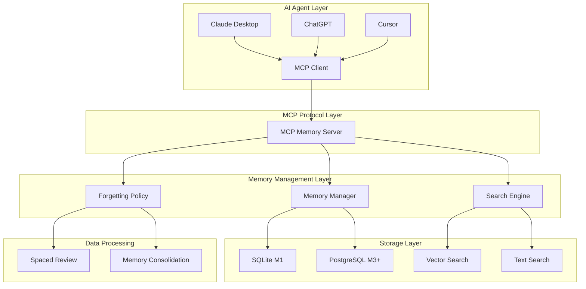

# 🧠 Memento MCP Server

> 사람의 기억 구조를 모사한 AI Agent 기억 보조 MCP 서버

[](https://modelcontextprotocol.io/)
[](https://www.typescriptlang.org/)
[](https://nodejs.org/)
[](LICENSE)
[](https://github.com/your-org/memento/actions)
[](https://github.com/your-org/memento/actions)

## 📖 개요

Memento는 AI Agent가 대화/작업 맥락을 잃지 않도록, 사람의 기억 체계(작업기억·일화기억·의미기억·절차기억)를 모사한 스토리지+검색+요약+망각 메커니즘을 제공하는 MCP(Model Context Protocol) 서버입니다.

### 🎯 핵심 가치

- **인간적 기억 모델**: 작업기억, 일화기억, 의미기억, 절차기억을 구분하여 관리
- **지능적 검색**: 임베딩 유사도 + BM25 + 태그 매칭을 결합한 2단계 검색
- **자동 망각**: 중요도와 사용 빈도에 따른 자동 기억 정리
- **간격 반복**: 중요한 기억의 주기적 리뷰를 통한 장기 보존
- **확장 가능**: 개인용(M1) → 팀(M2) → 조직(M3+) → 엔터프라이즈(M4) 단계별 확장

## ✨ 주요 기능

### 🧠 기억 관리
- **기억 저장**: `remember` - 텍스트를 기억으로 저장
- **기억 검색**: `recall` - 관련 기억을 지능적으로 검색
- **기억 고정**: `pin`/`unpin` - 중요한 기억을 보호
- **기억 삭제**: `forget` - 불필요한 기억을 정리

### 🔍 고급 검색
- **벡터 검색**: 임베딩 기반 의미적 유사도 검색
- **키워드 검색**: BM25 알고리즘 기반 텍스트 검색
- **태그 매칭**: 자카드 유사도를 이용한 태그 기반 검색
- **복합 랭킹**: 관련성, 최근성, 중요도, 사용성을 종합한 점수 계산

### 🧹 자동 관리
- **망각 정책**: 타입별 TTL 기반 자동 삭제
- **간격 반복**: 중요도에 따른 주기적 리뷰 스케줄링
- **수면 통합**: 야간 배치를 통한 기억 통합 및 요약

## 🚀 빠른 시작

### 설치

```bash
# 저장소 클론
git clone https://github.com/your-org/memento.git
cd memento

# 의존성 설치
npm install

# 환경 변수 설정
cp env.example .env
# .env 파일을 편집하여 필요한 설정을 입력하세요

# 데이터베이스 초기화
npm run db:init

# 개발 서버 시작
npm run dev
```

### 기본 사용법

```typescript
import { MemoryManager } from '@memento/mcp-client';

// MCP 서버 연결
const memory = new MemoryManager({
  serverUrl: 'ws://localhost:8080/mcp'
});

// 기억 저장
const memoryId = await memory.remember(
  "사용자가 React Hook에 대해 질문했고, useState와 useEffect의 차이점을 설명했다.",
  {
    type: 'episodic',
    tags: ['react', 'hooks', 'javascript'],
    importance: 0.8
  }
);

// 기억 검색
const results = await memory.recall(
  "React Hook 사용법",
  {
    type: ['episodic', 'semantic'],
    limit: 5
  }
);

// 프롬프트 주입
const context = await memory.injectContext(
  "React 개발 관련 질문",
  1200 // 토큰 예산
);
```

## 🏗️ 아키텍처

### 시스템 아키텍처



### 마일스톤별 계획

| 단계 | 대상 | 스토리지 | 인증 | 보안 | 운영 |
|------|------|----------|------|------|------|
| **M1** | 개인 | SQLite 임베디드 | 없음 | 로컬 | 로컬 실행 |
| **M2** | 팀 | SQLite 서버 모드 | API Key | 내부망 | Docker |
| **M3** | 조직 | PostgreSQL + pgvector | JWT | VPN | Docker Compose |
| **M4** | 엔터프라이즈 | PostgreSQL HA | JWT + RBAC + SSO | 기업 보안 | Kubernetes |

### 프로젝트 구조

```
memento/
├── src/                    # 소스 코드
│   ├── server/            # MCP 서버
│   │   ├── tools/         # MCP Tools 구현
│   │   ├── resources/     # MCP Resources 구현
│   │   ├── prompts/       # MCP Prompts 구현
│   │   └── database/      # 데이터베이스 관련
│   ├── client/            # MCP 클라이언트
│   │   ├── memory-manager.ts
│   │   └── types.ts
│   ├── algorithms/        # 검색 및 망각 알고리즘
│   │   ├── search-ranking.ts
│   │   ├── forgetting.ts
│   │   └── spaced-review.ts
│   └── shared/            # 공통 유틸리티
├── tests/                 # 테스트 코드
│   ├── unit/             # 단위 테스트
│   ├── integration/      # 통합 테스트
│   └── fixtures/         # 테스트 데이터
├── docs/                 # 문서
├── scripts/              # 빌드 및 배포 스크립트
├── docker/               # Docker 관련 파일
└── .cursor/rules/        # Cursor 개발 규칙
```

### 기억 모델

- **작업기억 (Working Memory)**: 현재 처리 중인 정보 (48시간 유지)
- **일화기억 (Episodic Memory)**: 사건과 경험 (90일 유지)
- **의미기억 (Semantic Memory)**: 지식과 사실 (무기한)
- **절차기억 (Procedural Memory)**: 방법과 절차 (무기한)

## 📊 검색 랭킹 공식

```
S = α × relevance + β × recency + γ × importance + δ × usage - ε × duplication_penalty
```

- **α=0.50**: 관련성 (임베딩 + BM25 + 태그 + 타이틀)
- **β=0.20**: 최근성 (반감기 기반 지수 감쇠)
- **γ=0.20**: 중요도 (사용자 가중 + 시스템 가중)
- **δ=0.10**: 사용성 (로그 스케일 집계)
- **ε=0.15**: 중복 패널티 (MMR식 다양성 제어)

## 🛠️ 개발

### 프로젝트 구조

```
memento/
├── docs/                    # 설계 문서
├── src/
│   ├── server/             # MCP 서버
│   ├── database/           # 데이터베이스 스키마
│   ├── types/              # TypeScript 타입 정의
│   ├── config/             # 설정 관리
│   └── utils/              # 유틸리티 함수
├── .cursor/rules/          # Cursor 개발 규칙
└── tests/                  # 테스트 코드
```

### 개발 환경 설정

```bash
# 개발 의존성 설치
npm install

# 데이터베이스 초기화
npm run db:init

# 개발 서버 시작 (핫 리로드)
npm run dev

# 빌드
npm run build

# 테스트 실행
npm test

# 린트 검사
npm run lint

# 타입 체크
npm run type-check
```

### MCP Tools

현재 구현된 MCP Tools:

1. **remember** - 기억 저장
2. **recall** - 기억 검색
3. **forget** - 기억 삭제
4. **pin** - 기억 고정
5. **unpin** - 기억 고정 해제

### 기여 방법

1. 이슈 생성 또는 기존 이슈 확인
2. 포크 생성 및 브랜치 생성
3. 변경사항 구현 및 테스트
4. Pull Request 생성

## 📚 문서

### 사용자 가이드
- [설치 및 설정 가이드](docs/installation-guide.md)
- [사용자 매뉴얼](docs/user-manual.md)
- [API 참조](docs/api-reference.md)
- [문제 해결 가이드](docs/troubleshooting.md)

### 개발자 가이드
- [개발 환경 설정](docs/developer-setup.md)
- [아키텍처 문서](docs/architecture.md)
- [기여 가이드](docs/contributing.md)
- [테스트 가이드](docs/testing-guide.md)

### 기술 문서
- [프로젝트 목표](docs/Memento-Goals.md)
- [M1 상세 설계](docs/Memento-M1-DetailSpecs.md)
- [마일스톤 계획](docs/Memento-Milestones.md)
- [검색 랭킹 수식](docs/Search-Ranking-Memory-Decay-Formulas.md)

## 🔒 보안 기능

- **데이터 암호화**: 민감한 기억 데이터 암호화 저장
- **접근 제어**: 사용자별 권한 관리 (M3+)
- **API 보안**: JWT 토큰 기반 인증 (M3+)
- **데이터 마스킹**: 민감 정보 자동 마스킹
- **감사 로깅**: 모든 활동 추적 및 로그 저장

## 📈 모니터링

- **성능 메트릭**: 응답 시간, 처리량, 에러율 모니터링
- **메모리 사용량**: 데이터베이스 크기 및 메모리 사용량 추적
- **검색 통계**: 검색 성능 및 정확도 분석
- **사용자 활동**: 기억 생성, 검색, 삭제 패턴 분석

## 🧪 테스트

```bash
# 전체 테스트 실행
npm test

# 단위 테스트
npm run test:unit

# 통합 테스트
npm run test:integration

# E2E 테스트
npm run test:e2e

# 커버리지 리포트
npm run test:coverage
```

## 🚀 다음 단계

1. **M1 MVP 완성**: 기본 MCP 서버 및 클라이언트 구현
2. **M2 팀 협업**: Docker 배포 및 API Key 인증
3. **M3 조직 확장**: PostgreSQL 마이그레이션 및 JWT 인증
4. **M4 엔터프라이즈**: Kubernetes 배포 및 고가용성 구성

## 🔗 관련 링크

- [Model Context Protocol](https://modelcontextprotocol.io/)
- [pgvector](https://github.com/pgvector/pgvector)
- [SQLite VSS](https://github.com/asg017/sqlite-vss)
- [Bridge 프로젝트](https://github.com/your-org/bridge) - 데이터 통합 및 AI 오케스트레이션

## 📄 라이선스

MIT License - 자세한 내용은 [LICENSE](LICENSE) 파일을 참조하세요.

## 🤝 지원

- **이슈**: [GitHub Issues](https://github.com/your-org/memento/issues)
- **토론**: [GitHub Discussions](https://github.com/your-org/memento/discussions)
- **이메일**: support@memento.dev
- **문서**: [프로젝트 문서](https://memento.dev/docs)

---

**Memento** - AI Agent의 기억을 더 인간적으로 만들어보세요. 🧠✨