# 데이터베이스 전체 ERD (Entity Relationship Diagram)

**하는 일**: Memento MCP Server SQLite 스키마의 **전체 테이블**을 대상으로 한 ERD. 물리 테이블만 포함하며, 가상 테이블(FTS5, vec0)은 제외한다.  
**연관**: [데이터베이스 설계](database-design.md)(설계 명세·명명 규칙·마이그레이션 이력).

---

## 1. 개요

- **범위**: `schema.sql` 및 마이그레이션 002~020에서 정의된 모든 물리 테이블.
- **관계**: 실선은 DB에 정의된 FOREIGN KEY, 점선은 논리적 참조(예: `memory_relation.relation_type` → `relation_type_registry.type_name`).
- **가상 테이블**: `memory_item_fts`, `memory_item_vec*`는 `memory_embedding`/`memory_item`과 트리거로 연동되며 ERD에는 그리지 않는다.

---

## 2. 전체 ERD

```mermaid
erDiagram
  memory_item {
    string id
    string type
    string content
    string owner_id
    string process_id
    string session_id
    string version_series_id
    int version
    real confidence
  }
  memory_tag {
    int id
    string name
  }
  memory_item_tag {
    string memory_id
    int tag_id
  }
  memory_link {
    int id
    string source_id
    string target_id
    string relation_type
  }
  feedback_event {
    int id
    string memory_id
    string event
    real score
  }
  wm_buffer {
    string session_id
    string items
    int token_budget
    string expires_at
  }
  process_attribute {
    string process_id
    string topics
    string workflow_names
    string skill_names
  }
  memory_embedding {
    int id
    string memory_id
    string embedding_provider
    string projection_type
    int dimensions
  }
  embedding_model_registry {
    int id
    string provider
    string model
    int dimensions
    string vec_table
    string status
  }
  core_memory {
    string core_id
    string agent_id
    string key
    string value
    int always_load
  }
  knowledge_vault {
    string vault_id
    string agent_id
    string key
    int version
    string previous_version_id
  }
  anchor {
    int id
    string agent_id
    string slot
    string memory_id
  }
  memory_relation {
    int id
    string source_id
    string target_id
    string relation_type
    real confidence
  }
  relation_type_registry {
    string type_name
    string category
    string description
  }
  kg_triple {
    string id
    string subject
    string predicate
    string object
    string representative_memory_id
    string owner_id
    string process_id
  }
  memento_schema_version {
    string version
    string migration_name
    string applied_at
  }
  quality_measurement_history {
    string id
    string measurement_type
    string measured_at
    string metrics
    string status
  }
  quality_metrics {
    string metric_namespace
    string metric_key
    string context
    real metric_value
    string status
  }
  quality_thresholds {
    string metric_namespace
    string metric_key
    string context
    real threshold_value
    string threshold_type
  }
  meta_memory_stats {
    string memory_id
    int recall_count
    int success_count
    int failure_count
    real avg_confidence
    string last_recalled_at
  }

  memory_item ||--o{ memory_item_tag : "태그 소속"
  memory_tag ||--o{ memory_item_tag : "태그 적용"
  memory_item ||--o{ memory_link : "source"
  memory_item ||--o{ memory_link : "target"
  memory_item ||--o{ feedback_event : "피드백"
  memory_item ||--o{ memory_embedding : "임베딩"
  memory_item ||--o{ anchor : "슬롯 고정"
  memory_item ||--o{ memory_relation : "source"
  memory_item ||--o{ memory_relation : "target"
  memory_item ||--o{ kg_triple : "대표 기억"
  memory_item ||--o| meta_memory_stats : "회상 통계"
```

※ `relation_type_registry`는 FK 없이 `memory_relation.relation_type`(문자열)이 타입명으로 참조한다.

---

## 3. 테이블별 출처·요약

| 테이블 | 출처 | memory_item과의 관계 |
|--------|------|----------------------|
| memory_item | schema.sql | (중심 엔티티) |
| memory_tag | schema.sql | — |
| memory_item_tag | schema.sql | N:N 조인 |
| memory_link | schema.sql | source_id, target_id → memory_item |
| feedback_event | schema.sql | memory_id → memory_item |
| wm_buffer | schema.sql | 없음 (세션별 버퍼) |
| process_attribute | schema.sql (020) | 없음 (memory_item.process_id는 논리 참조) |
| memory_embedding | schema.sql | memory_id → memory_item |
| embedding_model_registry | schema.sql | 없음 (레지스트리) |
| core_memory | schema.sql | 없음 (agent_id 단위) |
| knowledge_vault | schema.sql | 없음 (agent_id 단위) |
| anchor | 마이그레이션 004 | memory_id → memory_item (nullable) |
| memory_relation | 마이그레이션 005 | source_id, target_id → memory_item |
| relation_type_registry | 마이그레이션 005 | memory_relation.relation_type가 타입명 참조 |
| kg_triple | 마이그레이션 018 | representative_memory_id → memory_item |
| memento_schema_version | 마이그레이션 002 | 없음 (버전 추적) |
| quality_measurement_history | 마이그레이션 009 | 없음 (품질 이력) |
| quality_metrics | 마이그레이션 009 | 없음 (품질 지표) |
| quality_thresholds | 마이그레이션 009 | 없음 (품질 임계값) |
| meta_memory_stats | 마이그레이션 011 | memory_id → memory_item |

---

## 4. 스키마 변경 시

새 테이블·컬럼·FK를 추가할 때는 (1) [database-design.md](database-design.md) §4·§5·§6을 갱신하고, (2) **본 ERD 문서**의 Mermaid 다이어그램과 §3 테이블 목록을 함께 갱신한다.
