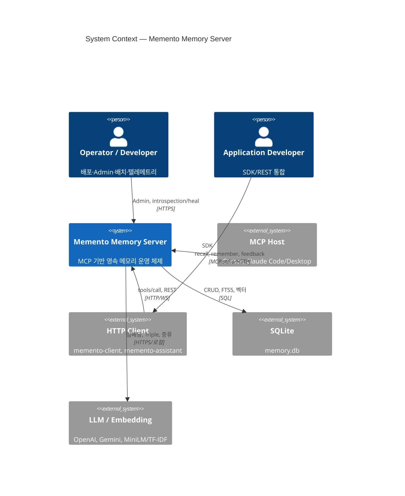
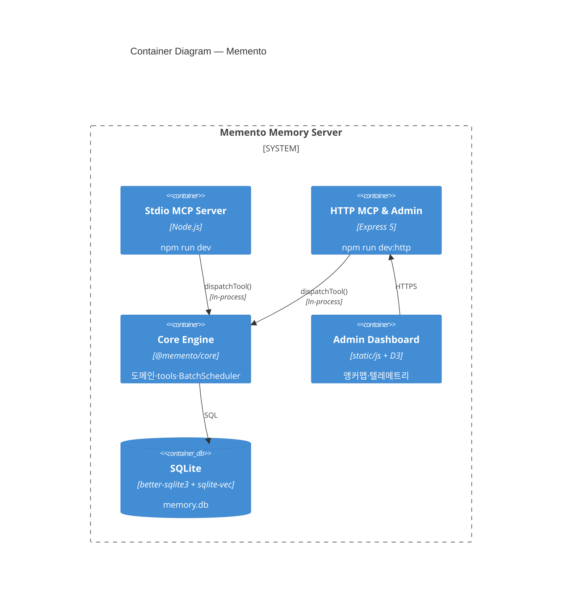

# Memento — ARC42 아키텍처 문서

> [ARC42](https://arc42.org/) 템플릿(12+2 섹션)을 적용한 Memento Memory Server 아키텍처 명세입니다.  
> 상세 다이어그램·DB 스키마·도메인 설명은 기존 문서를 SSOT로 두고, 본 문서는 **의사결정·경계·품질·리스크**를 한눈에 잡는 진입점입니다.

| 메타 | 값 |
|------|-----|
| **시스템** | Memento Memory Server |
| **버전** | 1.17.x (루트 `package.json` 기준) |
| **최종 갱신** | 2026-08-28 |
| **상태** | 운영 중 (M1 — SQLite 단일 writer) |

---

## 목차

1. [소개와 목표](#1-소개와-목표)
2. [제약 조건](#2-제약-조건)
3. [컨텍스트와 범위](#3-컨텍스트와-범위)
4. [해결 전략](#4-해결-전략)
5. [빌딩 블록 뷰](#5-빌딩-블록-뷰)
6. [런타임 뷰](#6-런타임-뷰)
7. [배포 뷰](#7-배포-뷰)
8. [횡단 관심사](#8-횡단-관심사)
9. [아키텍처 결정](#9-아키텍처-결정)
10. [품질 요구사항](#10-품질-요구사항)
11. [리스크와 기술 부채](#11-리스크와-기술-부채)
12. [용어집](#12-용어집)

---

## 1. 소개와 목표

### 1.1 요구사항 개요

AI 에이전트(LLM 기반)는 기본적으로 **무상태(stateless)** 입니다. 대화·세션이 끝나면 이름, 결정, 과거 디버깅 맥락이 사라집니다. Memento는 이 공백을 메우는 **MCP(Model Context Protocol) 기반 영속 메모리 운영 체제**입니다.

에이전트는 `remember`, `recall`, `feedback` 등 MCP 도구만 호출하고, 저장·검색·망각·증류·관계 그래프 구축은 Memento가 담당합니다.

### 1.2 품질 목표 (Top 3)

| # | 목표 | 설명 |
|---|------|------|
| 1 | **세션 간 맥락 유지** | working·episodic·semantic·procedural 4종 기억을 TTL 정책과 함께 영속화 |
| 2 | **관련 기억의 빠른 회수** | FTS5 + 벡터 하이브리드 검색, 앵커·관계 그래프, MMR 다양성 |
| 3 | **운영 가능성** | Admin UI, 텔레메트리, introspection/heal, 배치 파이프라인 가시성 |

### 1.3 이해관계자

| 이해관계자 | 관심사 |
|-----------|--------|
| **AI 에이전트** (MCP Host 경유) | recall/remember/feedback, 낮은 지연, 도구 표면 단순화 |
| **Operator / Developer** | 배포, DB 백업, Admin 대시보드, 배치·텔레메트리 |
| **Application Developer** | `@jee1/memento-client`, REST/HTTP MCP 통합 |
| **기여자 (에이전트·개발자)** | 모노레포 경계, 도메인 구조, CI·테스트 |

### 1.4 범위

**포함**

- MCP stdio / HTTP(SSE·Streamable HTTP·WebSocket) 서버
- `@memento/core` 도메인·DB·22 MCP tools·BatchScheduler
- SQLite 기반 저장·FTS5·sqlite-vec 검색
- Admin SPA (`static/`), 배치·introspection API

**제외 (현재)**

- PostgreSQL / Redis / Kubernetes 멀티테넌트 (로드맵)
- MCP Host 애플리케이션 자체 (Cursor, Claude Code 등)
- LLM·임베딩 프로바이더 내부 구현

---

## 2. 제약 조건

### 2.1 기술 제약

| 제약 | 내용 |
|------|------|
| **런타임** | Node.js ≥ 24, ES modules, npm workspaces (pnpm/yarn 미지원) |
| **언어** | TypeScript 5.x strict |
| **DB** | SQLite (better-sqlite3), WAL 모드, **단일 writer** |
| **프로토콜** | MCP JSON-RPC; HTTP Admin/REST (Express 5.x) |
| **임베딩** | TF-IDF/MiniLM(로컬) 또는 OpenAI/Gemini(클라우드, 선택) |

### 2.2 조직·운영 제약

| 제약 | 내용 |
|------|------|
| **npm 발행** | `memento-mcp-server`, `@jee1/memento-client`, `@jee1/memento-assistant`만 공개 발행 |
| **내부 패키지** | `@memento/core`, `@memento/agent-integration` — tarball 번들, scope `@memento` 미사용 |
| **DB 경로** | `DB_PATH`는 절대 경로; `~` 미확장 |
| **Docker 배포** | 배포 전 `npm run db:pre-docker-deploy` 필수 |
| **라이선스** | MIT (LoCoMo 벤치마크 데이터 CC BY-NC 4.0 — 커밋 금지) |

### 2.3 아키텍처·코딩 제약

- 의존 방향: `shared` ← `domains` ← `infrastructure` (domain→infra 역방향 금지, CI freeze)
- 모든 transport의 `tools/call`은 `dispatchTool()` 단일 경로 (`audit-tool-dispatch.ts`)
- `remember`/`recall`의 `type` 파라미터: 기본 `MEMENTO_TYPE_PARAM_MODE=error` (v1.18+)
- MCP `tools/list`: 기본 `MEMENTO_TOOLSET=core` (4개 노출, 18개는 call만 가능)

---

## 3. 컨텍스트와 범위

### 3.1 비즈니스 컨텍스트

Memento는 "기억 DB"가 아니라 **기억이 생성·분류·강화·망각되는 운영 체제**입니다. 인간 기억 체계(작업·일화·의미·절차)를 모사하여 에이전트가 세션을 넘어 경험을 축적합니다.

### 3.2 기술 컨텍스트



상세: [C4 System Context](./c4/01-system-context.md)

### 3.3 외부 인터페이스

| 인터페이스 | 프로토콜 | 소비자 |
|-----------|---------|--------|
| MCP stdio | JSON-RPC (subprocess) | Cursor, Claude Desktop |
| MCP HTTP | SSE / Streamable HTTP / WebSocket | 멀티 에이전트, HTTP 클라이언트 |
| Admin / REST | HTTPS (`/admin/*`, `/api/*`, `/tools/*`) | Operator, SDK |
| SQLite | SQL (better-sqlite3) | Core Engine (in-process) |
| LLM / Embedding API | HTTPS 또는 로컬 | Triple 추출, Sleep Consolidation, (선택) 임베딩 |

---

## 4. 해결 전략

Memento의 아키텍처는 다음 전략적 결정 위에 서 있습니다.

| 전략 | 선택 | 근거 |
|------|------|------|
| **통합 프로토콜** | MCP | Cursor·Claude 등 에이전트 생태계 표준 |
| **즉시 응답 + 비동기 정제** | remember → INSERT 즉시 반환 → BatchScheduler | 에이전트 지연 최소화; Triple·증류는 수렴 |
| **단일 SQLite writer** | WAL + checkpoint + lock monitor | M1 개인/소규모 배포 단순성; 멀티 writer 복잡도 회피 |
| **하이브리드 검색** | FTS5 ∥ 벡터 → 가중 합산 → MMR | 키워드·의미 양쪽 회수 |
| **Functional Core, Structured Shell** | 도메인 순수 로직 + infrastructure 셸 | 테스트·경계 유지 ([DEVELOPMENT_RULES.md](../../../DEVELOPMENT_RULES.md)) |
| **도구 표면 축소** | CORE 4 tools list 노출 | 에이전트 컨텍스트·오용 감소 (#769) |
| **In-process Core** | server가 `@memento/core` 직접 로드 | 네트워크 hop 없음; CLI·실험 앱도 동일 Core 재사용 |

---

## 5. 빌딩 블록 뷰

### 5.1 Level 1 — 시스템

**Memento Memory Server** 하나의 소프트웨어 시스템. §3.2 참조.

### 5.2 Level 2 — 컨테이너 (배포 단위)



| 컨테이너 | 진입점 | 역할 |
|----------|--------|------|
| Stdio MCP Server | `packages/memento-server/src/server/index.ts` | 단일 에이전트 subprocess |
| HTTP MCP & Admin | `http-server.ts` | `:9001`, 멀티 에이전트 + REST |
| Core Engine | `packages/memento-core/` | 도메인·22 tools·스케줄러 |
| Admin Dashboard | `static/` | D3.js 시각화 |
| SQLite | `DB_PATH` | 영속 저장소 |

상세: [C4 Container](./c4/02-container.md)

### 5.3 Level 3 — Core 컴포넌트

| 블록 | 패키지 경로 | 책임 |
|------|------------|------|
| **Tool Registry** | `tools/` | 22 MCP tools, `executeTool()` |
| **Memory** | `domains/memory/` | CRUD, pin, feedback, procedural |
| **Search** | `domains/search/` | HybridSearchEngine, FTS5, MMR |
| **Embedding** | `domains/embedding/` | 다중 프로바이더, memory_embedding |
| **Anchor** | `domains/anchor/` | A/B/C 슬롯, search_local |
| **Relation** | `domains/relation/` | memory_link, Triple 추출 |
| **Consolidation** | `domains/consolidation/` | Sleep Consolidation |
| **Forgetting** | `domains/forgetting/` | TTL, Forget Score |
| **Telemetry** | `domains/telemetry/` | search/feedback 품질, owner 격리 |
| **Monitoring** | `domains/monitoring/` | PerformanceMonitor, Reflexion |
| **Batch Scheduler** | `infrastructure/scheduler/` | 11종 주기·큐 배치 |
| **Repository / DB** | `infrastructure/database/` | stores, migrations, WAL |

상세: [C4 Component — Core](./c4/03-component-core.md), [아키텍처 개요](./architecture.md)

### 5.4 패키지 의존성 (모노레포)

```text
@memento/core  ←  memento-server
               ←  @jee1/memento-client
               ←  @jee1/memento-assistant
               ←  @memento/agent-integration
               ←  apps/experimental-example
```

---

## 6. 런타임 뷰

### 6.1 시나리오: `remember` (에피소드 저장)

```text
MCP Host
  → Stdio/HTTP Server
      → dispatchTool('remember')
          → RememberTool.execute()
              → memory_item INSERT (즉시 응답)
              → BatchScheduler.addJob(triple_extraction)
  ← JSON-RPC 응답

(백그라운드)
  BatchScheduler → TripleExtractionBatchJob → LLM API
               → memory_link / kg_triple 갱신
```

상세: [비동기 Augmentation 파이프라인](./async-augmentation-pipeline.md)

### 6.2 시나리오: `recall` (하이브리드 검색)

```text
MCP Server → dispatchTool('recall')
  → RecallTool
      → HybridSearchEngine
          ├─ FTS5 SearchEngine → BM25 후보
          ├─ VectorSearchEngine → ANN 후보 (sqlite-vec)
          ├─ 가중치 합산 (ranking-weights.toml)
          ├─ RelationGraph (relation_weight)
          └─ MMR 다양성 조절
      → TelemetryService (search_quality)
  ← ranked memories
```

랭킹 공식: [search-ranking.md](../../agents/search-ranking.md)

### 6.3 시나리오: 서비스 부트스트랩

`createMementoCore()` → `initializeServices(db)` 순서:

1. Search + Embedding + Forgetting + DB Optimizer  
2. ErrorLoggingService  
3. Anchor Stack (VectorSearchEngine, AnchorManager)  
4. FailureDetector + ReflexionWorker  
5. Monitoring (PerformanceMonitor, WAL checkpoint, lock monitor)  
6. Write Coalescing + MetaMemory + ConsolidationScore  
7. BatchScheduler + Telemetry + RelationGraph + SleepConsolidation  
8. RelationGraph 주입 (anchor, hybrid search)  
9. RuntimeDiagnosticsSampler  

**모든 서비스 준비 후** MCP/HTTP 요청 수신 시작.

### 6.4 HTTP `/tools` 미들웨어 체인

```text
rateLimit → programmaticAuth → toolContext → ownerScope → httpAudit → router
```

### 6.5 BatchScheduler 주요 job

| Job | 주기 | 역할 |
|-----|------|------|
| `triple_extraction` | 1h | 에피소드 → Triple |
| `sleep_consolidation` | 1h | 에피소드 → 시맨틱 |
| `forgetting_cleanup` | 24h | TTL 만료 정리 |
| `meta_memory_introspection` | 6h | 저신뢰 기억 식별 |
| `quality_measurement` | 24h | 검색 품질 측정 |
| `telemetry_cleanup` | 24h | 텔레메트리 정리 |

전체 목록: [아키텍처 개요 §BatchScheduler](./architecture.md)

---

## 7. 배포 뷰

### 7.1 실행 모드

| 모드 | 명령 | 컨테이너 | 용도 |
|------|------|----------|------|
| 로컬 stdio | `npm run dev` | Stdio MCP + Core | Cursor/Claude subprocess |
| 로컬 HTTP | `npm run dev:http` | HTTP + Admin + Core | 멀티 에이전트 + 대시보드 |
| Docker | `docker compose up` | HTTP + Admin + Core | 프로덕션 단일 writer |
| npx | `npx memento-mcp-server@latest` | 동일 | 빠른 설치 |
| CLI one-shot | `memento recall …` | Core in-process | 시스템 경계 밖 단발 |

### 7.2 Docker 배포 (M1)

```text
┌─────────────────────────────────────────┐
│  Host: ~/.memento/data/memory.db        │
│         (volume mount)                  │
└──────────────────┬──────────────────────┘
                   │
┌──────────────────▼──────────────────────┐
│  Container: memento-mcp-server          │
│  Base: node:24-slim                     │
│  Port: 9001 (HTTP MCP + Admin)          │
│  DB_PATH=/app/data/memory.db            │
│  start-container.sh → wal_checkpoint    │
└─────────────────────────────────────────┘
```

**필수 절차:** 컨테이너 stop → `npm run db:pre-docker-deploy` → build → up  
상세: [Docker 배포 절차](../../operations/ko/docker-deploy-procedure.md)

### 7.3 환경 변수 (핵심)

| 변수 | 기본 | 설명 |
|------|------|------|
| `DB_PATH` | `~/.memento/memory.db` | SQLite 경로 (절대 경로 권장) |
| `TRANSPORT_TYPE` | `stdio` | `stdio` / `sse` |
| `EMBEDDING_PROVIDER` | `tfidf` | tfidf / minilm / openai / gemini |
| `MEMENTO_TOOLSET` | `core` | tools/list 노출 범위 |
| `MEMENTO_TYPE_PARAM_MODE` | `error` | type 파라미터 정책 |

전체: [env-deployment-checklist.md](../../operations/env-deployment-checklist.md)

### 7.4 인프라 로드맵 (미구현)

PostgreSQL, Redis, Kubernetes 멀티테넌트 — [architecture.md §데이터베이스](./architecture.md) 참조.

---

## 8. 횡단 관심사

### 8.1 보안

| 영역 | 구현 |
|------|------|
| HTTP programmatic 호출 | `programmaticAuth`, rate limit, owner scope |
| Audit | `httpAudit`, `dispatchTool()` 통합 audit |
| Admin | HTTPS, Helmet.js (#011) |
| SQL | parameterized queries, injection 검사 CI |

### 8.2 다중 에이전트 격리

- `owner_id` / `agent_id` 기반 TelemetryService 컨텍스트
- 앵커맵·기억 스코프 per owner
- HTTP owner scope 미들웨어

### 8.3 로깅·모니터링

- `ErrorLoggingService` — 심각도·카테고리별 구조화 로그
- `PerformanceMonitor` — 메모리·CPU·DB·쿼리 경보
- `TelemetryService` — recall search_quality, feedback_quality
- Admin `/telemetry/*`, `get_telemetry_summary` tool

### 8.4 마이그레이션·스키마

- SSOT: `schema.sql` + numbered migrations (`002`~)
- UTC 타임스탬프 표준
- FTS5 zero-downtime 마이그레이션: [zero-downtime-fts5-migration.md](./zero-downtime-fts5-migration.md)

### 8.5 테스트·품질 게이트

```bash
npm run lint && npm run type-check && npm test
```

- 아키텍처: `dependency-boundaries.spec.ts`
- Transport parity: `runtime-transport-parity.spec.ts`
- Nightly: vector-search-quality, category-report

### 8.6 국제화·문서

- 사용자 문서: `docs/` ko/en 병행
- Admin UI: `static/js/`, 디자인 토큰 `static/css/tokens.css`

---

## 9. 아키텍처 결정

ADR 형식 요약. 상세 이슈·PR은 GitHub 참조.

| ID | 결정 | 상태 | 근거 |
|----|------|------|------|
| ADR-001 | MCP를 유일한 에이전트 인터페이스로 채택 | 채택 | Host 생태계 표준, stdio·HTTP 동시 지원 |
| ADR-002 | SQLite 단일 writer (M1) | 채택 | 배포·운영 단순성; WAL로 읽기 동시성 |
| ADR-003 | remember 즉시 저장 + BatchScheduler 정제 | 채택 | 지연 vs 품질 트레이드오프 — 지연 우선 |
| ADR-004 | FTS5 + sqlite-vec 하이브리드 검색 | 채택 | 키워드·의미 이중 회수 |
| ADR-005 | ranking-weights.toml 외부화 | 채택 | 튜닝·A/B without redeploy |
| ADR-006 | `dispatchTool()` 단일 실행 경계 (#793) | 채택 | transport 간 audit·동시성·에러 일관성 |
| ADR-007 | MEMENTO_TOOLSET=core (4 tools list) (#769) | 채택 | 에이전트 UX; 18 tools는 call 가능 |
| ADR-008 | type 파라미터 필수화 error 모드 (#636) | 채택 | 암묵적 type 혼선 제거 |
| ADR-009 | npm workspaces 모노레포 (#013) | 채택 | core/server/client 분리·번들 발행 |
| ADR-010 | dependency-boundaries CI freeze (#749) | 채택 | domain→infra 역방향 회귀 방지 |

---

## 10. 품질 요구사항

### 10.1 품질 트리

```text
품질
├── 기능성
│   ├── 4종 메모리 타입 + TTL
│   ├── 22 MCP tools (call)
│   └── Admin·배치·export/import
├── 신뢰성
│   ├── DB quick_check (Docker 기동 거부)
│   ├── 마이그레이션 트랜잭션 롤백 (#755)
│   └── Triple 추출 failed 재시도
├── 성능
│   ├── remember 즉시 응답 (< DB INSERT)
│   ├── recall 하이브리드 (병렬 FTS+벡터)
│   └── WAL checkpoint·write coalescing
├── 운영성
│   ├── 텔레메트리·introspection/heal
│   ├── db:backup / db:pre-docker-deploy
│   └── Admin 대시보드
├── 보안
│   ├── programmaticAuth·owner scope
│   └── rate limit (/tools)
└── 유지보수성
    ├── dependency-boundaries CI
    ├── Vitest + architecture specs
    └── graphify + AGENTS.md 가이드
```

### 10.2 품질 시나리오

| ID | 시나리오 | 측정 |
|----|----------|------|
| Q1 | recall이 관련 기억을 top-k에 포함 | MRR/NDCG 벤치 (`npm run quality`) |
| Q2 | feedback 없는 recall 비율 | `recall_without_feedback_rate` 텔레메트리 |
| Q3 | Docker 기동 시 DB 손상 감지 | quick_check fail → exit 1 |
| Q4 | transport 간 tools/list 동일 | `runtime-transport-parity.spec.ts` |
| Q5 | 카테고리별 검색 MRR ≥ 0.5 | nightly category-report |

### 10.3 품질 트레이드오프

| 트레이드오프 | 선택 |
|-------------|------|
| 검색 정확도 vs 지연 | 하이브리드 + MMR; 벡터 ANN 근사 |
| 저장 즉시성 vs 그래프 품질 | 즉시 INSERT, Triple 1h 배치 |
| 도구 발견성 vs 컨텍스트 노이즈 | list 4개, call 22개 |
| 단일 DB vs 수평 확장 | M1 SQLite; PG/K8s는 로드맵 |

---

## 11. 리스크와 기술 부채

### 11.1 리스크

| 리스크 | 영향 | 완화 |
|--------|------|------|
| SQLite 단일 writer 병목 | 멀티 프로세스 동시 쓰기 실패 | HTTP 단일 서버; Docker writer 1개 |
| 동시 Docker + npm dev 같은 DB | DB 손상 | 문서·기동 거부; pre-docker-deploy |
| LLM API 장애 | Triple·증류 지연 | failed 상태 재시도; 원문 recall 가능 |
| onnxruntime-node CI flake | CI 실패 | `gh run rerun --failed` (코드 버그 아님) |
| embedding 차원 불일치 | 검색 실패 | check-embedding-dimensions, migrate rebuild |

### 11.2 기술 부채

| 항목 | 추적 | 비고 |
|------|------|------|
| 전체 기술 부채 | GitHub #593 | |
| @deprecated API | [core-deprecated-inventory.md](../core-deprecated-inventory.md) | 현재 활성 0건 |
| PostgreSQL/K8s | 로드맵 | M3+ |
| C4 Level 4 (Code) | 미문서화 | 도메인별 PR에서 다룸 |
| deployment.mdc 일부 | Cursor rule | Node 24·실제 Dockerfile과 불일치 가능 — SSOT는 docker-deploy-procedure |

### 11.3 알려진 Gotcha

- `DB_PATH`의 `~` 미확장
- memory_embedding hot path 전역 UPDATE 금지 (#753)
- gh pr merge 후 worktree 미제거 시 브랜치 삭제 실패
- graphify-out/ 커밋 금지

---

## 12. 용어집

| 용어 | 정의 |
|------|------|
| **MCP** | Model Context Protocol — AI Host와 도구 서버 간 JSON-RPC 프로토콜 |
| **Working memory** | 48h TTL, 현재 작업 맥락 (`type: working`) |
| **Episodic memory** | 90d TTL, 대화·사건 기록; Triple·증류 원천 |
| **Semantic memory** | 무기한, 지식·사실 |
| **Procedural memory** | 무기한, 버전 관리 절차 (`version_series_id`) |
| **Triple** | Subject–Predicate–Object; KG·관계 추출 단위 |
| **Anchor** | A/B/C 슬롯; search_local 탐색 기준점 |
| **Sleep Consolidation** | 에피소드 → 시맨틱 증류 배치 (1h) |
| **Hybrid Search** | FTS5 + 벡터 병렬 → 가중 합산 → MMR |
| **MMR** | Maximal Marginal Relevance — 결과 다양성 |
| **owner_id** | 다중 에이전트/테넌트 격리 키 |
| **CORE toolset** | tools/list 4개: recall, remember, memory_injection, feedback |
| **dispatchTool** | 모든 transport의 tools/call 단일 진입점 |
| **WAL** | Write-Ahead Logging — SQLite 동시 읽기 |
| **sqlite-vec** | SQLite 벡터 ANN 확장 |
| **Introspection / heal** | 저신뢰 기억 식별·정리 (`POST /admin/introspection/heal`) |

---

## 부록 A — ARC42 템플릿 매핑

| ARC42 섹션 | 본 문서 | 상세 SSOT |
|------------|---------|-----------|
| 1 Introduction | §1 | [README.md](../../../README.md) |
| 2 Constraints | §2 | [AGENTS.md](../../../AGENTS.md) §3.1 |
| 3 Context | §3 | [c4/01-system-context.md](./c4/01-system-context.md) |
| 4 Solution Strategy | §4 | — |
| 5 Building Block | §5 | [c4/](./c4/README.md), [architecture.md](./architecture.md) |
| 6 Runtime | §6 | [async-augmentation-pipeline.md](./async-augmentation-pipeline.md) |
| 7 Deployment | §7 | [docker-deploy-procedure.md](../../operations/ko/docker-deploy-procedure.md) |
| 8 Cross-cutting | §8 | [DEVELOPMENT_RULES.md](../../../DEVELOPMENT_RULES.md) |
| 9 Decisions | §9 | GitHub Issues/PRs |
| 10 Quality | §10 | [search-ranking.md](../../agents/search-ranking.md) |
| 11 Risks | §11 | [#593](https://github.com/jee1/memento/issues/593) |
| 12 Glossary | §12 | — |

## 부록 B — 문서 유지

- **갱신 트리거:** major 아키텍처 변경, 새 ADR, 배포 모드 추가, MCP tool surface 변경
- **검증:** `npm run docs:audit-links`
- **관련 인덱스:** [docs/README.md](../../README.md), [docs-classification.md](../../docs-classification.md)

---

*템플릿: [arc42.org](https://arc42.org/) · Memento v1.17.x*
