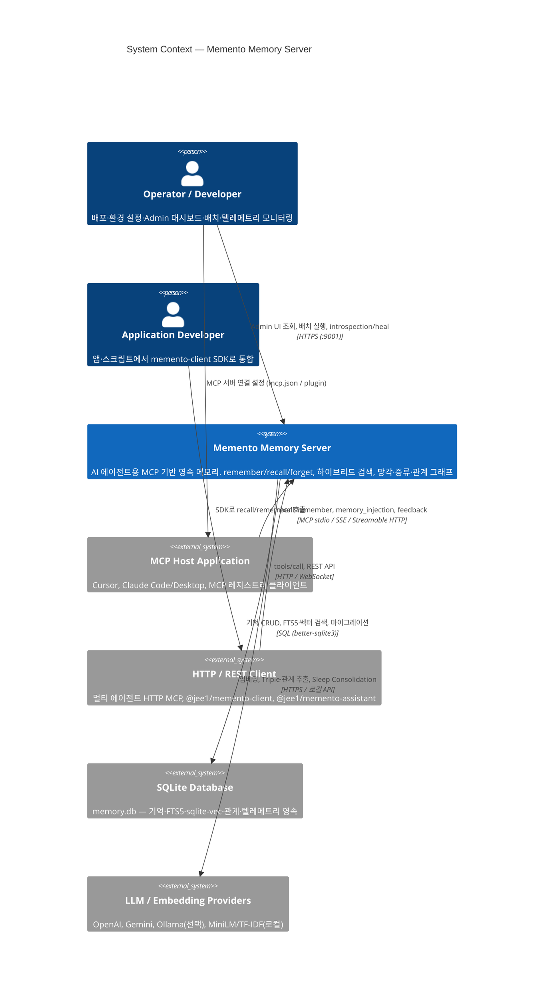

# C4 Level 1 — System Context Diagram

[System Context](./README.md) | 다음: [Container Diagram →](./02-container.md)

---

## 시스템 개요

| 항목 | 내용 |
|------|------|
| **시스템 이름** | Memento Memory Server |
| **목적** | AI 에이전트가 대화·세션을 넘어 **기억을 생성·분류·검색·강화·망각**할 수 있게 하는 MCP 기반 영속 메모리 운영 체제 |
| **핵심 책임** | `remember` / `recall` / `forget` / `feedback`, 4종 메모리 타입(working·episodic·semantic·procedural), 하이브리드 검색(FTS5+벡터), 배치 증류·Triple 추출 |

Memento는 “기억 DB”가 아니라 **기억 운영 체제**입니다. 에이전트는 MCP 도구만 호출하고, 저장·검색·망각·증류는 Memento가 처리합니다.

---

## System Context Diagram



---

## 액터 (Person)

| 액터 | 역할 |
|------|------|
| **Operator / Developer** | Docker·npx 배포, 환경 변수 설정, Admin 대시보드(`static/`)로 모니터링, 배치 수동 실행, introspection/heal |
| **Application Developer** | `@jee1/memento-client`, `@jee1/memento-assistant`로 앱·외부 비서(OpenClaw 등) 통합 |

AI 에이전트 자체는 C4 Person이 아니라 **MCP Host Application을 통해 Memento와 통신하는 외부 시스템** 쪽에 가깝게 둡니다.

---

## 외부 시스템 (External Software System)

| 시스템 | 관계 |
|--------|------|
| **MCP Host Application** | Cursor, Claude Code 플러그인, Claude Desktop 등. stdio 또는 HTTP MCP로 `recall`/`remember` 호출 |
| **HTTP / REST Client** | 멀티 에이전트 운영 시 단일 HTTP MCP 서버에 집중 접속하는 SDK·클라이언트 |
| **SQLite Database** | `DB_PATH`(기본 `~/.memento/memory.db`). WAL 모드, FTS5·sqlite-vec 포함 |
| **LLM / Embedding Providers** | 설정에 따라 선택: TF-IDF/MiniLM(로컬), OpenAI/Gemini(클라우드), Ollama(로컬 LLM). Triple 추출·증류·(선택) 임베딩 |

---

## 관계 요약 (ASCII)

```text
┌─────────────────┐     MCP (stdio/HTTP)      ┌──────────────────────┐
│  MCP Host       │ ─────────────────────────►│                      │
│  (Cursor/Claude)│   recall / remember / ... │  Memento Memory      │
└─────────────────┘                           │  Server              │
                                              │                      │
┌─────────────────┐     HTTPS Admin/API       │                      │
│  Operator       │ ─────────────────────────►│                      │
└─────────────────┘                           └──────────┬───────────┘
                                                         │
         ┌───────────────────────────────────────────────┼────────────────────┐
         │ SQL                                           │ HTTPS/API (선택)   │
         ▼                                               ▼                    │
┌─────────────────┐                           ┌─────────────────┐           │
│  SQLite         │                           │  LLM/Embedding  │           │
│  (memory.db)    │                           │  Providers      │           │
└─────────────────┘                           └─────────────────┘           │
                                                                               │
┌─────────────────┐     HTTP MCP / REST                                       │
│  HTTP Client    │ ──────────────────────────────────────────────────────────┘
│  (SDK/Assistant)│
└─────────────────┘
```

---

## 이 다이어그램에서 의도적으로 제외한 것

| 항목 | 이유 |
|------|------|
| `@memento/core`, `memento-server` 패키지 | [Container Diagram](./02-container.md) (Level 2) |
| memory/search/embedding 도메인 | [Component Diagram](./03-component-core.md) (Level 3) |
| Docker, GitHub Issue Monitor | 배포·운영 인프라 — Context 핵심 흐름 아님 |
| npm / MCP Registry | 배포 채널 — Context 핵심 흐름 아님 |

---

## 관련 문서

- [Container Diagram →](./02-container.md)
- [아키텍처 개요](../architecture.md)
- [Cursor MCP 설정](../../../guides/ko/cursor-mcp-setup.md)
