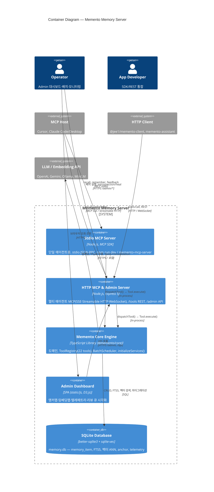

# C4 Level 2 — Container Diagram

[← System Context](./01-system-context.md) | [C4 목차](./README.md) | 다음: [Component Diagram →](./03-component-core.md)

---

## 개요

[System Context](./01-system-context.md)에서 **Memento Memory Server** 하나였던 경계를 **배포·실행 단위(컨테이너)** 로 펼칩니다. C4에서 컨테이너는 별도 프로세스·앱·데이터 저장소를 가리킵니다.

Memento는 두 가지 주요 실행 모드가 있습니다. 단일 에이전트용 **stdio MCP**(`npm run dev`)와 멀티 에이전트·Admin용 **HTTP MCP & Admin Server**(`npm run dev:http`)입니다. 둘 다 `@memento/core`를 in-process로 로드합니다.

---

## Container Diagram



---

## 컨테이너 설명

| 컨테이너 | 기술 | 소스 | 역할 |
|----------|------|------|------|
| **Stdio MCP Server** | Node.js + `@modelcontextprotocol/sdk` | `packages/memento-server/src/server/index.ts` | Cursor/Claude Desktop이 subprocess로 붙는 모드. `TRANSPORT_TYPE=stdio`(기본) |
| **HTTP MCP & Admin Server** | Express 5 + ws | `packages/memento-server/src/server/http-server.ts` | `:9001` 리슨. MCP(SSE/Streamable HTTP/WS) + `/tools/*` REST + `/admin/*` + `/api/*` |
| **Memento Core Engine** | `@memento/core` (in-process) | `packages/memento-core/` | `createMementoCore()` → `initializeServices()`. 도메인·22 MCP tools·BatchScheduler |
| **Admin Dashboard** | `static/js/`, `static/css/` | `static/` | HTTP 서버가 정적 제공. D3.js 앵커맵·임베딩맵·텔레메트리 |
| **SQLite Database** | better-sqlite3, WAL, sqlite-vec | `DB_PATH` | 단일 writer — 멀티 에이전트는 HTTP 서버 **하나**만 띄움 |

---

## 배포 모드

| 명령 / 진입점 | 활성 컨테이너 | 용도 |
|---------------|---------------|------|
| `npm run dev` | Stdio MCP Server (+ Core in-process) | 로컬 Cursor/Claude stdio |
| `npm run dev:http` | HTTP MCP & Admin Server (+ Core, Admin UI) | 멀티 에이전트 + Admin UI |
| Docker `memento-mcp-server` | HTTP MCP & Admin Server | 프로덕션 단일 writer |
| `memento recall …` (CLI) | Core 직접 in-process | **시스템 경계 밖** — 단발 프로세스 |

`TRANSPORT_TYPE=sse`로 `server/index.ts`를 기동하면 HTTP 서버 경로로 분기합니다.

---

## 요청 흐름 (`remember` 예)

모든 transport(stdio·HTTP MCP·WebSocket·REST `/tools`)는 `packages/memento-server/src/server/audit-tool-dispatch.ts`의 **`dispatchTool()` 한 경로**를 거칩니다.

```text
MCP Host
  │
  ├─[stdio]─► Stdio MCP Server ──dispatchTool()──┐
  │                                               │
  └─[HTTP]──► HTTP MCP & Admin Server ────────────┤
                                                  ▼
                                         Memento Core Engine
                                           ├─ RememberTool.execute()
                                           ├─ memory_item INSERT (즉시 응답)
                                           └─ BatchScheduler.addJob(triple_extraction)
                                                  │
                                                  ▼
                                         SQLite Database
                                                  │
                                         (백그라운드) ──► LLM API (Triple 추출)
```

즉시 저장·나중에 정제 패턴은 [async-augmentation-pipeline.md](../async-augmentation-pipeline.md)를 참조하세요.

---

## HTTP 서버 미들웨어 순서 (`/tools`)

프로그래matic 호출 경로는 아래 순서를 따릅니다 (Issue #662–#664).

```text
rateLimit → programmaticAuth → toolContext → ownerScope → httpAudit → router
```

---

## 시스템 경계 밖

| 요소 | 설명 |
|------|------|
| **MCP Host Application** | Cursor, Claude Code |
| **HTTP Client** | `@jee1/memento-client`, `@jee1/memento-assistant` |
| **LLM / Embedding API** | OpenAI, Gemini, Ollama, MiniLM/TF-IDF |

---

## 관련 문서

- [Component Diagram — Core Engine →](./03-component-core.md)
- [아키텍처 개요](../architecture.md)
- [Docker 배포 절차](../../../operations/ko/docker-deploy-procedure.md)
