# C4 Level 3 — Component Diagram (Memento Core Engine)

[← Container Diagram](./02-container.md) | [C4 목차](./README.md)

---

## 개요

[Container Diagram](./02-container.md)의 **Memento Core Engine** 컨테이너 내부를 컴포넌트 수준으로 펼칩니다. `@memento/core`는 별도 프로세스가 아니라 stdio/HTTP 서버 프로세스 안에서 in-process로 로드되는 TypeScript 라이브러리입니다.

부트스트랩 진입점은 `createMementoCore()` → `initializeServices()`(`packages/memento-core/src/bootstrap.ts`)입니다. MCP 도구 실행 진입점은 `executeTool()`(`packages/memento-core/src/tools/index.ts`)입니다.

---

## Component Diagram

```mermaid
C4Component
    title Component Diagram — Memento Core Engine

    Container_Ext(mcpServer, "MCP / HTTP Server", "memento-server", "dispatchTool() 호출")
    ContainerDb_Ext(db, "SQLite Database", "memory.db")
    System_Ext(llm, "LLM / Embedding API", "OpenAI, Gemini, Ollama, MiniLM")

    Container_Boundary(core, "Memento Core Engine (@memento/core)") {

        Component(toolRegistry, "Tool Registry", "tools/index.ts", "22 MCP tools 등록·실행. executeTool() 진입점. CORE_TOOLSET 4개 노출(#769)")

        Component(memoryTools, "Memory Tools", "domains/memory/", "remember, recall, forget, pin, feedback, memory_injection, procedural, introspection")
        Component(searchEngine, "Hybrid Search Engine", "domains/search/", "FTS5 + 벡터 병렬 → 가중치 합산 → MMR. recall 핵심")
        Component(ftsEngine, "FTS5 Search Engine", "SearchEngine", "memory_item_fts 전문 검색·BM25")
        Component(vectorEngine, "Vector Search Engine", "VectorSearchEngine", "sqlite-vec ANN 근사 검색")
        Component(embedding, "Embedding Service", "domains/embedding/", "MemoryEmbeddingService + ProviderFactory (tfidf/minilm/openai/gemini)")
        Component(anchor, "Anchor Manager", "domains/anchor/", "A/B/C 슬롯 앵커·search_local 그래프 탐색")
        Component(relation, "Relation Graph", "domains/relation/", "memory_link, Triple 추출·관계 그래프")
        Component(consolidation, "Sleep Consolidation", "domains/consolidation/", "에피소드→시맨틱 증류 + ConsolidationScore")
        Component(forgetting, "Forgetting Policy", "domains/forgetting/", "TTL·Forget Score 기반 정리")
        Component(metaMem, "Meta Memory / Introspection", "introspection/", "MetaMemoryService, IntrospectionScanCache, heal 후보")
        Component(telemetry, "Telemetry Service", "domains/telemetry/", "owner/agent 컨텍스트·search/feedback 품질 텔레메트리")
        Component(monitoring, "Monitoring Stack", "domains/monitoring/", "PerformanceMonitor, FailureDetector, ReflexionWorker, ErrorLogging")
        Component(batch, "Batch Scheduler", "infrastructure/scheduler/", "11종 배치: triple_extraction, sleep_consolidation, forgetting, …")
        Component(repos, "Repository Layer", "infrastructure/database/repositories/", "memory·vector·telemetry·anchor stores")
        Component(dbInfra, "DB Infrastructure", "infrastructure/database/", "WAL checkpoint, lock monitor, write coalescing, migrations")
    }

    Rel(mcpServer, toolRegistry, "dispatchTool() → executeTool()", "In-process")
    Rel(toolRegistry, memoryTools, "remember/recall/forget/…")
    Rel(toolRegistry, anchor, "set_anchor/search_local")
    Rel(toolRegistry, relation, "extract_triples")
    Rel(toolRegistry, telemetry, "get_telemetry_summary")

    Rel(memoryTools, searchEngine, "recall 검색")
    Rel(memoryTools, repos, "CRUD")
    Rel(memoryTools, batch, "에피소드 저장 → triple job 큐")
    Rel(memoryTools, metaMem, "introspection")
    Rel(memoryTools, telemetry, "이벤트 기록")

    Rel(searchEngine, ftsEngine, "텍스트 후보")
    Rel(searchEngine, vectorEngine, "벡터 후보")
    Rel(searchEngine, embedding, "쿼리 임베딩")
    Rel(searchEngine, relation, "relation_weight 신호")
    Rel(searchEngine, forgetting, "TTL 필터")

    Rel(vectorEngine, embedding, "벡터 생성·조회")
    Rel(embedding, llm, "임베딩 API (선택)")

    Rel(anchor, vectorEngine, "앵커 주변 탐색")
    Rel(anchor, relation, "로컬 그래프")

    Rel(batch, relation, "TripleExtractionBatchJob")
    Rel(batch, consolidation, "SleepConsolidationBatch")
    Rel(batch, forgetting, "forgetting_cleanup")
    Rel(batch, metaMem, "meta_memory_introspection")
    Rel(batch, telemetry, "telemetry_cleanup")
    Rel(relation, llm, "Triple·관계 추출 LLM")

    Rel(repos, db, "SQL")
    Rel(dbInfra, db, "WAL·lock·checkpoint")
    Rel(monitoring, db, "성능·진단")
```



---

## 1. Tool Layer (진입점)

| 컴포넌트 | 경로 | 역할 |
|----------|------|------|
| **Tool Registry** | `tools/index.ts`, `tools/tool-registry.ts` | 22개 MCP tool 등록·실행 |

`executeTool()` 호출 흐름:

```text
executeTool(name, params, context)
  → flattenNestedToolFilters(params)
  → TelemetryService.runWithContext(ownerId, …)   // telemetryService 있을 때
  → toolRegistry.execute(name, params, context)
```

**tools/list 노출 정책** (`MEMENTO_TOOLSET`, Issue #769):

| 모드 | tools/list 노출 | 비고 |
|------|-----------------|------|
| `core`(기본) | 4개 | `recall`, `remember`, `memory_injection`, `feedback` |
| `full` | 22개 | v1.18 이전 동작 |

나머지 18개 tool은 목록에서만 빠지고 **`tools/call`로 호출 가능**합니다. 노출 지점은 `getExposedTools()` 한 곳이며 stdio·HTTP·WebSocket이 모두 이를 사용합니다.

---

## 2. Memory Domain

| 하위 | 도구 / 서비스 |
|------|---------------|
| **CRUD·피드백** | `remember`, `recall`, `forget`, `pin`/`unpin`, `feedback`, `memory_injection`, `get_memory_neighbors`, `export_memories` |
| **Procedural** | `remember_procedure`, `procedural_diff`, `procedural_rollback` |
| **Introspection** | `get_introspection_summary`, `MetaMemoryService`, `IntrospectionScanCache` |

**메모리 타입과 TTL:**

| 타입 | TTL | 용도 |
|------|-----|------|
| `working` | 48시간 | 현재 작업 맥락 |
| `episodic` | 90일 | 과거 대화·사건 |
| `semantic` | 무제한 | 지식·사실·규칙 |
| `procedural` | 무제한 | 반복 절차·워크플로우 |

`remember` (episodic) 흐름: `memory_item` INSERT → **즉시 응답** → `BatchScheduler.addJob(triple_extraction)`.

---

## 3. Search Domain

| 컴포넌트 | 역할 |
|----------|------|
| **Hybrid Search Engine** | FTS5 + 벡터 병렬 실행 → 점수 합산 → MMR 다양성 조절 |
| **FTS5 Search Engine** | `memory_item_fts` BM25 |
| **Vector Search Engine** | sqlite-vec ANN (`vector-search.repository.ts`) |

**랭킹 공식** (`config/ranking-weights.toml`):

```text
S = α·relevance + β·recency + γ·importance + δ·usage
  + ζ·relation_weight + ζ_fb·(feedback_norm − 0.5)
  + θ·process_attribute_fit − ε·duplication_penalty
```

상세: [search-ranking.md](../../../agents/search-ranking.md).

---

## 4. Embedding Domain

| 컴포넌트 | 설명 |
|----------|------|
| **MemoryEmbeddingService** | `memory_embedding` 테이블 CRUD |
| **EmbeddingProviderFactory** | tfidf, minilm(로컬), openai, gemini, mock |

환경 변수 `EMBEDDING_PROVIDER`로 기본 프로바이더 선택. LLM 추출용 프로바이더(`LLM_PROVIDER`)와는 별도입니다.

---

## 5. Anchor · Relation · Consolidation · Forgetting

| 컴포넌트 | 역할 |
|----------|------|
| **Anchor Manager** | A/B/C 슬롯, `search_local` 그래프 탐색, `owner_id`별 독립 앵커맵 |
| **Relation Graph** | `memory_link`, Triple 추출(`TripleExtractionService`), LLM 관계 추출 |
| **Sleep Consolidation** | 에피소드→시맨틱 증류, `ConsolidationScoreService` |
| **Forgetting Policy** | TTL·Forget Score, pinned 제외, 24h 배치 정리 |

---

## 6. Observability

| 컴포넌트 | 역할 |
|----------|------|
| **Telemetry Service** | recall search_quality·feedback_quality 텔레메트리 (`owner_id`/`agent_id` 격리) |
| **Monitoring Stack** | `PerformanceMonitor`, `FailureDetector`, `ReflexionWorker`, `RuntimeDiagnosticsLogger`, `ErrorLoggingService` |

---

## 7. Infrastructure

| 컴포넌트 | 역할 |
|----------|------|
| **Batch Scheduler** | 주기·큐 기반 배치 job (`infrastructure/scheduler/`) |
| **Repository Layer** | `*-store.ts` composition — memory/vector/telemetry/anchor |
| **DB Infrastructure** | WAL checkpoint, lock monitor, write coalescing, migrations |

### BatchScheduler 주요 job

| Job | 기본 주기 | 담당 컴포넌트 |
|-----|-----------|---------------|
| `triple_extraction` | 1h | Relation Graph |
| Per-item triple (JobQueue) | remember 직후 | Relation Graph |
| `sleep_consolidation` | 1h | Sleep Consolidation |
| `consolidation_score_incremental` | 1h | Consolidation |
| `consolidation_score_full_sweep` | 24h (03:00) | Consolidation |
| `forgetting_cleanup` | 24h | Forgetting Policy |
| `meta_memory_introspection` | 6h | Meta Memory |
| `memory_review_candidates` | 24h | Memory |
| `quality_measurement` | 24h | Search 품질 |
| `relation_validation` | 7d (일 02:00) | Relation Graph |
| `telemetry_cleanup` | 24h | Telemetry |
| `log_rotation` | 24h | Monitoring |

전체 파이프라인: [async-augmentation-pipeline.md](../async-augmentation-pipeline.md).

---

## 서비스 초기화 순서

`initializeServices(db)` (`bootstrap.ts`)는 아래 순서로 컴포넌트를 조립합니다.

```text
1. Search + Embedding + Forgetting + DB Optimizer
      createSearchEmbeddingAndOptimizerServices()
2. ErrorLoggingService
3. Anchor Stack
      VectorSearchEngine, AnchorManager, AnchorSearchService
4. FailureDetector + ReflexionWorker
5. Monitoring Schedulers
      PerformanceMonitor, WalCheckpointScheduler, DatabaseLockMonitor
6. Write Coalescing + Meta
      WriteCoalescingManager, ConsolidationScoreService, MetaMemoryService
7. Batch + Telemetry + Relation + Sleep
      BatchScheduler, TelemetryService, RelationGraph, SleepConsolidationService
8. RelationGraph 주입
      anchorSearchService.setRelationGraph()
      hybridSearchEngine.setRelationGraph()
9. RuntimeDiagnosticsSampler
```

모든 서비스가 준비된 뒤 MCP/HTTP 서버가 요청을 받기 시작합니다.

---

## `recall` 요청 경로

```text
MCP Server (dispatchTool)
  └─ Tool Registry.execute('recall')
       └─ RecallTool
            └─ Hybrid Search Engine
                 ├─ FTS5 Search Engine ──► Repository ──► SQLite
                 ├─ Vector Search Engine ──► Embedding Service
                 └─ Relation Graph (relation_weight)
            └─ Telemetry Service (search_quality 기록)
```

---

## 의존성 경계

도메인 의존 방향은 `shared` ← `domains` ← `infrastructure`입니다. CI는 `packages/memento-core/src/test/architecture/dependency-boundaries.spec.ts`로 domain→infra, shared→infra|server 위반을 막습니다.

---

## C4 4단계 요약

| Level | 문서 | 범위 |
|-------|------|------|
| 1 Context | [01-system-context.md](./01-system-context.md) | Memento ↔ 외부 |
| 2 Container | [02-container.md](./02-container.md) | Stdio/HTTP/Core/Admin/SQLite |
| 3 Component | 본 문서 | Core Engine 내부 |
| 4 Code | (미포함) | 특정 도메인 이슈·PR에서 다룸 |

---

## 관련 문서

- [아키텍처 개요](../architecture.md)
- [database-design.md](../database-design.md)
- [async-augmentation-pipeline.md](../async-augmentation-pipeline.md)
- [search-ranking.md](../../../agents/search-ranking.md)
