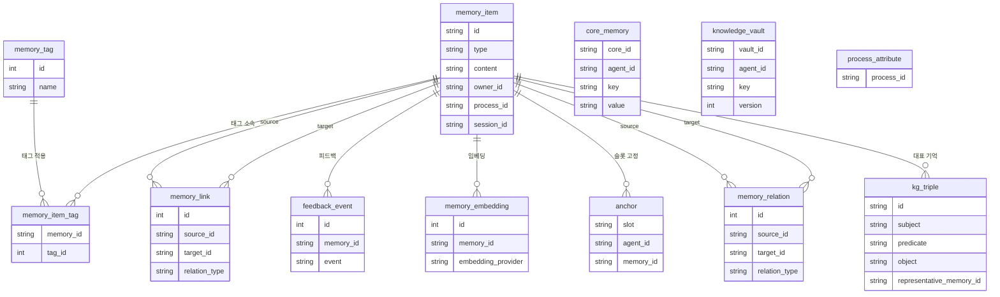

# 데이터베이스 설계 (Database Design)

**하는 일**: Memento MCP Server의 SQLite 스키마에 대한 단일 설계 명세. 테이블·컬럼 목적, 명명 규칙, 인덱스·제약, 마이그레이션 이력을 한 문서에서 참조한다.  
**주의**: 실행용 DDL의 진실 공급원은 `packages/memento-core/src/infrastructure/database/database/schema.sql`과 마이그레이션 스크립트이며, 본 문서는 그에 대한 설명·정리용이다.  
**연관**: [마이그레이션 시스템 가이드](../../guides/ko/migration-system-guide.md), [DB 설계 통합 제안서](../../_work/plans/ko/database-design-consolidation-proposal.md), [전체 테이블 ERD](database-erd.md).

---

## 1. 개요

- **역할**: Memento는 SQLite 임베디드 DB를 사용한다. M1 단계의 개인용 메모리 저장에서 시작해, MIRIX·관계 엔진·앵커·임베딩·다중 에이전트·KG Triple 등으로 확장된 현재 스키마를 유지한다.
- **단일 문서 정책**: 실행 가능한 스키마의 진실 공급원은 `schema.sql` + 마이그레이션(002~020)이다. 본 문서는 “설계 설명·목적·이력”의 단일 참조본이다.
- **타임스탬프 표준 시간대**: DB에 저장하는 시각은 **UTC**를 표준으로 한다. ISO 8601 형식·`Z` 접미사 또는 SQLite `strftime('%Y-%m-%dT%H:%M:%fZ','now')` 사용을 권장한다. 로그·사용자 표시는 필요 시 KST 등으로 변환한다.
- **관련 문서**:
  - [마이그레이션 시스템 가이드](../../guides/ko/migration-system-guide.md)
  - 스키마 DDL: `packages/memento-core/src/infrastructure/database/database/schema.sql`
  - 마이그레이션: `packages/memento-core/src/infrastructure/database/database/migration/migrations/`
  - 저장소 가이드(DB 절): `AGENTS.md`

---

## 2. 개념 수준

- **메모리 타입**: `working`, `episodic`, `semantic`, `procedural` (메인 저장소는 `memory_item.type`).
- **Core / Vault**: 에이전트 정체성·지침은 `core_memory`, 불변 지식은 `knowledge_vault` (MIRIX 확장).
- **관계**: 기억 간 링크는 `memory_link`(레거시)와 `memory_relation`(관계 엔진, 마이그레이션 005). `relation_type_registry`로 관계 타입 등록.
- **앵커**: 슬롯 A/B/C 구조의 로컬 메모리 앵커는 `anchor` 테이블(마이그레이션 004).
- **임베딩·벡터**: `memory_embedding`에 다중 제공자/차원 저장, FTS5(`memory_item_fts`), vec0(`memory_item_vec*`)로 검색.
- **KG Triple**: 시맨틱 트리플 전용 저장·중복 제거는 `kg_triple`(마이그레이션 018·019).

### 2.1 ERD (Entity Relationship Diagram)

핵심 엔티티와 관계만 표시한다. 가상 테이블(FTS5, vec0)·레지스트리·버퍼 등은 생략했다.

---

## 3. 테이블 및 컬럼 명명 규칙

- **테이블명**: `snake_case`. 단수/집합 의미의 명사 또는 명사_명사 조합. 예: `memory_item`, `memory_item_tag`, `core_memory`, `embedding_model_registry`.
- **컬럼명**: `snake_case`. 팀 통용 약어만 사용. 참조는 `memory_id`, `tag_id`처럼 대상이 드러나게.
- **주 키**: 테이블당 하나. `id` 또는 `{엔티티}_id`(예: `core_id`, `vault_id`). 복합 PK는 해당 컬럼 나열.
- **외래 키·참조**: `{참조}_id`. 동일 테이블 참조 시 `source_id`, `target_id` 등 역할 구분.
- **시각/타임스탬프**: `*_at` 접미사(예: `created_at`, `updated_at`, `last_accessed`, `expires_at`). **표준 시간대**: DB 저장은 UTC로 통일하고, 본 문서에 명시한다(§1 참조).
- **인덱스명**: `idx_{테이블}_{컬럼}`. 복합이면 `idx_{테이블}_{col1}_{col2}`. 예: `idx_memory_item_type`, `idx_core_memory_agent_id`.
- **가상 테이블**: `_fts`, `_vec` 등 접미사로 구분. 예: `memory_item_fts`, `memory_item_vec_tfidf`.
- **일관성**: 신규 테이블/컬럼/인덱스 추가 시 위 규칙을 따르고, 본 문서의 해당 절을 갱신한다.

---

## 4. 물리 모델: 테이블·가상 테이블

### 4.1 schema.sql에 정의된 테이블

| 테이블 | 목적 | 주요 컬럼 |
|--------|------|-----------|
| `memory_item` | 메인 기억 저장. type(working/episodic/semantic/procedural), content, importance, 메타(owner_id, process_id, session_id, version, Fact 메타 등). | id, type, content, created_at, last_accessed, version, version_series_id, owner_id, process_id, session_id, num_times, last_mentioned_at, confidence |
| `memory_tag` | 태그 마스터. | id, name, created_at |
| `memory_item_tag` | memory_item–memory_tag N:N. | memory_id, tag_id |
| `memory_link` | 기억 간 관계(레거시). cause_of, derived_from, duplicates, contradicts, version_of. | source_id, target_id, relation_type, created_at |
| `feedback_event` | 메모리별 피드백(used, edited, neglected, helpful, not_helpful). | memory_id, event, score, created_at |
| `wm_buffer` | 작업기억 버퍼(세션별). | session_id, items, token_budget, expires_at |
| `process_attribute` | process별 주제·속성(recall 스코어링). 마이그레이션 020. | process_id, topics, workflow_names, skill_names, created_at, updated_at |
| `memory_embedding` | 임베딩 다중 제공자/차원 저장. | memory_id, embedding_provider, projection_type, embedding, dim, dimensions, model |
| `embedding_model_registry` | 제공자별 모델·차원·vec 테이블명. | provider, model, dimensions, vec_table, priority, status |
| `core_memory` | Core Memory(key-value, 에이전트 정체성·지침). | core_id, agent_id, key, value, always_load |
| `knowledge_vault` | Knowledge Vault(불변 지식, 버전). | vault_id, agent_id, key, value, immutable, version, previous_version_id |

### 4.2 가상 테이블

| 테이블 | 용도 | 비고 |
|--------|------|------|
| `memory_item_fts` | FTS5 전문 검색. content, tags, source, reflection_notes. | content='memory_item' 연동, 트리거로 동기화 |
| `memory_item_vec` | vec0 기본(384차원). | sqlite-vec 확장 |
| `memory_item_vec_tfidf` | TF-IDF 512차원. | |
| `memory_item_vec_minilm` | MiniLM 384차원. | |
| `memory_item_vec_openai` | OpenAI 1536차원. | |
| `memory_item_vec_gemini` | Gemini 768차원. | |

### 4.3 마이그레이션에서만 추가되는 테이블

| 테이블 | 추가 마이그레이션 | 목적 |
|--------|-------------------|------|
| `memory_relation` | 005 | 관계 엔진용 시맨틱 관계 저장 |
| `relation_type_registry` | 005 | 관계 타입 등록 |
| `anchor` | 004 | 앵커 슬롯 A/B/C |
| `kg_triple` | 018 | KG 전용 트리플·중복 제거 |
| `memento_schema_version` | 마이그레이션 시스템 | 적용된 마이그레이션 버전 기록 |
| 품질 측정·메타 메모리 통계 등 | 009, 011 | 품질 보증·메타 메모리 통계 |

---

## 5. 인덱스·제약

- **memory_item**: type, created_at, last_accessed, pinned, privacy_scope, importance, workflow_name, skill_name, (type, version_series_id), (type, version_series_id, version) WHERE type='procedural', owner_id, process_id, session_id, last_mentioned_at, num_times 등.
- **memory_item_tag**: memory_id, tag_id.
- **memory_link**: source_id, target_id.
- **feedback_event**: memory_id, event, created_at.
- **wm_buffer**: expires_at.
- **core_memory**: agent_id, key, created_at, always_load.
- **knowledge_vault**: agent_id, key, version, deleted_at, (agent_id, key).
- **memory_embedding**: memory_id, (memory_id, embedding_provider), (embedding_provider, projection_type), dimensions, model, version.
- **UNIQUE**: memory_item(id), memory_item_tag(memory_id, tag_id), memory_link(source_id, target_id, relation_type), core_memory(agent_id, key), knowledge_vault(agent_id, key, version), memory_embedding(memory_id, embedding_provider, projection_type) 등. kg_triple(subject, predicate, object)(018).

---

## 6. 마이그레이션 이력

| 버전 | 이름 | 변경 요약 |
|------|------|-----------|
| 2.0 | mirix-schema-expansion | MIRIX 5-memory 확장(Core, Episodic, Semantic, Procedural, Vault) |
| 3.0 | consolidation-score-fields | memory_item에 recall_count, last_accessed_at, consolidation_score, g_value 등 |
| 4.0 | anchor-table | anchor 테이블(슬롯 A/B/C) |
| 5.0 | relation-engine-schema | memory_relation, relation_type_registry, memory_link → memory_relation 마이그레이션 |
| 6.0 | fts5-reflection-notes | FTS5에 reflection_notes 반영(Zero-Downtime) |
| 7.0 | procedural-memory-enhancement | workflow_name, skill_name, trigger_conditions, memory_link relation_type 확장 |
| 8.0 | arigraph-schema-expansion | memory_item 트리플 추출 필드, relation_type_registry 확장 |
| 9.0 | quality-assurance-schema | 품질 측정 테이블 |
| 10.0 | add-core-memory-version | core_memory에 version 컬럼 |
| 11.0 | meta-memory-stats-schema | meta_memory_stats 테이블 |
| 12.0 | fix-tfidf-dimension-trigger | TF-IDF 트리거 dimensions 512 반영 |
| 13.0 | procedural-version-fields | memory_item에 version, version_series_id |
| 14.0 | procedural-version-indexes | procedural용 partial index |
| 15.0 | memory-item-owner-id | memory_item에 owner_id(다중 에이전트) |
| 16.0 | memory-item-attribution | memory_item에 process_id, session_id(Memori Attribution) |
| 17.0 | fact-metadata-fields | memory_item에 num_times, last_mentioned_at, source_session_id, confidence |
| 18.0 | kg-triple-table | kg_triple 테이블 |
| 19.0 | backfill-kg-triple-from-memory-item | 기존 semantic memory_item → kg_triple 백필 |
| 20.0 | process-attribute-table | process_attribute 테이블 |

상세는 `packages/memento-core/src/infrastructure/database/database/migration/migrations/` 내 해당 `.ts` 파일 참조.

---

## 7. 동기화 규칙

- 스키마 변경 시: (1) 마이그레이션 추가 및 필요 시 `schema.sql` 반영(팀 정책), (2) **본 설계 문서 해당 절(§4·§5·§6) 갱신**을 PR 체크리스트에 포함한다.
- 스키마/마이그레이션을 건드리는 PR에서 “database-design.md 갱신 여부”를 리뷰 항목으로 둔다.
