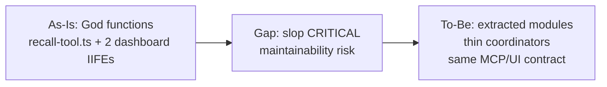
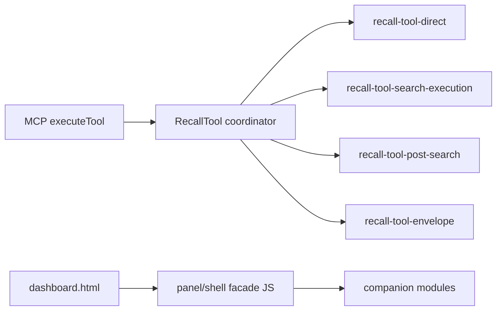
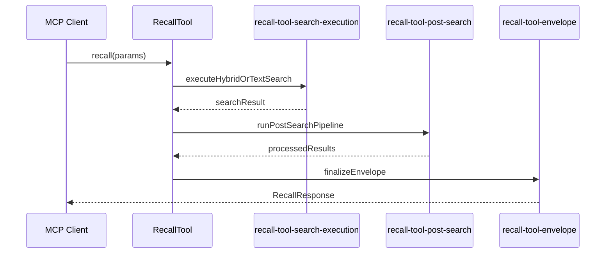
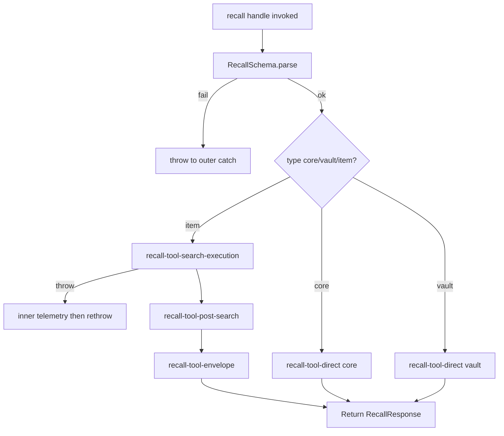

# Issue #445 slop 후속 리팩터 — Technical Design Document

## 목차

1. [서문](#1-서문)
2. [배경과 문제](#2-배경과-문제)
3. [현재 시스템](#3-현재-시스템)
4. [갭과 설계 전환](#4-갭과-설계-전환)
5. [상위설계](#5-상위설계)
6. [상세설계](#6-상세설계)
7. [마무리](#7-마무리)
- [부록 A. 출처·코드 위치](#부록-a-출처코드-위치)
- [부록 B. Ch.4 결정 전문](#부록-b-ch4-결정-전문)

## 이 문서 읽는 법

| 독자 | 먼저 볼 곳 | 목표 |
|------|-----------|------|
| PM | ## 1. 서문 opening + Goals → [§5](#5-상위설계) diagram | \\~3분 |
| Dev | [§4](#4-갭과-설계-전환) → [§6](#6-상세설계) tables + [인수조건](#인수조건) | \\~5분 |
| QA | [§6](#6-상세설계) [인수조건](#인수조건) → [테스트](#테스트) | \\~3분 |
| 감사 | [§4](#4-갭과-설계-전환) 결정 요약 → [부록 A](#부록-a-출처코드-위치) | \\~3분 |

## 1. 서문

Memento 저장소는 `ai-slop-detector` 정적 스캔으로 AI 생성 코드의 구조적 부채를 추적한다. GitHub 이슈 [#445](https://github.com/jee1/memento/issues/445)는 2026-05-30 재스캔 결과를 PRD로 정리했으며, 프로덕션 TypeScript Critical 1건과 dashboard 정적 JavaScript Critical 2건을 해소하는 것을 목표로 한다. PM·Dev·QA·감사 독자는 `## 이 문서 읽는 법`의 경로표를 따르면 \\~3\\~5분 내 역할별 핵심을 확인할 수 있다. 본 TDD는 동작·스키마 변경 없이 God function과 IIFE 복잡도를 줄이는 리팩터 범위, 모듈 분해 경계, 검증 게이트를 정의한다. 구현은 PR-A\\~PR-C 순의 소규모 PR로 나누며, 각 PR은 기존 Vitest CI를 회귀 방어선으로 사용한다. slop 재스캔은 참고 지표이며 merge 필수 게이트는 아니다 [ref:A-1].

### Goals / Non-Goals

**Goals:**

- `recall-tool.ts` 프로덕션 `CRITICAL_DEFICIT` 제거 (God function 분해)
- `review-candidates-panel.js`, `memory-evolution-demo-shell.js` dashboard Critical 제거
- PR 단위·모듈 경계·인수조건·테스트 매핑을 문서화하여 후속 구현 일관성 확보
- 기존 MCP `recall` 도구 계약과 dashboard UX 동작 유지

**Non-Goals:**

본 리팩터는 데이터 영속성 계층이나 MCP 프로토콜 버전을 건드리지 않는다. slop 점수 개선만을 위해 테스트 파일을 저장소 ignore에 추가하는 것도 범위 밖이다.

- SQLite 스키마·마이그레이션 변경
- slop-detector를 CI merge 필수 게이트로 승격
- `.slopconfig.yaml`에 `*.spec.ts` 대량 ignore 추가 ([#313](https://github.com/jee1/memento/issues/313) 정책 A)
- Suspicious 잔여 전체 일괄 정리 (PR-D는 선택)

## 2. 배경과 문제

2026-05-30 `slop-detector --project packages --js --config .slopconfig.yaml` 실행 결과, 896개 JS/TS 파일 중 Critical 59건이 보고되었다 [ref:A-2]. 그러나 이 중 대부분은 Vitest `describe`/`it` 블록, `src/test/**` 벤치마크, `mcp-client/examples/**` 예제로 인한 노이즈다. 저장소는 정책 A에 따라 커밋된 ignore로 테스트 파일을 숨기지 않으므로, 백로그는 **프로덕션 소스 Critical**만 우선한다 [ref:A-3].

프로덕션 경로에서는 `packages/memento-core/src/domains/memory/tools/recall-tool.ts` 단 1건이 Critical(Score 50.0)로 남아 있다. slop-detector는 `constructor`(205줄), `recallCoreMemoryDirect`, `finalizeMemoryItemRecallEnvelope`(202줄, complexity 40), `runMemoryItemPostSearchPipeline`(complexity 34) 등을 God function으로 분류한다 [ref:A-4]. 이 파일은 MCP `recall` 도구의 진입점이며, 검색·필터·앵커·이웃·메타 통계까지 end-to-end 오케스트레이션을 담당한다.

dashboard `static/js` 8파일 스캔에서는 Critical 2건이 확인되었다. `review-candidates-panel.js`(1014줄 IIFE, complexity 251)와 `memory-evolution-demo-shell.js`(893줄 IIFE, complexity 196)가 해당한다 [ref:A-5]. 두 스크립트는 `static/dashboard.html`에서 `<script>` 태그로 직접 로드되며, bundler 없이 전역 `initReviewCandidatesPanel` / `__MEMENTO_EVOLUTION_DEMO_SHELL__` API를 노출한다 [ref:A-6].

이전 백로그 [#315](https://github.com/jee1/memento/issues/315)에서 `batch-scheduler.ts`, `hybrid-search-engine.ts`, `llm-based-relation-extractor.ts` 등은 Critical에서 벗어났다. Issue #445는 잔여 Critical과 dashboard JS를 PR-A\\~C로 쪼개 처리하도록 제안한다. 따라서 본 설계는 **행동 동일성 + 구조 개선**에 집중하며, slop 점수는 PR 본문 Before/After로 기록한다. 이를 위해 먼저 PRD가 지적한 recall pipeline과 dashboard 정적 자산의 **현재** 구조를 코드 기준으로 정리한다.

## 3. 현재 시스템

현재 코드베이스에서 Memento core는 npm workspace `packages/memento-core`에 도메인 로직을 두고, MCP 도구는 `packages/memento-core/src/tools/index.ts`에서 `RecallTool`을 등록한다 [ref:A-7]. `RecallTool.handle`(`recall-tool.ts:803`)이 `RecallSchema.parse` 이후 core/vault 직접 조회 또는 memory_item 하이브리드 검색 파이프라인을 분기한다 [ref:A-8].

Issue #350 이후 recall 도구는 이미 일부 모듈로 분리되어 있다. `recall-tool-schema.ts`, `recall-tool-validation.ts`, `recall-tool-filters.ts`, `recall-tool-results.ts`, `recall-tool-telemetry.ts`, `recall-tool-types.ts`가 sibling 파일로 존재한다 [ref:A-9]. 그럼에도 `recall-tool.ts` 본체는 1731줄이며, 클래스 private 메서드와 MCP JSON schema가 포함된 `constructor`가 slop Critical의 주 원인이다 [ref:A-4].

회귀 방어는 `packages/memento-core/src/domains/memory/tools/__tests__/recall-tool.spec.ts`(4711줄, 103 `it`)가 담당한다. CI job `test-core`는 `npm run test:ci:core`로 core 전체 Vitest를 실행한다 [ref:A-10]. procedural `version_filter`/`include_diff_with` 경로와 `introspection_hint` envelope 분기는 spec 커버가 약한 영역으로 남아 있다 [ref:A-11].

HTTP admin dashboard는 `packages/memento-server`가 `static/` 정적 자산을 서빙한다 [ref:A-14]. `dashboard-tabs.js`가 review·evolution demo 탭 활성 시 각각 `initReviewCandidatesPanel()` [ref:A-12], `__MEMENTO_EVOLUTION_DEMO_SHELL__.initPanel()` [ref:A-15]을 호출한다. dashboard JS 품질 검증은 런타임 E2E가 아니라 `dashboard-review-candidates-panel.spec.ts`, `dashboard-memory-evolution-demo-shell.spec.ts`가 HTML/JS **문자열 포함**과 API URL 패턴을 assert한다 [ref:A-13].

slop-detector는 `.github/workflows/slop-detector-js.yml`에서 주간·수동 `workflow_dispatch`로만 실행되며 merge 필수 check가 아니다 [ref:A-1]. 로컬 재현 명령은 `DEVELOPMENT_RULES.md`와 Issue #445 본문에 동일하게 기재되어 있다.

## 4. 갭과 설계 전환

현재 `recall-tool.ts`는 기능적으로는 안정적이나, 단일 클래스 파일에 MCP 스키마 정의·직접 조회·검색 실행·후처리·응답 envelope·앵커/이웃·side-effect writer가 한데 모여 slop God function 경고를 유발한다 [ref:A-4]. dashboard JS는 bundler 없이 대형 IIFE 한 파일에 polling/SSE·health·render·bootstrap이 혼재하여 cyclomatic complexity가 비정상적으로 높다 [ref:A-5].

목표 상태는 [#315](https://github.com/jee1/memento/issues/315)에서 검증된 패턴을 따른다. 즉 **한 PR·한 주제**, **동작·스키마 불변**, **sibling 모듈 추출 후 얇은 coordinator 유지**다. recall 쪽은 기존 `recall-tool-*` 네이밍을 확장하고, dashboard 쪽은 IIFE를 유지하되 책임별 companion script로 분리한다 [ref:A-9].

검증 층은 변경되지 않는다. merge gate는 `npm test`, `npm run lint`, `npm run type-check`이며 [ref:A-10], slop 재스캔은 PR 증거용 advisory 측정이다 [ref:A-1]. PRD 완료 기준 4항목은 AC-1\\~AC-4로 Ch.6에 매핑한다.

Ch.4 Tier-1 결정은 PR 분리, recall pipeline 모듈 경계, dashboard companion 전략, slop 검증 게이트 네 가지로 수렴한다. 아래 표는 감사·PM용 인덱스이며, 각 주제의 근거는 직후 decision card에 기술한다.

### 결정 요약

| # | 주제 | 선택 | 상태 | 근거 한줄 |
|---|------|------|------|-----------|
| 1 | PR 단위 | PR-A/B/C 주제별 분리 | 확정 | #315에서 검증된 reviewable chunk |
| 2 | recall 분해 | `recall-tool-*` sibling 확장 | 확정 | #350 분리와 동일 관례 |
| 3 | dashboard JS 분해 | companion script + 전역 facade | 확정 | bundler 없이 script 순서로 로드 |
| 4 | slop CI 게이트 | advisory 유지 | 확정 | #314 merge 필수 아님 |

### PR 단위 (주제별 1 PR)

Issue #445는 recall, review panel, evolution shell을 각각 독립 PR로 제안한다. 한 PR에 hybrid-search-engine까지 묶으면 diff가 커져 review·rollback 비용이 증가한다. 각 PR은 단일 slop Critical 파일 또는 dashboard facade 하나를 목표로 한다.

| 항목 | 내용 |
|------|------|
| 결정 | PR-A(`recall-tool.ts`), PR-B(`review-candidates-panel.js`), PR-C(`memory-evolution-demo-shell.js`) 순으로 착수한다 |
| 상태 | 확정 |
| 코드 | `packages/memento-core/src/domains/memory/tools/recall-tool.ts:70`, `static/js/review-candidates-panel.js:4` |

**근거 설명:** slop 리팩터는 기능 추가가 아니라 구조 정리이므로, blast radius를 파일 단위로 제한하는 것이 회귀 탐지에 유리하다. recall-tool은 103개 integration spec이 있어 단독 PR로도 충분한 CI 신호를 제공한다. dashboard JS는 string spec만 있으므로 파일별 PR이 실패 지점을 좁힌다.

**참고:** [DEVELOPMENT_RULES.md](https://github.com/jee1/memento/blob/main/DEVELOPMENT_RULES.md) — slop 스캔은 선택적 정적 분석

### recall-tool 모듈 경계

`recall-tool.ts` 본체는 coordinator로 남기고, pipeline 단계별 private 로직을 sibling 파일로 이동한다.

| 항목 | 내용 |
|------|------|
| 결정 | direct lookup / search execution / post-search / envelope / procedural enrich / auto-anchor / neighbors / side-effects를 `recall-tool-*.ts`로 추출 |
| 상태 | 확정 |
| 코드 | `packages/memento-core/src/domains/memory/tools/recall-tool.ts:1025-1080` — 명시적 3단 pipeline |

**근거 설명:** `handle` 내부는 이미 `executeHybridOrTextSearchForMemoryItem` → `runMemoryItemPostSearchPipeline` → `finalizeMemoryItemRecallEnvelope` 순서로 호출된다. 이 seam을 파일 경계로 승격하면 slop God function LOC가 분산되고, #328 memory-embedding-service·#330 triple-extraction 패턴과 일치한다. MCP JSON schema는 `recall-tool-schema.ts` 또는 `recall-tool-definition.ts`로 이동해 constructor를 얇게 만든다.

**참고:** [Vitest](https://vitest.dev/guide/) — 기존 `recall-tool.spec.ts` 회귀 실행

### dashboard companion script 전략

dashboard는 webpack/esbuild bundler가 없으므로, 다중 `<script src>` 로드 순서로 모듈화한다.

| 항목 | 내용 |
|------|------|
| 결정 | poll/SSE·health·table render 등 cluster를 `static/js/review-candidates-*.js`, `static/js/evolution-demo-*.js` companion으로 분리하고 facade 파일이 전역 API를 유지 |
| 상태 | 확정 |
| 코드 | `static/dashboard.html:383-387` — script 태그 로드 |

**근거 설명:** 단일 IIFE 내부 함수 분리만으로는 slop가 anonymous `(anonymous)` 블록을 God function으로 잡을 수 있다. companion 파일은 named top-level function으로 complexity를 분산한다. `initReviewCandidatesPanel`과 `__MEMENTO_EVOLUTION_DEMO_SHELL__` 시그니처는 변경하지 않아 `dashboard-tabs.js`와 string spec을 그대로 통과시킨다.

**참고:** [MDN Script loading](https://developer.mozilla.org/en-US/docs/Web/HTML/Element/script) — 순차 script 실행 모델

### slop 검증 게이트

slop-detector는 품질 신호이지만 현재 CI merge blocker가 아니다.

| 항목 | 내용 |
|------|------|
| 결정 | PR 본문에 Before/After slop 요약을 첨부하고, merge gate는 Vitest·lint·type-check만 사용 |
| 상태 | 확정 |
| 코드 | `.github/workflows/slop-detector-js.yml:32-43` — advisory workflow |

**근거 설명:** #314에서 slop workflow를 필수 check로 등록하지 않기로 했다. Vitest spec의 describe God function 노이즈가 Critical count를 inflate하므로, 프로덕션 파일 단위 Before/After가 더 actionable하다.

**참고:** [ai-slop-detector PyPI](https://pypi.org/project/ai-slop-detector/) — Deficit Score 해석

PR 분리·recall sibling·dashboard companion·advisory slop 네 결정에 따라 To-Be 상위설계는 coordinator·pipeline module·dashboard facade·slop evidence 절차 네 축으로 재배치한다.

## 5. 상위설계

Ch.4에서 확정한 PR 분리와 module 추출 원칙에 따라, 리팩터 후에도 MCP 클라이언트와 dashboard 사용자가 보는 계약은 변하지 않는다. 변경은 파일 내부 구조와 slop 지표에만 한정되며, coordinator가 기존 public/private 메서드 시그니처를 facade로 재노출한다. PR-A는 core 패키지, PR-B/C는 static JS + `dashboard.html` script 순서 + server string spec만 건드린다.

### 아키텍처 개요

As-Is의 monolith 파일을 To-Be에서는 **얇은 coordinator + extracted modules**로 재배치한다. recall pipeline은 core 도메인 내부 모듈 그래프로, dashboard는 static script dependency chain으로 표현한다.

### 구성요소 및 책임

To-Be 시스템은 MCP recall coordinator, pipeline 모듈, dashboard facade, slop evidence 절차 네 계층으로 나뉜다. brownfield 자산은 (기존), PR-A/B/C에서 추출하는 sibling·companion·절차는 (신규)로 라벨한다.

- **RecallTool** (기존): MCP `recall` 도구 coordinator; `handle`에서 파라미터 검증 후 pipeline 모듈 호출 [ref:A-8]
- **RecallToolPipelineModules** (신규): direct lookup, search execution, post-search filter/enrich, response envelope, procedural version, auto-anchor, neighbors, meta/consolidation side-effects [ref:A-4]
- **ReviewCandidatesFacade** (기존): `initReviewCandidatesPanel` 전역 진입점; companion 모듈 orchestration [ref:A-12]
- **EvolutionDemoFacade** (기존): `__MEMENTO_EVOLUTION_DEMO_SHELL__` 객체; scenario render·fetch orchestration [ref:A-12]
- **SlopVerificationEvidence** (신규): PR 본문 Before/After slop 기록 절차; `.github/workflows/slop-detector-js.yml` 및 로컬 CLI와 동일 명령 [ref:A-1]

### 데이터 흐름

memory_item recall happy path는 coordinator가 세 pipeline 모듈을 순차 호출하는 구조를 유지한다. dashboard review 탭은 facade가 DOM bind → list load → poll/SSE cycle → row action POST 순으로 companion을 호출한다.

1. MCP `recall` 요청이 `RecallTool.handle`에 도달한다 (sync) [ref:A-8].
2. core/vault 분기 또는 memory_item pipeline 분기가 선택된다 (sync) [ref:A-8].
3. memory_item 경로에서 search → post-search → envelope 순으로 모듈이 호출된다 (sync) [ref:A-8].
4. envelope가 telemetry·metadata·introspection_hint를 포함한 JSON을 반환한다 (sync) [ref:A-8].
5. dashboard review 탭 활성화 시 facade가 companion을 순서대로 초기화한다 (sync) [ref:A-12].
6. poll/SSE companion이 admin API에서 queue 변경을 감지한다 (async polling/EventSource) [ref:A-13].
7. evolution demo 탭 활성화 시 `__MEMENTO_EVOLUTION_DEMO_SHELL__.initPanel()`이 호출된다 (sync) [ref:A-15].

## 6. 상세설계

아래 표는 PR-A\\~C 구현 시 파일·인터페이스·검증 매핑의 단일 색인이다. 모든 변경은 export/public API와 MCP JSON schema 필드 semantics를 유지해야 한다.

| PR | 주요 파일 | CI gate |
|----|-----------|---------|
| PR-A | `recall-tool.ts`, 신규 `recall-tool-*.ts` | `test:ci:core` [ref:A-10] |
| PR-B | `review-candidates-panel.js`, companions, `dashboard.html` | `test:ci:server` string specs [ref:A-16] |
| PR-C | `memory-evolution-demo-shell.js`, companions, `dashboard.html` | `test:ci:server` string specs [ref:A-16] |

### API 및 인터페이스

MCP `recall` 도구의 외부 계약(JSON schema, response shape)은 변경하지 않는다. 내부 모듈은 pure function 또는 class static helper로 추출하며, `RecallTool` 인스턴스 메서드는 thin delegate로 남긴다 [ref:A-9].

**MCP recall (unchanged external contract)**

| Field | Type | Required | Note |
|-------|------|----------|------|
| `query` | string | memory_item 시 필수 | 하이브리드 검색 쿼리 [ref:A-8] |
| `type` | enum | optional | core/vault/memory_item 분기 |
| `limit` | number | optional | 결과 상한 |
| `include_neighbors` | boolean | optional | 이웃 기억 포함 |
| `auto_set_anchor` | boolean | optional | 슬롯 A 자동 앵커 |

**RecallToolPipelineModules (PR-A 신규/이동)**

`RecallToolPipelineModules`는 coordinator가 delegate하는 sibling TypeScript 모듈 집합이다. 각 파일은 단일 pipeline 단계 책임을 가지며 barrel re-export는 `recall-tool.ts`에서만 수행한다 [ref:A-4].

| Module file | Exported symbol | Input | Output |
|-------------|-----------------|-------|--------|
| `recall-tool-direct.ts` | `recallCoreMemoryDirect`, `recallVaultMemoryDirect` | context, params | direct lookup result |
| `recall-tool-search-execution.ts` | `executeHybridOrTextSearchForMemoryItem` | context, search opts | `{ searchResult, executionTime }` |
| `recall-tool-post-search.ts` | `runMemoryItemPostSearchPipeline` | context, searchResult, opts | `{ searchItems, processedResults }` |
| `recall-tool-envelope.ts` | `finalizeMemoryItemRecallEnvelope` | context, pipeline ctx | `RecallResponse` envelope |
| `recall-tool-procedural-enrich.ts` | `applyVersionFilter`, `enrichProceduralVersionInfo` | items, version opts | filtered/enriched items |
| `recall-tool-auto-anchor.ts` | `handleAutoSetAnchor` | context, results | anchor side-effects |
| `recall-tool-neighbors.ts` | `handleIncludeNeighbors` | context, results | neighbor attachments |
| `recall-tool-recall-side-effects.ts` | `collectMetaMemoryStats`, `updateConsolidationScoreMetadata` | context, results | meta/consolidation writes |

**Dashboard global facade (unchanged)**

| Global | Method | Owner | Note |
|--------|--------|-------|------|
| `window` | `initReviewCandidatesPanel()` | ReviewCandidatesFacade | PR-B 유지 [ref:A-12] |
| `window.__MEMENTO_EVOLUTION_DEMO_SHELL__` | `initPanel`, `refresh`, `onAuthStateChanged` | EvolutionDemoFacade | PR-C 유지 [ref:A-15] |

**Error handling (recall internal — behavior preserved)**

현재 `RecallTool.handle`은 validation·query·search 오류 시 `Error`를 throw하고 outer `catch`에서 `handleFailure`로 전달한다 [ref:A-17]. search execution 내부 catch는 rethrow 전 `memory.search.failed` telemetry를 기록한다 [ref:A-18].

| Condition | When | Runtime behavior | Telemetry | Retry? |
|-----------|------|------------------|-----------|--------|
| Zod parse failure | invalid MCP params | throw → outer catch | via `handleFailure` | no |
| Missing query | memory_item without query | throw `Error` (Korean message) | via `handleFailure` | no |
| Search execution error | hybrid/text search throws | inner catch records telemetry then rethrow | `memory.search.failed` [ref:A-18] | yes (client) |

### 데이터 모델

DB 스키마·migration 변경은 없다. slop Before/After와 PR 추적을 위한 **문서 artifact**만 추가하며, 런타임 persistence layer는 기존 SQLite·MCP response schema를 그대로 사용한다 [ref:A-4].

| Field | Type | Nullable | Constraint | Notes |
|-------|------|----------|------------|-------|
| `target_path` | string | no | repo-relative | slop 측정 대상 파일 [ref:A-2] |
| `deficit_score` | number | no | 0\\~100 | slop Critical/Suspicious 판정 |
| `scan_command` | string | no | fixed CLI | 재현 가능성 |
| `pr_id` | string | yes | GitHub PR URL | Before/After 연결 |

**SlopVerificationEvidence workflow**

| Step | Actor | Action | Output field |
|------|-------|--------|--------------|
| 1 | PR author / reviewer | run `slop-detector --project <path> --js --config .slopconfig.yaml` | `scan_command` |
| 2 | PR author / reviewer | parse `[CRITICAL_DEFICIT]` for `target_path` | `deficit_score` |
| 3 | PR author | paste Before/After into PR body | `pr_id` |

### 핵심 처리 흐름

PR-A 구현 시 `RecallTool.handle`은 파라미터 정규화 후 extracted module을 호출하는 coordinator만 남긴다. constructor의 MCP schema JSON은 `recall-tool-definition.ts`(신규) 또는 `recall-tool-schema.ts`(기존 확장)로 이동한다.

**Error branch 1 — validation failure:** `RecallSchema.parse` 실패 시 `Error`가 throw되고 outer `catch`(`recall-tool.ts:1083-1106`)가 `handleFailure`로 처리한다. extracted module은 호출되지 않는다 [ref:A-17].

**Error branch 2 — search execution failure:** `executeHybridOrTextSearchForMemoryItem` inner catch가 `memory.search.failed` telemetry를 기록한 뒤 rethrow한다 [ref:A-18]. outer `handleFailure` 경로는 기존과 동일하다.

**Error branch 3 — dashboard fetch failure (PR-B/C):** companion fetch helper는 기존과 같이 UI toast/empty state로 degrade하며 uncaught exception을 발생시키지 않는다 [ref:A-13].

### 인수조건

AC는 Issue #445 완료 기준과 PRD 제안 PR 단위를 verifiable pass/fail로 변환한다. slop 0건 판정은 해당 파일 단위 `CRITICAL_DEFICIT` 부재로 정의한다. merge gate는 Vitest·lint·type-check이며 slop는 PR evidence용 advisory 측정이다.

| AC ID | PRD | 인수조건 | 우선순위 | 완료 판정 |
|-------|-----|----------|----------|-----------|
| AC-1 | [source:prd#프로덕션-critical-1건] | Given `recall-tool.ts` 리팩터 후 When `slop-detector --project packages/memento-core/src/domains/memory/tools/recall-tool.ts --js` Then `[CRITICAL_DEFICIT]` for that path is absent | Must | T-6 slop scan + T-1/T-2 CI green |
| AC-2 | [source:prd#staticjs-요약-8-파일] | Given PR-B/C merged When `slop-detector --project static/js --js` Then `review-candidates-panel.js` and `memory-evolution-demo-shell.js` are not `[CRITICAL_DEFICIT]` | Must | T-6 slop scan + T-3/T-4 CI green |
| AC-3 | [source:prd#완료-기준-품질] | Given any PR in scope When `npm test`, `npm run lint`, `npm run type-check` Then all exit 0 | Must | T-1/T-3 CI green |
| AC-4 | [source:prd#완료-기준-재스캔] | Given PR opened When reviewer reads PR body Then Before/After slop command output summary for touched files is present | Should | T-6 + manual PR check |

### 테스트

brownfield 회귀는 기존 Vitest CI를 1차 gate로 사용한다. procedural version/introspection 경로는 PR-A에서 spec gap 보강을 Should로 권장한다 [ref:A-11].

| Test ID | AC ID | Layer | 시나리오 | Fixture / Mock | CI gate |
|---------|-------|-------|----------|----------------|---------|
| T-1 | AC-1 | integration | `recall-tool.spec.ts` 103 cases pass after module extraction | in-memory SQLite test DB | yes |
| T-2 | AC-1, AC-3 | integration | `telemetry-instrumentation.integration.spec.ts` recall failure chain | mock telemetry | yes |
| T-3 | AC-2 | integration | `dashboard-review-candidates-panel.spec.ts` script URLs, POST paths, poll/SSE strings | readFileSync static assets | yes |
| T-4 | AC-2, AC-3 | integration | `dashboard-memory-evolution-demo-shell.spec.ts` scenario UI markers, auth gating strings | readFileSync static assets | yes |
| T-5 | AC-1 | unit | (Should) add cases for `version_filter`, `include_diff_with`, `introspection_hint` if touched in PR-A | RecallTool test helpers | no |
| T-6 | AC-1, AC-2, AC-4 | e2e | Manual slop Before/After on touched files per Issue #445 command | local `ai-slop-detector 3.7.3` | no |

## 7. 마무리

### 롤아웃·일정

롤아웃은 기능 플래그 없이 main 브랜치 순차 merge로 진행한다. recall pipeline은 MCP 핵심 경로이므로 PR-A를 먼저 merge하고 core CI green을 확인한 뒤 dashboard PR을 진행한다.

Phase 1(PR-A): `recall-tool.ts` pipeline extraction — highest production risk, strongest spec coverage. Phase 2(PR-B): review candidates panel companion scripts. Phase 3(PR-C): evolution demo shell companions. Phase 4(optional PR-D): `hybrid-search-engine.ts`, `batch-scheduler.ts` Suspicious only if bandwidth remains.

각 PR merge 후 **SlopVerificationEvidence** 절차로 해당 파일 slop Before/After를 Issue #445 또는 follow-up comment에 기록한다. deploy는 기존 server/core release cadence를 따른다.

### 리스크

리팩터는 동작 동일성을 전제로 하므로, 가장 큰 리스크는 눈에 보이지 않는 recall metadata drift와 dashboard script 로드 순서 회귀다. 두 영역 모두 기존 CI spec으로 1차 방어하고, slop는 2차 구조 지표로만 사용한다.

| Risk | Impact | Mitigation |
|------|--------|------------|
| recall pipeline subtle behavior drift | MCP clients get wrong metadata | Keep `recall-tool.spec.ts` green; add T-5 for uncovered branches |
| dashboard script load order regression | Tab init throws ReferenceError | Preserve facade globals; update `dashboard.html` order; string specs |
| slop false positive on tests | Mis-prioritized work | Filter production paths in PR evidence; policy A unchanged |
| companion file proliferation | Harder static asset management | Name companions by cluster; document in PR body |

### 열린 질문

구현 착수 전 확정이 필요한 Tier-1 fork는 없다. 아래 Should 항목은 PR-A/B/C implementer가 첫 commit에서 slop After 점수와 함께 결정하면 된다.

- **Should:** PR-A에서 `recall-tool-definition.ts` 신규 파일 vs `recall-tool-schema.ts` 확장 중 어느 쪽이 export graph에 더 적합한지 implementer가 첫 PR에서 한 줄 근거를 남길 것.
- **Should:** dashboard companion을 몇 개 파일로 쪼갤지(poll/SSE vs render vs health)는 PR-B/C implementer가 slop After 점수를 보며 확정.

## 부록 A. 출처·코드 위치

| ID | 주장 | PRD | Code | External URL |
|----|------|-----|------|----------------|
| A-1 | slop workflow는 advisory이며 merge 필수 아님 | [source:prd#관련] | `.github/workflows/slop-detector-js.yml:32-43` | |
| A-2 | packages 896 JS/TS, Critical 59 | [source:prd#packages-요약] | Issue #445 body | https://pypi.org/project/ai-slop-detector/ |
| A-3 | spec 대량 ignore 정책 A | [source:prd#packages-요약] | Issue #313 | |
| A-4 | recall-tool.ts Critical God functions | [source:prd#프로덕션-critical-1건] | `packages/memento-core/src/domains/memory/tools/recall-tool.ts:70-801` | |
| A-5 | dashboard JS Critical 2건 | [source:prd#staticjs-요약-8-파일] | `static/js/review-candidates-panel.js`, `static/js/memory-evolution-demo-shell.js` | |
| A-6 | dashboard script direct load | [source:prd#staticjs-요약-8-파일] | `static/dashboard.html:383-387` | |
| A-7 | RecallTool registry | [source:prd#프로덕션-critical-1건] | `packages/memento-core/src/tools/index.ts:29` | |
| A-8 | handle orchestration | [source:prd#프로덕션-critical-1건] | `packages/memento-core/src/domains/memory/tools/recall-tool.ts:803-1108` | |
| A-9 | existing recall-tool-* modules | [source:prd#제안-pr-단위] | `packages/memento-core/src/domains/memory/tools/recall-tool-schema.ts` | |
| A-10 | test:ci:core gate | [source:prd#완료-기준-품질] | `package.json` (`test:ci:core`) | https://vitest.dev/guide/ |
| A-11 | spec gaps version_filter/introspection | (code analysis) | `packages/memento-core/src/domains/memory/tools/__tests__/recall-tool.spec.ts` | |
| A-12 | review tab hook | [source:prd#staticjs-요약-8-파일] | `static/js/dashboard-tabs.js:81-82` | |
| A-13 | dashboard string specs | [source:prd#staticjs-요약-8-파일] | `packages/memento-server/src/server/dashboard-review-candidates-panel.spec.ts` | |
| A-14 | memento-server serves static | (code) | `packages/memento-server` static mount | |
| A-15 | evolution demo tab hook | [source:prd#staticjs-요약-8-파일] | `static/js/dashboard-tabs.js:63-67` | |
| A-16 | test:ci:server gate | [source:prd#완료-기준-품질] | `package.json` (`test:ci:server`) | |
| A-17 | handle outer catch / handleFailure | (code) | `packages/memento-core/src/domains/memory/tools/recall-tool.ts:1083-1106` | |
| A-18 | search inner catch telemetry | (code) | `packages/memento-core/src/domains/memory/tools/recall-tool.ts:462-476` | |

## 부록 B. Ch.4 결정 전문

### PR 단위 (주제별 1 PR)

Issue #445는 recall, review panel, evolution shell을 각각 독립 PR로 제안한다. 한 PR에 hybrid-search-engine까지 묶으면 diff가 커져 review·rollback 비용이 증가한다.

| 항목 | 내용 |
|------|------|
| 결정 | PR-A(`recall-tool.ts`), PR-B(`review-candidates-panel.js`), PR-C(`memory-evolution-demo-shell.js`) 순으로 착수한다 |
| 상태 | 확정 |
| 코드 | `packages/memento-core/src/domains/memory/tools/recall-tool.ts:70`, `static/js/review-candidates-panel.js:4` |

**근거 설명:** slop 리팩터는 기능 추가가 아니라 구조 정리이므로, blast radius를 파일 단위로 제한하는 것이 회귀 탐지에 유리하다. recall-tool은 103개 integration spec이 있어 단독 PR로도 충분한 CI 신호를 제공한다. dashboard JS는 string spec만 있으므로 파일별 PR이 실패 지점을 좁힌다.

**참고:** [DEVELOPMENT_RULES.md](https://github.com/jee1/memento/blob/main/DEVELOPMENT_RULES.md) — slop 스캔은 선택적 정적 분석

### recall-tool 모듈 경계

| 항목 | 내용 |
|------|------|
| 결정 | direct lookup / search execution / post-search / envelope / procedural enrich / auto-anchor / neighbors / side-effects를 `recall-tool-*.ts`로 추출 |
| 상태 | 확정 |
| 코드 | `packages/memento-core/src/domains/memory/tools/recall-tool.ts:1025-1080` — 명시적 3단 pipeline |

**근거 설명:** `handle` 내부는 이미 `executeHybridOrTextSearchForMemoryItem` → `runMemoryItemPostSearchPipeline` → `finalizeMemoryItemRecallEnvelope` 순서로 호출된다. 이 seam을 파일 경계로 승격하면 slop God function LOC가 분산되고, #328 memory-embedding-service·#330 triple-extraction 패턴과 일치한다. MCP JSON schema는 `recall-tool-schema.ts` 또는 `recall-tool-definition.ts`로 이동해 constructor를 얇게 만든다.

**참고:** [Vitest](https://vitest.dev/guide/) — 기존 `recall-tool.spec.ts` 회귀 실행

### dashboard companion script 전략

| 항목 | 내용 |
|------|------|
| 결정 | poll/SSE·health·table render 등 cluster를 companion JS로 분리하고 facade 파일이 전역 API를 유지 |
| 상태 | 확정 |
| 코드 | `static/dashboard.html:383-387` — script 태그 로드 |

**근거 설명:** companion 파일은 named top-level function으로 complexity를 분산한다. facade global API는 변경하지 않는다.

**참고:** [MDN Script loading](https://developer.mozilla.org/en-US/docs/Web/HTML/Element/script) — 순차 script 실행 모델

### slop 검증 게이트

| 항목 | 내용 |
|------|------|
| 결정 | PR 본문 Before/After slop; merge gate는 Vitest·lint·type-check |
| 상태 | 확정 |
| 코드 | `.github/workflows/slop-detector-js.yml` |

**근거 설명:** #314에서 slop workflow를 필수 check로 등록하지 않기로 했다.

**참고:** [ai-slop-detector PyPI](https://pypi.org/project/ai-slop-detector/)
