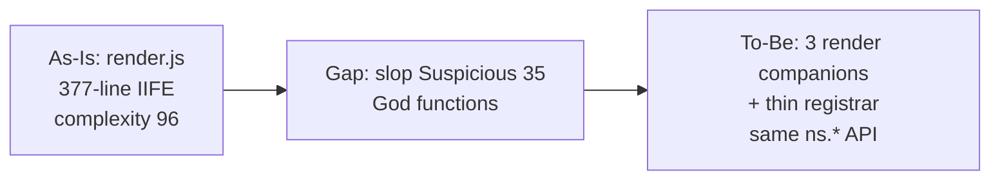
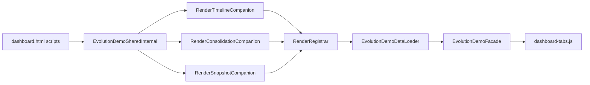
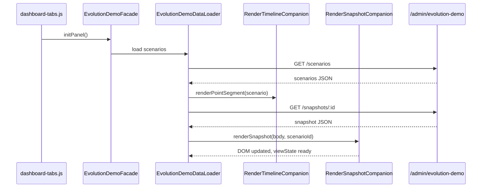
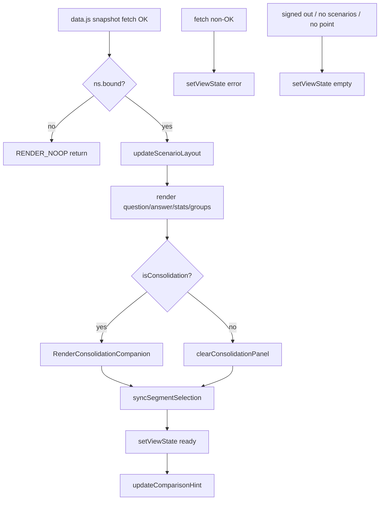

# Issue #450 memory-evolution render companion 분리 — Technical Design Document

## 목차

1. [서문](#1-서문)
2. [배경과 문제](#2-배경과-문제)
3. [현재 시스템](#3-현재-시스템)
4. [갭과 설계 전환](#4-갭과-설계-전환)
5. [상위설계](#5-상위설계)
6. [상세설계](#6-상세설계)
7. [마무리](#7-마무리)
- [부록 A. 출처·코드 위치](#부록-a-출처코드-위치)
- [부록 B. Ch.4 결정 전문](#부록-b-ch4-결정-전문)

## 이 문서 읽는 법

| 독자 | 먼저 볼 곳 | 목표 |
|------|-----------|------|
| PM | ## 1. 서문 opening + Goals → [§5](#5-상위설계) diagram | \~3분 |
| Dev | [§4](#4-갭과-설계-전환) → [§6](#6-상세설계) tables + [인수조건](#인수조건) | \~5분 |
| QA | [§6](#6-상세설계) [인수조건](#인수조건) → [테스트](#테스트) | \~3분 |
| 감사 | [§4](#4-갭과-설계-전환) 결정 요약 → [부록 A](#부록-a-출처코드-위치) | \~3분 |

## 1. 서문

Memento HTTP admin dashboard의 memory evolution demo 탭은 bundler 없이 여러 companion script로 구성된다. GitHub 이슈 [#450](https://github.com/jee1/memento/issues/450)는 [#445](https://github.com/jee1/memento/issues/445) PR-C 이후 `memory-evolution-demo-shell-render.js`에 남은 slop Suspicious(Score 35.0)를 해소하는 후속 작업을 PRD로 정의한다. PM·Dev·QA·감사 독자는 `## 이 문서 읽는 법` 경로표를 따르면 \~3\~5분 내 역할별 핵심을 확인할 수 있다. 본 TDD는 **동작·API·DOM 계약 불변** 조건에서 render companion 추가 분해 경계, script 로드 순서, slop·Vitest 검증 게이트를 정의한다. 구현은 단일 소규모 PR로 진행하며 merge gate는 기존 `npm test`·`lint`·`type-check`를 유지한다. slop 재스캔은 PR 증거용 advisory 측정이다 [ref:A-1].

### Goals / Non-Goals

**Goals:**

- `memory-evolution-demo-shell-render.js` JS/TS slop 분석 **Clean** 또는 Score ≤ 15 달성
- dashboard memory evolution 탭 view state(`loading` / `empty` / `error` / `ready`) 및 렌더 결과 UX 동일성 유지
- `__MEMENTO_EVOLUTION_DEMO_SHELL__.internal` render API(`renderSnapshot`, `renderPointSegment` 등) 시그니처 유지
- PR 본문 Before/After slop 명령 출력 및 인수조건·테스트 매핑 문서화

**Non-Goals:**

- SQLite 스키마·admin evolution-demo REST API 응답 형식 변경
- slop-detector CI merge 필수 게이트 승격
- `.slopconfig.yaml`에 dashboard spec ignore 추가
- `review-candidates-panel.js`·`recall-tool.ts` 등 #445 다른 PR 범위 재작업
- dashboard E2E 브라우저 자동화 신규 도입

## 2. 배경과 문제

2026-05-31 `slop-detector --project static/js --js --config .slopconfig.yaml` 재스캔 결과, `static/js` 전체 15파일 중 Suspicious 6건이 보고되었다 [ref:A-2]. Issue #450 PRD가 직접 지적하는 대상은 그중 `memory-evolution-demo-shell-render.js` 1건(Suspicious 35.0)이다 [source:prd#현재-상태]. [#445](https://github.com/jee1/memento/issues/445) PR-C는 monolith facade를 companion으로 분리하여 `shared`·`data`·facade는 Clean 상태에 도달했다 [ref:A-3].

slop-detector는 `renderMemoryGroups`(55줄), `renderEpisodicSources`(55줄), `renderSemanticResult`(40줄), `renderPointSegment`(48줄) 및 anonymous IIFE 루트를 God function으로 분류한다 [ref:A-4]. 이 파일은 snapshot JSON을 DOM(`med-*` id/class)으로 투영하는 유일한 render cluster이며, `data.js`가 fetch 완료 후 `ns.renderSnapshot`·`ns.renderPointSegment`를 호출한다 [ref:A-5]. render 회귀는 Vitest string spec `dashboard-memory-evolution-demo-shell.spec.ts`가 companion script 목록·핵심 문자열·CSS class를 assert한다 [ref:A-6].

Issue #450 PRD는 render 함수를 timeline / semantic·consolidation / snapshot 역할별 companion으로 추가 분리하고, IIFE 루트 복잡도를 낮출 것을 제안한다 [source:prd#제안-작업]. 완료 기준은 slop Clean(≤15), view state 4종 동일, CI 통과, PR slop Before/After 첨부다 [source:prd#완료-기준]. 본 설계는 **구조 리팩터**에 한정하며, [#445 TDD](https://github.com/jee1/memento/blob/main/docs/design/2026-05-30-issue-445-slop-refactor-tdd.md)에서 검증된 companion·facade 패턴을 render cluster에 2차 적용한다. 따라서 Ch.3에서는 `dashboard.html` script chain과 `shell.internal` render API 연결을 코드 기준으로 정리한다.

## 3. 현재 시스템

Issue #450이 지적한 render cluster는 `dashboard.html` script chain 안에서 동작한다. HTTP admin dashboard는 `packages/memento-server`가 `static/` 정적 자산을 서빙한다 [ref:A-7]. `static/dashboard.html`은 evolution demo companion을 `shared` → `render` → `data` → facade `memory-evolution-demo-shell.js` 순으로 `<script src>` 로드한다 [ref:A-8]. `dashboard-tabs.js`는 `evolution-demo` 탭 활성 시 `__MEMENTO_EVOLUTION_DEMO_SHELL__.initPanel()`·`refresh()`를 호출한다 [ref:A-9].

`memory-evolution-demo-shell-shared.js`는 전역 `__MEMENTO_EVOLUTION_DEMO_SHELL__`·`shell.internal`(`ns`)를 초기화하고, 시나리오 URL·view state·DOM cache(`ns.els`)·fetch helper·`setViewState`를 제공한다 [ref:A-10]. `VALID_STATES`는 `loading`, `empty`, `error`, `ready` 네 값이다 [ref:A-11]. `memory-evolution-demo-shell-data.js`는 시나리오 목록 fetch·point select change·snapshot fetch를 담당하며, 성공 시 `ns.renderPointSegment(scenario)`·`ns.renderSnapshot(result.body, scenarioId)`를 호출한다 [ref:A-5].

`memory-evolution-demo-shell-render.js`(381줄)는 단일 IIFE 안에 11개 render helper(내부 `buildComparisonHintMarkup` 포함)와 `renderSnapshot` orchestrator를 정의하고, 마지막에 10개 함수를 `shell.internal`에 attach한다 [ref:A-4]. `renderSnapshot`은 question/answer/memory summary·explanation·consolidation panel·memory groups·`syncSegmentSelection`·`setViewState('ready')`·`updateComparisonHint` 순으로 orchestrate한다 [ref:A-12]. facade `memory-evolution-demo-shell.js`는 얇은 `init()`만 유지한다 [ref:A-13].

품질 게이트는 merge 시 `npm test`, `npm run lint`, `npm run type-check`이며 [ref:A-14], evolution demo 회귀는 `packages/memento-server/src/server/dashboard-memory-evolution-demo-shell.spec.ts`의 HTML/JS/CSS 문자열 검사가 담당한다 [ref:A-6]. slop-detector는 `.github/workflows/slop-detector-js.yml`에서 advisory로만 실행된다 [ref:A-1]. 단일 파일 slop 실행 시 주석 em dash(`—`) 때문에 Python 파서가 syntax error를 내고 상단 Score 100 false positive가 발생할 수 있으나, 판정은 `[JS/TS Analysis]` 섹션을 따른다 [ref:A-15].

PRD가 지적한 render God function 잔여는 shared·data·facade companion과 단일 render IIFE가 공존하는 현재 script chain에서 발생한다. Ch.4에서는 render cluster 2차 분해 방향과 script 로드 순서를 확정한다.

## 4. 갭과 설계 전환

As-Is `render.js`는 PR-C 1차 분해 이후에도 **단일 anonymous IIFE**에 timeline·consolidation·snapshot orchestration이 공존한다 [ref:A-4]. slop-detector는 anonymous 블록 전체를 God function으로 집계하므로, 함수 단위로 파일 내부에만 두면 LOC·complexity가 한 파일에 누적된다 [ref:A-4]. #445 TDD는 bundler 부재 환경에서 **named top-level companion script**로 complexity를 분산하는 전략을 이미 채택했다 [ref:A-16].

To-Be는 render cluster를 **timeline / consolidation / snapshot** 세 companion + **얇은 render registrar** 네 파일로 재배치한다. 각 companion은 자체 IIFE에서 `shell.internal`에 함수를 attach하고, registrar는 attach만 담당하거나 snapshot orchestrator만 유지한다 [source:prd#제안-작업]. `data.js`·facade·`dashboard-tabs.js`가 호출하는 `ns.renderSnapshot` 등 public internal API 이름은 변경하지 않는다 [ref:A-5]. `dashboard.html` script 순서와 spec의 `SHELL_COMPANION_SCRIPTS` 배열만 companion 추가에 맞게 갱신한다 [ref:A-6].

검증 층은 변경되지 않는다. merge gate는 Vitest·lint·type-check이며 [ref:A-14], slop Before/After는 PR 증거용이다 [ref:A-1]. Issue #450 완료 기준 4항목은 AC-1\~AC-4로 Ch.6에 매핑한다. 아래 transition diagram은 As-Is render monolith에서 To-Be companion graph로의 방향을 한눈에 보여 준다.

Ch.4 Tier-1 결정은 render companion 경계, script 로드 순서, slop 검증 게이트, 주석 em dash 처리 네 주제로 수렴한다. 각 결정은 bundler-less dashboard 제약과 Issue #450 완료 기준을 동시에 만족해야 한다. 아래 결정 요약 표는 감사·PM용 인덱스이며, 각 주제의 근거·코드 앵커·공식 참고는 직후 decision card 본문에 기술한다.

### 결정 요약

Tier-1 네 결정은 render 파일 분할·로드 순서·slop 증거·주석 ASCII화로 Issue #450 AC를 충족한다. 표의 **상태** 열은 모두 `확정`이며 Ch.5\~6 To-Be 설계는 이 선택만 따른다.

| # | 주제 | 선택 | 상태 | 근거 한줄 |
|---|------|------|------|-----------|
| 1 | render companion 경계 | timeline / consolidation / snapshot 3분할 | 확정 | slop anonymous IIFE 분산 + #445 관례 |
| 2 | script 로드 순서 | shared → 3 render companions → registrar → data → facade | 확정 | `ns` 선행 초기화 + data가 render API 사용 |
| 3 | slop CI 게이트 | advisory 유지 | 확정 | #314·#445와 동일 정책 |
| 4 | em dash 주석 | ASCII `-`로 치환(선택 일괄) | 확정 | Python 파서 false positive 완화 |

### render companion 3분할 경계

PR-C 이후 render cluster만 2차 분해 대상이다. timeline·consolidation·snapshot 책임은 DOM id(`med-point-segment`, `med-consolidation-panel` 등)와 `ns.isConsolidation`·`ns.isForgettingPolicy` 분기에서 코드상 이미 구분되어 있어 파일 경계로 승격하기 적합하다 [ref:A-12]. slop는 파일 단위 IIFE LOC를 측정하므로 companion 분할이 Score 35→15 이하로 내리는 1차 수단이다.

| 항목 | 내용 |
|------|------|
| 결정 | `memory-evolution-demo-shell-render-timeline.js`, `-consolidation.js`, `-snapshot.js`를 신규 추가하고 `memory-evolution-demo-shell-render.js`는 registrar(≤80 LOC 목표)로 축소 |
| 상태 | 확정 |
| 코드 | `static/js/memory-evolution-demo-shell-render.js:4-379` |

**근거 설명:** slop God function 경고의 주 원인은 377줄 anonymous IIFE 전체 집계다. companion 파일은 파일당 named top-level IIFE로 slop가 `(anonymous)` 블록을 분리 측정한다. `renderSnapshot` orchestrator는 snapshot companion에 두되 `ns.renderSnapshot` attach 이름은 유지해 `data.js` 변경을 최소화한다. consolidation companion은 `renderEpisodicSources`·`renderSemanticResult`·`renderSearchComparison`·`renderConsolidationPanel` cluster를 수용한다.

**참고:** [MDN Script loading](https://developer.mozilla.org/en-US/docs/Web/HTML/Element/script) — 순차 script 실행·전역 공유 모델

### dashboard script 로드 순서

companion 추가 시 `shell.internal`이 render attach 전에 존재해야 한다. script 순서 오류는 런타임 `ns.renderSnapshot is not a function`로 즉시 드러나므로 HTML과 string spec을 dual gate로 삼는다 [ref:A-6].

| 항목 | 내용 |
|------|------|
| 결정 | `dashboard.html` 및 spec `SHELL_COMPANION_SCRIPTS`를 `shared` → `render-timeline` → `render-consolidation` → `render-snapshot` → `render`(registrar) → `data` → `memory-evolution-demo-shell.js` 순으로 갱신 |
| 상태 | 확정 |
| 코드 | `static/dashboard.html:383-386`, `dashboard-memory-evolution-demo-shell.spec.ts:12-17` |

**근거 설명:** `shared.js`가 `__MEMENTO_EVOLUTION_DEMO_SHELL__`·`ns.els`·helper를 먼저 정의한다. render companions는 `ns`에 함수를 attach하고, `data.js`가 fetch callback에서 `ns.renderSnapshot`을 호출하므로 render companions는 **반드시 data.js보다 앞**에 로드해야 한다. registrar는 snapshot companion이 정의한 orchestrator를 re-export하거나 no-op attach만 수행해 slop 단일 파일 LOC를 낮춘다.

**참고:** [Issue #445 TDD Ch.4 dashboard companion](https://github.com/jee1/memento/blob/main/docs/design/2026-05-30-issue-445-slop-refactor-tdd.md) — 동일 bundler-less 패턴

### slop 검증 게이트

slop 점수는 merge blocker가 아니다. Issue #450 완료 증거와 CI merge gate를 분리해 기록한다.

| 항목 | 내용 |
|------|------|
| 결정 | PR 본문에 Issue #450 재현 명령 Before/After를 첨부하고, merge gate는 `npm test`·`lint`·`type-check`만 사용 |
| 상태 | 확정 |
| 코드 | `.github/workflows/slop-detector-js.yml:32-43` |

**근거 설명:** #314·#445에서 slop workflow를 필수 check로 등록하지 않기로 했다. 프로덕션 dashboard JS는 string spec coverage가 제한적이므로, 대상 파일 단위 Before/After가 backlog 추적에 더 actionable하다. AC-1 slop Clean은 PR merge 조건이 아니라 Issue #450 완료 증거다.

**참고:** [ai-slop-detector PyPI](https://pypi.org/project/ai-slop-detector/) — Deficit Score 구간 해석

### em dash 주석 정리

render companion 파일 헤더 주석에 Unicode em dash가 포함되어 Python 파서가 syntax error를 낸다 [ref:A-15].

| 항목 | 내용 |
|------|------|
| 결정 | 신규·수정 companion 헤더 주석의 `—`를 ASCII `-`로 치환한다 |
| 상태 | 확정 |
| 코드 | `static/js/memory-evolution-demo-shell-render.js:2`, `memory-evolution-demo-shell-data.js:2` |

**근거 설명:** em dash 치환은 런타임 동작에 영향이 없으며 slop 단일 파일 리포트의 false positive 100점을 줄인다. JS/TS Analysis 판정은 이미 정확하나 PR reviewer 혼선을 방지한다. 범위는 evolution demo companion 헤더에 한정해 diff를 작게 유지한다.

**참고:** [Unicode U+2014 EM DASH](https://unicode.org/charts/PDF/U2000.pdf) — 비-ASCII 주석 파서 이슈 배경

render 3분할·script 순서·advisory slop·em dash 정리 네 결정에 따라 To-Be 상위설계는 shared state·render companions·data loader·string spec 회귀 네 축으로 재배치한다.

## 5. 상위설계

Ch.4에서 확정한 companion 경계에 따라, 사용자·`dashboard-tabs.js`·`data.js`가 관찰하는 계약(`__MEMENTO_EVOLUTION_DEMO_SHELL__`, view state 4종, DOM id/class)은 변하지 않는다. 변경은 static JS 파일 그래프와 slop 지표에만 한정된다. 단일 PR은 `static/js/memory-evolution-*`·`static/dashboard.html`·`dashboard-memory-evolution-demo-shell.spec.ts`만 수정한다.

### 아키텍처 개요

As-Is 단일 `render.js` IIFE를 To-Be에서는 **shared internal state + 3 render companions + thin registrar + data loader + facade** chain으로 표현한다. admin REST API(`/admin/evolution-demo/*`)는 변경하지 않는다 [ref:A-10].

### 구성요소 및 책임

To-Be는 brownfield dashboard 정적 모듈 그래프다. 기존 shared·data·facade는 coordinator 역할을 유지하고, render cluster만 3 companion + registrar로 쪼갠다.

- **EvolutionDemoSharedInternal** (기존): `__MEMENTO_EVOLUTION_DEMO_SHELL__.internal` state·DOM cache·fetch·view state helper [ref:A-10]
- **RenderTimelineCompanion** (신규): point segment tablist·comparison hint·segment selection sync [ref:A-4]
- **RenderConsolidationCompanion** (신규): episodic sources list·semantic result card·search comparison·consolidation panel [ref:A-12]
- **RenderSnapshotCompanion** (신규): memory stats/groups·`renderSnapshot` orchestrator·`setViewState('ready')` [ref:A-12]
- **RenderRegistrar** (기존): `memory-evolution-demo-shell-render.js` script 앵커; registrar ≤80 LOC [ref:A-8]
- **EvolutionDemoDataLoader** (기존): scenario/snapshot fetch; `ns.renderPointSegment`·`ns.renderSnapshot` 호출 [ref:A-5]
- **EvolutionDemoFacade** (기존): `initPanel`/`refresh` thin entry [ref:A-13]
- **SlopVerificationEvidence** (신규): PR Before/After slop CLI 출력 절차 [ref:A-1]

### 데이터 흐름

happy path는 탭 활성 → init → scenario fetch → point controls render → snapshot fetch → snapshot DOM render → ready view state 순이다. consolidation 시나리오는 snapshot render 중 consolidation companion branch가 추가 DOM을 채운다.

1. 사용자가 evolution demo 탭을 선택하면 `dashboard-tabs.js`가 `__MEMENTO_EVOLUTION_DEMO_SHELL__.initPanel()`을 호출한다 (sync) [ref:A-9].
2. `data.js`가 admin API에서 scenario 목록을 fetch하고 view state를 갱신한다 (sync/async) [ref:A-5].
3. scenario 선택 시 `RenderTimelineCompanion`이 point segment·select UI를 그린다 (sync) [ref:A-4].
4. point/scenario 변경 시 snapshot URL로 fetch한다 (async) [ref:A-10].
5. fetch 성공 시 `RenderSnapshotCompanion.renderSnapshot`이 question/answer/stats/groups/explanation DOM을 채운다 (sync) [ref:A-12].
6. consolidation scenario면 `RenderConsolidationCompanion`이 episodic·semantic·comparison panel을 추가 렌더한다 (sync) [ref:A-12].
7. orchestrator가 `ns.setViewState('ready')`로 content panel을 표시한다 (sync) [ref:A-11].
8. fetch non-OK는 `setViewState('error')`, signed-out·no scenarios·no pointId는 `setViewState('empty')` 분기를 유지한다 (sync) [ref:A-5].

## 6. 상세설계

Ch.5 구성요소와 파일·책임 매핑은 아래와 같다. **EvolutionDemoSharedInternal**은 `shared.js`가 state·fetch를 소유하고, **RenderTimelineCompanion**·**RenderConsolidationCompanion**·**RenderSnapshotCompanion**이 render attach를 분담한다. **RenderRegistrar**는 script chain 앵커이며, **EvolutionDemoDataLoader**·**EvolutionDemoFacade**는 fetch·init orchestration을 유지한다. **SlopVerificationEvidence**는 PR 본문 CLI Before/After 기록 절차다 [ref:A-1].

| Ch.5 component | Source file(s) | Role in this change |
|----------------|----------------|---------------------|
| EvolutionDemoSharedInternal | `memory-evolution-demo-shell-shared.js` | unchanged state/DOM/fetch |
| RenderTimelineCompanion | `memory-evolution-demo-shell-render-timeline.js` | new |
| RenderConsolidationCompanion | `memory-evolution-demo-shell-render-consolidation.js` | new |
| RenderSnapshotCompanion | `memory-evolution-demo-shell-render-snapshot.js` | new |
| RenderRegistrar | `memory-evolution-demo-shell-render.js` | shrink to registrar |
| EvolutionDemoDataLoader | `memory-evolution-demo-shell-data.js` | unchanged call sites |
| EvolutionDemoFacade | `memory-evolution-demo-shell.js` | unchanged init |
| SlopVerificationEvidence | PR template / Issue #450 body | Before/After slop CLI |

아래 표는 Issue #450 구현 시 파일·internal API·검증 매핑의 단일 색인이다. 모든 변경은 export된 `ns.*` render 함수 이름과 DOM selector contract를 유지해야 한다.

| 영역 | 주요 파일 | CI gate |
|------|-----------|---------|
| Render split | `memory-evolution-demo-shell-render-*.js`, `render.js` | `npm test` (server spec) [ref:A-6] |
| HTML order | `static/dashboard.html` | `npm test` (server spec) [ref:A-6] |
| Slop evidence | PR 본문 CLI 출력 | advisory [ref:A-1] |

### API 및 인터페이스

외부 HTTP API(`/admin/evolution-demo/scenarios`, `/admin/evolution-demo/snapshots/{id}`)는 변경하지 않는다 [ref:A-10]. dashboard JavaScript **internal render contract**는 `shell.internal` 함수 attach로 유지한다 [ref:A-5].

**Internal render API (unchanged signatures)**

| Function | Owner | Parameters | Note |
|----------|-------|------------|------|
| `renderSnapshot` | RenderSnapshotCompanion | `(snapshot, scenarioId?)` | orchestrator; `ready` 후 `updateComparisonHint` [ref:A-12] |
| `renderPointSegment` | RenderTimelineCompanion | `(scenario)` | tablist + select visibility [ref:A-4] |
| `renderMemoryGroups` | RenderSnapshotCompanion | `(snapshot, scenarioId)` | forgetting-policy scenario only [ref:A-4] |
| `renderMemoryStats` | RenderSnapshotCompanion | `(memorySummary)` | stat chips [ref:A-4] |
| `renderEpisodicSources` | RenderConsolidationCompanion | `(sources)` | list items [ref:A-12] |
| `renderSemanticResult` | RenderConsolidationCompanion | `(result)` | semantic card [ref:A-12] |
| `renderSearchComparison` | RenderConsolidationCompanion | `(comparison)` | search diff UI [ref:A-12] |
| `renderConsolidationPanel` | RenderConsolidationCompanion | `(snapshot)` | consolidation layout [ref:A-12] |
| `syncSegmentSelection` | RenderTimelineCompanion | `(pointId)` | aria-selected sync [ref:A-4] |
| `updateComparisonHint` | RenderTimelineCompanion | `(pointId)` | hint markup [ref:A-4] |

**Admin evolution-demo HTTP (unchanged)**

| Method | Path | Auth | Response |
|--------|------|------|----------|
| GET | `/admin/evolution-demo/scenarios` | dashboard session / API key | `{ scenarios: [...] }` [ref:A-10] |
| GET | `/admin/evolution-demo/snapshots/{scenarioId}/{pointId}` | dashboard session / API key | snapshot body JSON [ref:A-10] |

**Error handling (client-side, unchanged semantics)**

| Code | Condition | Handler | Client action | Retry? |
|------|-----------|---------|---------------|--------|
| `VIEW_EMPTY` | signed out or no scenarios | `setViewState('empty')` | show empty copy | no [ref:A-11] |
| `VIEW_ERROR` | fetch non-OK or parse fail | `setViewState('error')` | show error panel | user retry via refresh [ref:A-5] |
| `RENDER_NOOP` | `!ns.bound` or missing snapshot | early return in render | keep prior DOM | no [ref:A-12] |

### 데이터 모델

영속 스키마 변경 없음. render companions는 admin API JSON과 in-memory view state만 소비한다 [ref:A-10].

**Snapshot (API body, read-only)**

| Field | Type | Nullable | Constraint | Notes |
|-------|------|----------|------------|-------|
| `question` | string | yes | — | `med-question-text` [ref:A-12] |
| `answer` | string | yes | — | `med-answer-text` [ref:A-12] |
| `memory_summary` | object | yes | stat keys episodic/semantic/forgotten/preserved | chips via `renderMemoryStats` [ref:A-4] |
| `memory_groups` | array | yes | forgetting-policy scenario | `renderMemoryGroups` [ref:A-4] |
| `point_id` | string | yes | — | segment sync [ref:A-4] |
| `explanation` | string | yes | — | explanation section [ref:A-12] |
| `episodic_sources` | array | yes | consolidation scenario | episodic list [ref:A-12] |
| `semantic_result` | object | yes | consolidation scenario | semantic card [ref:A-12] |
| `search_comparison` | object | yes | consolidation scenario | search diff UI [ref:A-12] |

**View state (`ns.viewState`)**

| State | Enter trigger | Exit trigger | Side effects |
|-------|---------------|--------------|--------------|
| `loading` | initPanel / refresh start | fetch completes | show `#med-loading` [ref:A-11] |
| `empty` | no auth or no data | successful load | show `#med-empty` [ref:A-11] |
| `error` | fetch failure | user refresh success | show `#med-error` [ref:A-11] |
| `ready` | renderSnapshot completes (`setViewState('ready')` then hint) | next load cycle | show `#med-content` [ref:A-12] |

### 핵심 처리 흐름

리팩터 후 snapshot render happy path와 error branch는 As-Is와 동일한 순서를 유지한다. companion 분해는 함수 정의 위치만 변경하며 **EvolutionDemoDataLoader**가 `renderPointSegment`(Timeline) → `renderSnapshot`(Snapshot)을 호출하고, Snapshot orchestrator 내부에서 consolidation 분기·segment sync·`ready`·hint(Timeline) 순을 유지한다 [ref:A-5]. `VIEW_ERROR`·`VIEW_EMPTY` 분기는 HTTP non-OK→`error`, signed-out/no data→`empty`로 `data.js`와 동일하다 [ref:A-5].

### 인수조건

AC는 Issue #450 완료의 객관적 정의다. slop Clean은 **SlopVerificationEvidence** 절차로 기록하는 advisory 증거이며, merge 방어선은 Vitest string spec(**EvolutionDemoFacade**·**EvolutionDemoDataLoader** 계약)과 repo-wide CI gate다 [ref:A-6]. AC-1\~AC-3는 Must, AC-4는 PR 본문 Should다.

| AC ID | PRD | 인수조건 | 우선순위 | 완료 판정 |
|-------|-----|----------|----------|-----------|
| AC-1 | [source:prd#완료-기준] (항목 1: render.js Clean) | Given `memory-evolution-demo-shell-render.js` 및 신규 render companion When `slop-detector … --js` Then `[JS/TS Analysis]`에서 해당 파일들 Score ≤ 15 (Clean) | Must | T-1 slop output + T-2 pass |
| AC-2 | [source:prd#완료-기준] (항목 2: view state 4종) | Given dashboard evolution demo tab When loading/empty/error/ready 각 상태 Then As-Is와 동일 DOM id·class·copy·API URL 패턴 유지 | Must | T-2 spec pass |
| AC-3 | [source:prd#완료-기준] (항목 3: CI) | Given PR branch When `npm test` `npm run lint` `npm run type-check` Then exit 0 | Must | T-3 CI/local pass |
| AC-4 | [source:prd#완료-기준] (항목 4: PR slop evidence) | Given PR opened When reviewer reads body Then slop Before/After CLI 명령·Score 요약 포함 | Should | T-1 evidence in PR |

### 테스트

brownfield 회귀는 server package Vitest string spec과 repo-wide CI gate로 AC를 증명한다. **RenderRegistrar** script 목록 변경은 T-2가 가장 먼저 탐지하며, slop Before/After는 T-1이 담당한다. 브라우저 E2E는 본 이슈 범위 밖이므로 AC-2는 string spec + 수동 4-state smoke로 보완한다 [ref:A-6].

| Test ID | AC ID | Layer | 시나리오 | Fixture / Mock | CI gate |
|---------|-------|-------|----------|----------------|---------|
| T-1 | AC-1, AC-4 | integration (CLI) | `slop-detector static/js/memory-evolution-demo-shell-render*.js --js` Before/After | ai-slop-detector 3.7.3, `.slopconfig.yaml` | no |
| T-2 | AC-1, AC-2 | integration | `dashboard-memory-evolution-demo-shell.spec.ts` — companion script paths·render strings·CSS classes | `readFileSync` static assets [ref:A-6] | yes |
| T-3 | AC-3 | integration | `npm test`, `npm run lint`, `npm run type-check` | CI workflow / local | yes |

## 7. 마무리

### 롤아웃·일정

구현은 단일 PR(`chore/issue-450-slop-render-refactor` 또는 Issue #450 링크)로 배포한다. `static/dashboard.html` script 순서 변경은 서버 재시art 없이 정적 자산 교체로 반영된다. feature flag 없음. merge 후 Issue #450 체크리스트·slop After 출력으로 close한다.

### 리스크

| Risk | Impact | Mitigation |
|------|--------|------------|
| script 순서 오류로 `ns.renderSnapshot` undefined | 탭 blank/error | spec `SHELL_COMPANION_SCRIPTS`·HTML 순서 dual assert [ref:A-6] |
| companion 분해 중 circular attach | runtime error | shared만 state 소유; companions는 attach-only [ref:A-10] |
| slop Clean 미달 | Issue 미완 | 추가 micro-split(registrar 제거) 또는 함수 LOC 추가 분할 |
| string spec false confidence | UX regression undetected | manual dashboard smoke on 4 view states |

### 열린 질문

- **없음** — Ch.4 Tier-1 결정 모두 `확정` 상태다.

## 부록 A. 출처·코드 위치

| ID | 주장 | PRD | Code | External URL |
|----|------|-----|------|----------------|
| A-1 | slop workflow는 advisory; merge gate는 test/lint/type-check | [source:prd#관련] | `.github/workflows/slop-detector-js.yml` | [ai-slop-detector](https://pypi.org/project/ai-slop-detector/) |
| A-2 | static/js 15파일 스캔 Suspicious 6건; PRD 대상 render.js 1건 | [source:prd#현재-상태] | `static/js/` | |
| A-3 | PR-C 후 facade/data/shared Clean | [source:prd#현재-상태] | `static/js/memory-evolution-demo-shell.js`, `-data.js`, `-shared.js` | [#445](https://github.com/jee1/memento/issues/445) |
| A-4 | render.js Suspicious 35; IIFE 377줄 complexity 96 | [source:prd#현재-상태] | `static/js/memory-evolution-demo-shell-render.js:4-379` | |
| A-5 | data.js calls renderSnapshot/renderPointSegment | [source:prd#제안-작업] | `static/js/memory-evolution-demo-shell-data.js:28-113` | |
| A-6 | string spec companion list + DOM asserts | [source:prd#완료-기준] | `packages/memento-server/src/server/dashboard-memory-evolution-demo-shell.spec.ts:12-214` | |
| A-7 | memento-server serves static/ | | `packages/memento-server/src/server/http-server.ts:176` | |
| A-8 | dashboard.html script load order | | `static/dashboard.html:383-386` | |
| A-9 | tabs initPanel/refresh | | `static/js/dashboard-tabs.js:63-73` | |
| A-10 | shared URLs, fetch, ns helpers | | `static/js/memory-evolution-demo-shell-shared.js:11-12` | |
| A-11 | VALID_STATES four values | | `static/js/memory-evolution-demo-shell-shared.js:13` | |
| A-12 | renderSnapshot orchestration + consolidation branch | | `static/js/memory-evolution-demo-shell-render.js:320-368` | |
| A-13 | thin facade init | | `static/js/memory-evolution-demo-shell.js:15-42` | |
| A-14 | merge gate npm test/lint/type-check | [source:prd#완료-기준] | `AGENTS.md`, `DEVELOPMENT_RULES.md` | |
| A-15 | em dash causes Python parser false positive | [source:prd#현재-상태] | `static/js/memory-evolution-demo-shell-render.js:2` | |
| A-16 | #445 companion strategy precedent | | `docs/design/2026-05-30-issue-445-slop-refactor-tdd.md` | [#445 TDD](https://github.com/jee1/memento/blob/main/docs/design/2026-05-30-issue-445-slop-refactor-tdd.md) |

## 부록 B. Ch.4 결정 전문

### render companion 3분할 경계

PR-C 이후 render cluster만 2차 분해 대상이다. timeline·consolidation·snapshot 책임이 DOM id·시나리오 분기에서 명확히 갈린다.

| 항목 | 내용 |
|------|------|
| 결정 | `memory-evolution-demo-shell-render-timeline.js`, `-consolidation.js`, `-snapshot.js`를 신규 추가하고 `memory-evolution-demo-shell-render.js`는 registrar(≤80 LOC 목표)로 축소 |
| 상태 | 확정 |
| 코드 | `static/js/memory-evolution-demo-shell-render.js:4-379` |

**근거 설명:** slop God function 경고의 주 원인은 377줄 anonymous IIFE 전체 집계다. companion 파일은 파일당 named top-level IIFE로 slop가 `(anonymous)` 블록을 분리 측정한다. `renderSnapshot` orchestrator는 snapshot companion에 두되 `ns.renderSnapshot` attach 이름은 유지해 `data.js` 변경을 최소화한다. consolidation companion은 `renderEpisodicSources`·`renderSemanticResult`·`renderSearchComparison`·`renderConsolidationPanel` cluster를 수용한다.

**참고:** [MDN Script loading](https://developer.mozilla.org/en-US/docs/Web/HTML/Element/script) — 순차 script 실행·전역 공유 모델

### dashboard script 로드 순서

companion 추가 시 `shell.internal`이 render attach 전에 존재해야 한다. script 순서 오류는 런타임 `ns.renderSnapshot is not a function`로 즉시 드러나므로 HTML과 string spec을 dual gate로 삼는다 [ref:A-6].

| 항목 | 내용 |
|------|------|
| 결정 | `dashboard.html` 및 spec `SHELL_COMPANION_SCRIPTS`를 `shared` → `render-timeline` → `render-consolidation` → `render-snapshot` → `render`(registrar) → `data` → `memory-evolution-demo-shell.js` 순으로 갱신 |
| 상태 | 확정 |
| 코드 | `static/dashboard.html:383-386`, `dashboard-memory-evolution-demo-shell.spec.ts:12-17` |

**근거 설명:** `shared.js`가 `__MEMENTO_EVOLUTION_DEMO_SHELL__`·`ns.els`·helper를 먼저 정의한다. render companions는 `ns`에 함수를 attach하고, `data.js`가 fetch callback에서 `ns.renderSnapshot`을 호출하므로 render companions는 **반드시 data.js보다 앞**에 로드해야 한다. registrar는 snapshot companion이 정의한 orchestrator를 re-export하거나 no-op attach만 수행해 slop 단일 파일 LOC를 낮춘다.

**참고:** [Issue #445 TDD Ch.4 dashboard companion](https://github.com/jee1/memento/blob/main/docs/design/2026-05-30-issue-445-slop-refactor-tdd.md) — 동일 bundler-less 패턴

### slop 검증 게이트

slop 점수는 merge blocker가 아니다. Issue #450 완료 증거와 CI merge gate를 분리해 기록한다.

| 항목 | 내용 |
|------|------|
| 결정 | PR 본문에 Issue #450 재현 명령 Before/After를 첨부하고, merge gate는 `npm test`·`lint`·`type-check`만 사용 |
| 상태 | 확정 |
| 코드 | `.github/workflows/slop-detector-js.yml:32-43` |

**근거 설명:** #314·#445에서 slop workflow를 필수 check로 등록하지 않기로 했다. 프로덕션 dashboard JS는 string spec coverage가 제한적이므로, 대상 파일 단위 Before/After가 backlog 추적에 더 actionable하다. AC-1 slop Clean은 PR merge 조건이 아니라 Issue #450 완료 증거다.

**참고:** [ai-slop-detector PyPI](https://pypi.org/project/ai-slop-detector/) — Deficit Score 구간 해석

### em dash 주석 정리

render companion 파일 헤더 주석에 Unicode em dash가 포함되어 Python 파서가 syntax error를 낸다 [ref:A-15].

| 항목 | 내용 |
|------|------|
| 결정 | 신규·수정 companion 헤더 주석의 `—`를 ASCII `-`로 치환한다 |
| 상태 | 확정 |
| 코드 | `static/js/memory-evolution-demo-shell-render.js:2`, `memory-evolution-demo-shell-data.js:2` |

**근거 설명:** em dash 치환은 런타임 동작에 영향이 없으며 slop 단일 파일 리포트의 false positive 100점을 줄인다. JS/TS Analysis 판정은 이미 정확하나 PR reviewer 혼선을 방지한다. 범위는 evolution demo companion 헤더에 한정해 diff를 작게 유지한다.

**참고:** [Unicode U+2014 EM DASH](https://unicode.org/charts/PDF/U2000.pdf) — 비-ASCII 주석 파서 이슈 배경
