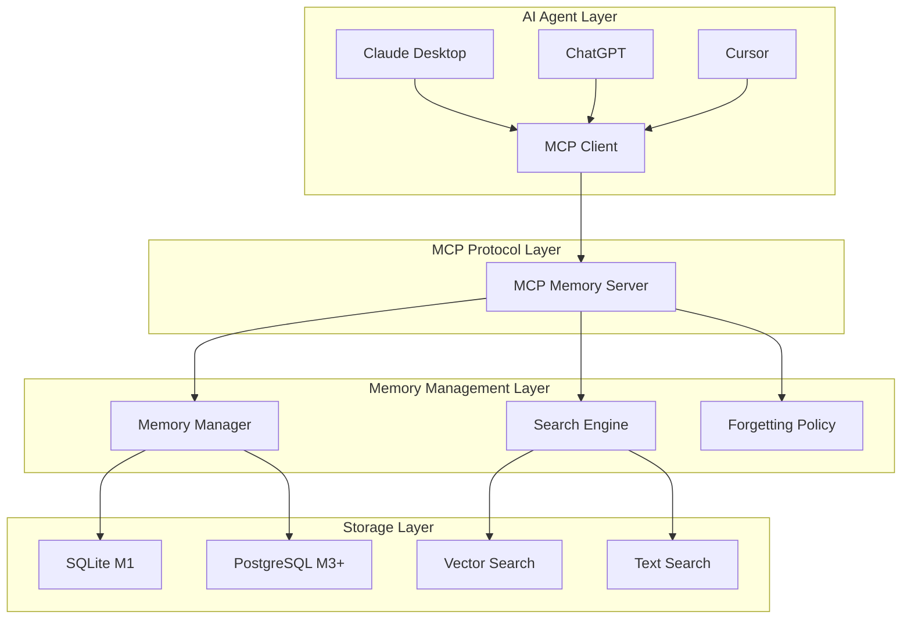

# 개발자 가이드

## 개요

이 가이드는 Memento MCP Server의 개발 환경 설정, 아키텍처 이해, 기여 방법을 설명합니다.

## 목차

1. [개발 환경 설정](#개발-환경-설정)
2. [프로젝트 구조](#프로젝트-구조)
3. [아키텍처 이해](#아키텍처-이해)
4. [개발 워크플로우](#개발-워크플로우)
5. [테스트 작성](#테스트-작성)
6. [기여 방법](#기여-방법)

## 개발 환경 설정

### 필수 요구사항

- **Node.js**: 20.0.0 이상
- **npm**: 10.0.0 이상
- **TypeScript**: 5.0.0 이상
- **Git**: 2.30.0 이상

### 개발 도구

- **IDE**: VS Code (권장)
- **확장 프로그램**:
  - TypeScript and JavaScript Language Features
  - ESLint
  - Prettier
  - Jest
  - GitLens

### 환경 설정

#### 1. 저장소 클론

```bash
git clone https://github.com/your-org/memento.git
cd memento
```

#### 2. 의존성 설치

```bash
# 프로덕션 의존성
npm install

# 개발 의존성
npm install -D
```

#### 3. 환경 변수 설정

```bash
# 환경 변수 파일 복사
cp .env.example .env

# 환경 변수 편집
# .env 파일을 편집하여 필요한 설정을 입력하세요
```

#### 4. 데이터베이스 초기화

```bash
# SQLite 데이터베이스 초기화
npm run db:init

# 테스트 데이터베이스 초기화
npm run db:init:test
```

#### 5. 개발 서버 시작

```bash
# 핫 리로드와 함께 개발 서버 시작
npm run dev

# 별도 터미널에서 테스트 실행
npm run test:watch
```

### VS Code 설정

#### .vscode/settings.json

```json
{
  "typescript.preferences.importModuleSpecifier": "relative",
  "editor.formatOnSave": true,
  "editor.codeActionsOnSave": {
    "source.fixAll.eslint": true
  },
  "jest.jestCommandLine": "npm run test",
  "jest.autoRun": "watch"
}
```

#### .vscode/launch.json

```json
{
  "version": "0.2.0",
  "configurations": [
    {
      "name": "Debug MCP Server",
      "type": "node",
      "request": "launch",
      "program": "${workspaceFolder}/src/server/index.ts",
      "outFiles": ["${workspaceFolder}/dist/**/*.js"],
      "env": {
        "NODE_ENV": "development"
      },
      "console": "integratedTerminal"
    },
    {
      "name": "Debug Tests",
      "type": "node",
      "request": "launch",
      "program": "${workspaceFolder}/node_modules/.bin/jest",
      "args": ["--runInBand", "--no-cache"],
      "console": "integratedTerminal",
      "internalConsoleOptions": "neverOpen"
    }
  ]
}
```

## 프로젝트 구조

```
memento/
├── src/                          # 소스 코드
│   ├── server/                   # MCP 서버
│   │   ├── index.ts             # 서버 진입점
│   │   ├── tools/               # MCP Tools 구현
│   │   │   ├── remember.ts      # remember 도구
│   │   │   ├── recall.ts        # recall 도구
│   │   │   ├── pin.ts           # pin/unpin 도구
│   │   │   ├── forget.ts        # forget 도구
│   │   │   ├── summarize-thread.ts
│   │   │   ├── link.ts          # link 도구
│   │   │   ├── export.ts        # export 도구
│   │   │   ├── feedback.ts      # feedback 도구
│   │   │   └── index.ts         # 도구 내보내기
│   │   ├── resources/           # MCP Resources 구현
│   │   │   ├── memory.ts        # memory/{id} 리소스
│   │   │   ├── search.ts        # memory/search 리소스
│   │   │   └── index.ts
│   │   ├── prompts/             # MCP Prompts 구현
│   │   │   ├── memory-injection.ts
│   │   │   └── index.ts
│   │   ├── database/            # 데이터베이스 관련
│   │   │   ├── sqlite.ts        # SQLite 구현
│   │   │   ├── postgres.ts      # PostgreSQL 구현
│   │   │   ├── migrations/      # 마이그레이션
│   │   │   └── index.ts
│   │   └── middleware/          # 미들웨어
│   │       ├── auth.ts          # 인증 미들웨어
│   │       ├── logging.ts       # 로깅 미들웨어
│   │       └── error.ts         # 에러 처리 미들웨어
│   ├── client/                  # MCP 클라이언트
│   │   ├── index.ts             # 클라이언트 진입점
│   │   ├── memory-manager.ts    # 메모리 관리자
│   │   ├── mcp-client.ts        # MCP 클라이언트 래퍼
│   │   └── types.ts             # 클라이언트 타입
│   ├── algorithms/              # 검색 및 망각 알고리즘
│   │   ├── search-ranking.ts    # 검색 랭킹 알고리즘
│   │   ├── forgetting.ts        # 망각 알고리즘
│   │   ├── spaced-review.ts     # 간격 반복 알고리즘
│   │   └── index.ts
│   └── shared/                  # 공통 유틸리티
│       ├── types.ts             # 공통 타입 정의
│       ├── utils.ts             # 유틸리티 함수
│       ├── constants.ts         # 상수 정의
│       └── validation.ts        # 검증 함수
├── tests/                       # 테스트 코드
│   ├── unit/                    # 단위 테스트
│   │   ├── tools/              # 도구 테스트
│   │   ├── algorithms/         # 알고리즘 테스트
│   │   └── utils/              # 유틸리티 테스트
│   ├── integration/            # 통합 테스트
│   │   ├── mcp-server.test.ts  # MCP 서버 통합 테스트
│   │   └── database.test.ts    # 데이터베이스 통합 테스트
│   ├── e2e/                    # E2E 테스트
│   │   └── memory-workflow.test.ts
│   └── fixtures/               # 테스트 데이터
│       ├── memories.json       # 샘플 기억 데이터
│       └── test-db.sql         # 테스트 데이터베이스
├── docs/                       # 문서
├── scripts/                    # 빌드 및 배포 스크립트
│   ├── build.js               # 빌드 스크립트
│   ├── deploy.js              # 배포 스크립트
│   └── db-migrate.js          # 데이터베이스 마이그레이션
├── docker/                     # Docker 관련 파일
│   ├── Dockerfile             # M1 Dockerfile
│   ├── Dockerfile.m3          # M3 Dockerfile
│   ├── docker-compose.dev.yml # 개발 환경
│   ├── docker-compose.team.yml # 팀 환경
│   └── docker-compose.org.yml # 조직 환경
├── .cursor/rules/              # Cursor 개발 규칙
├── .github/                    # GitHub Actions
│   └── workflows/
│       ├── ci.yml             # CI 파이프라인
│       ├── test.yml           # 테스트 파이프라인
│       └── deploy.yml         # 배포 파이프라인
├── package.json               # 프로젝트 설정
├── tsconfig.json              # TypeScript 설정
├── jest.config.js             # Jest 설정
├── .eslintrc.js               # ESLint 설정
├── .prettierrc                # Prettier 설정
└── README.md                  # 프로젝트 문서
```

## 아키텍처 이해

### 전체 아키텍처



### 핵심 컴포넌트

#### 1. MCP 서버 (`src/server/`)

MCP 프로토콜을 구현하는 핵심 서버입니다.

**주요 파일**:
- `index.ts`: 서버 진입점, MCP 서버 초기화
- `tools/`: MCP Tools 구현
- `resources/`: MCP Resources 구현
- `prompts/`: MCP Prompts 구현

**예시 코드**:
```typescript
// src/server/index.ts
import { Server } from '@modelcontextprotocol/sdk/server';
import { rememberTool } from './tools/remember';
import { recallTool } from './tools/recall';

const server = new Server({
  name: 'memento-memory-server',
  version: '0.1.0'
});

// Tools 등록
server.tool('remember', rememberTool);
server.tool('recall', recallTool);

// 서버 시작
server.start();
```

#### 2. 검색 엔진 (`src/algorithms/`)

기억 검색을 위한 알고리즘을 구현합니다.

**주요 파일**:
- `search-ranking.ts`: 검색 랭킹 알고리즘
- `forgetting.ts`: 망각 알고리즘
- `spaced-review.ts`: 간격 반복 알고리즘

**예시 코드**:
```typescript
// src/algorithms/search-ranking.ts
export class SearchRanking {
  calculateFinalScore(features: SearchFeatures): number {
    return this.ALPHA * features.relevance +
           this.BETA * features.recency +
           this.GAMMA * features.importance +
           this.DELTA * features.usage -
           this.EPSILON * features.duplication_penalty;
  }
}
```

#### 3. 데이터베이스 레이어 (`src/server/database/`)

데이터 저장 및 검색을 담당합니다.

**주요 파일**:
- `sqlite.ts`: SQLite 구현 (M1)
- `postgres.ts`: PostgreSQL 구현 (M3+)
- `migrations/`: 데이터베이스 마이그레이션

### 데이터 플로우

#### 1. 기억 저장 플로우

```
AI Agent → MCP Client → MCP Server → Memory Manager → Database
```

#### 2. 기억 검색 플로우

```
AI Agent → MCP Client → MCP Server → Search Engine → Database → Ranking → Results
```

## 개발 워크플로우

### 1. 기능 개발

#### 브랜치 생성

```bash
# 기능 브랜치 생성
git checkout -b feature/new-tool

# 또는 버그 수정 브랜치
git checkout -b fix/memory-leak
```

#### 개발 진행

```bash
# 개발 서버 시작
npm run dev

# 테스트 실행 (별도 터미널)
npm run test:watch

# 코드 포맷팅
npm run format

# 린트 검사
npm run lint
```

#### 커밋

```bash
# 변경사항 스테이징
git add .

# 커밋 (컨벤셔널 커밋 형식)
git commit -m "feat: add new summarize_thread tool"

# 푸시
git push origin feature/new-tool
```

### 2. 테스트 작성

#### 단위 테스트

```typescript
// tests/unit/tools/remember.test.ts
import { RememberTool } from '@/server/tools/remember';
import { MockDatabase } from '@/tests/mocks/database.mock';

describe('RememberTool', () => {
  let rememberTool: RememberTool;
  let mockDatabase: MockDatabase;

  beforeEach(() => {
    mockDatabase = new MockDatabase();
    rememberTool = new RememberTool(mockDatabase);
  });

  it('should create memory with valid parameters', async () => {
    // Given
    const params = {
      content: 'Test memory',
      type: 'episodic',
      importance: 0.8
    };

    // When
    const result = await rememberTool.execute(params);

    // Then
    expect(result.memory_id).toBeDefined();
    expect(mockDatabase.createMemory).toHaveBeenCalledWith(
      expect.objectContaining({
        content: 'Test memory',
        type: 'episodic',
        importance: 0.8
      })
    );
  });
});
```

#### 통합 테스트

```typescript
// tests/integration/mcp-server.test.ts
import { MCPClient } from '@modelcontextprotocol/sdk';
import { MCPServer } from '@/server';

describe('MCP Server Integration', () => {
  let server: MCPServer;
  let client: MCPClient;

  beforeAll(async () => {
    server = new MCPServer();
    await server.start();
    
    client = new MCPClient({
      name: 'test-client',
      version: '1.0.0'
    });
    await client.connect({
      command: 'node',
      args: ['dist/server/index.js']
    });
  });

  afterAll(async () => {
    await client.close();
    await server.stop();
  });

  it('should handle remember and recall workflow', async () => {
    // Remember
    const rememberResult = await client.callTool('remember', {
      content: 'Integration test memory'
    });

    expect(rememberResult.memory_id).toBeDefined();

    // Recall
    const recallResult = await client.callTool('recall', {
      query: 'integration test'
    });

    expect(recallResult.items).toHaveLength(1);
    expect(recallResult.items[0].content).toContain('Integration test memory');
  });
});
```

### 3. 코드 리뷰

#### Pull Request 생성

1. GitHub에서 Pull Request 생성
2. 변경사항 설명 작성
3. 관련 이슈 연결
4. 리뷰어 지정

#### 리뷰 체크리스트

- [ ] 코드가 프로젝트 스타일 가이드를 따르는가?
- [ ] 테스트가 충분히 작성되었는가?
- [ ] 문서가 업데이트되었는가?
- [ ] 성능에 영향을 주는가?
- [ ] 보안 취약점이 없는가?

## 테스트 작성

### 테스트 전략

#### 1. 단위 테스트 (Unit Tests)

- **목적**: 개별 함수/클래스의 동작 검증
- **범위**: 모든 public 메서드
- **도구**: Jest
- **위치**: `tests/unit/`

#### 2. 통합 테스트 (Integration Tests)

- **목적**: 컴포넌트 간 상호작용 검증
- **범위**: MCP 서버, 데이터베이스 연동
- **도구**: Jest + 실제 데이터베이스
- **위치**: `tests/integration/`

#### 3. E2E 테스트 (End-to-End Tests)

- **목적**: 전체 워크플로우 검증
- **범위**: 사용자 시나리오
- **도구**: Jest + MCP 클라이언트
- **위치**: `tests/e2e/`

### 테스트 작성 가이드

#### 1. 테스트 구조 (AAA 패턴)

```typescript
describe('ComponentName', () => {
  describe('methodName', () => {
    it('should do something when condition', async () => {
      // Arrange (준비)
      const input = createTestInput();
      const expected = createExpectedOutput();
      
      // Act (실행)
      const result = await component.method(input);
      
      // Assert (검증)
      expect(result).toEqual(expected);
    });
  });
});
```

#### 2. Mock 사용

```typescript
// Mock 객체 생성
const mockDatabase = {
  createMemory: jest.fn(),
  getMemory: jest.fn(),
  searchMemories: jest.fn()
};

// Mock 설정
mockDatabase.createMemory.mockResolvedValue('memory-123');

// Mock 검증
expect(mockDatabase.createMemory).toHaveBeenCalledWith(expectedParams);
```

#### 3. 테스트 데이터 관리

```typescript
// tests/fixtures/memories.json
{
  "episodic": [
    {
      "id": "memory-1",
      "content": "Test episodic memory",
      "type": "episodic",
      "importance": 0.8
    }
  ],
  "semantic": [
    {
      "id": "memory-2",
      "content": "Test semantic memory",
      "type": "semantic",
      "importance": 0.9
    }
  ]
}
```

### 테스트 실행

```bash
# 모든 테스트 실행
npm test

# 단위 테스트만
npm run test:unit

# 통합 테스트만
npm run test:integration

# E2E 테스트만
npm run test:e2e

# 커버리지 포함
npm run test:coverage

# 감시 모드
npm run test:watch
```

## 기여 방법

### 1. 이슈 생성

#### 버그 리포트

```markdown
**버그 설명**
간단명료한 버그 설명

**재현 단계**
1. '...'로 이동
2. '...' 클릭
3. '...' 입력
4. 오류 발생

**예상 동작**
어떤 일이 일어나야 하는지

**실제 동작**
실제로 일어난 일

**환경**
- OS: [예: Windows 10]
- Node.js: [예: 20.0.0]
- Memento: [예: 0.1.0]
```

#### 기능 요청

```markdown
**기능 설명**
원하는 기능에 대한 간단명료한 설명

**사용 사례**
이 기능이 왜 필요한지, 어떤 문제를 해결하는지

**제안하는 해결책**
구체적인 구현 방안 (있는 경우)

**대안**
고려한 다른 해결책들
```

### 2. 코드 기여

#### 1단계: 저장소 포크

1. GitHub에서 저장소 포크
2. 로컬에 클론

```bash
git clone https://github.com/your-username/memento.git
cd memento
```

#### 2단계: 개발 환경 설정

```bash
# 원본 저장소 추가
git remote add upstream https://github.com/your-org/memento.git

# 의존성 설치
npm install

# 개발 서버 시작
npm run dev
```

#### 3단계: 기능 개발

```bash
# 새 브랜치 생성
git checkout -b feature/your-feature

# 개발 진행
# ... 코드 작성 ...

# 테스트 작성
npm run test

# 커밋
git add .
git commit -m "feat: add your feature"
```

#### 4단계: Pull Request 생성

1. 변경사항 푸시
```bash
git push origin feature/your-feature
```

2. GitHub에서 Pull Request 생성
3. 템플릿에 따라 설명 작성
4. 리뷰어 지정

### 3. 문서 기여

#### 문서 작성 가이드

- **언어**: 한국어 (기술 용어는 영어 병기)
- **형식**: Markdown
- **구조**: 명확한 목차와 섹션 구분
- **예시**: 실제 사용 가능한 코드 예시

#### 문서 업데이트

1. 관련 문서 파일 수정
2. 변경사항 설명
3. 리뷰 요청

### 4. 커밋 메시지 규칙

#### 컨벤셔널 커밋 형식

```
<type>(<scope>): <description>

[optional body]

[optional footer(s)]
```

#### 타입

- `feat`: 새로운 기능
- `fix`: 버그 수정
- `docs`: 문서 변경
- `style`: 코드 포맷팅
- `refactor`: 코드 리팩토링
- `test`: 테스트 추가/수정
- `chore`: 빌드 프로세스 또는 보조 도구 변경

#### 예시

```bash
feat(tools): add summarize_thread tool
fix(database): resolve memory leak in SQLite connection
docs(api): update remember tool documentation
test(integration): add MCP server integration tests
```

## 추가 리소스

- [API 참조 문서](api-reference.md)
- [사용자 매뉴얼](user-manual.md)
- [아키텍처 문서](architecture.md)
- [테스트 가이드](testing-guide.md)
- [Cursor Rules](../.cursor/rules/)
- [GitHub 저장소](https://github.com/your-org/memento)
- [커뮤니티 포럼](https://github.com/your-org/memento/discussions)
