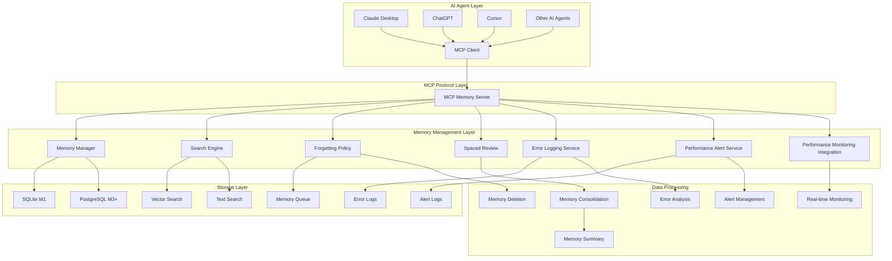
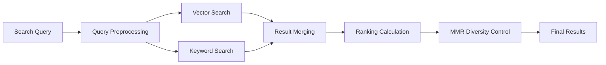
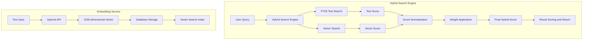
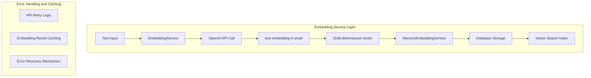
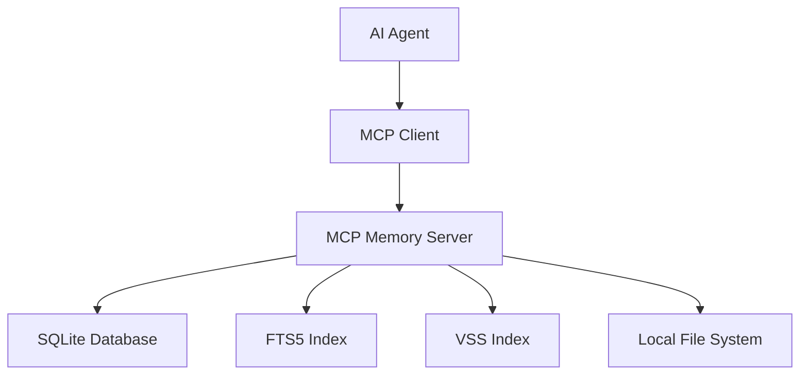
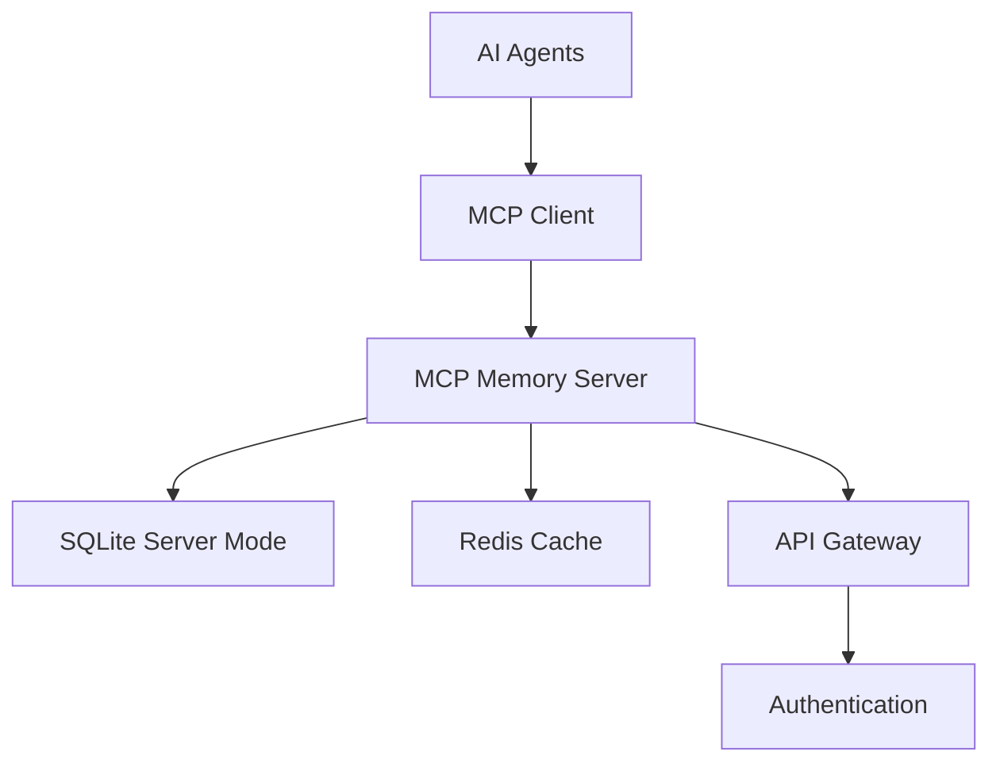
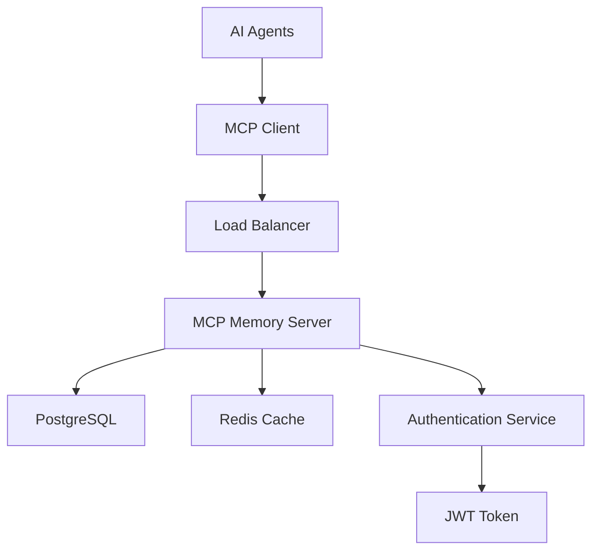
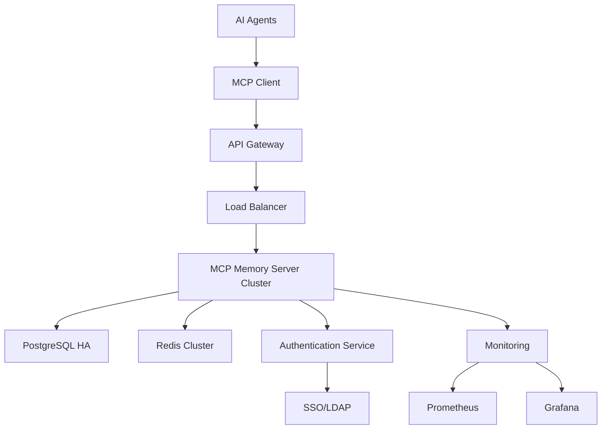

# Architecture Documentation

## Overview

Memento MCP Server is a system that manages AI Agent memory by mimicking human memory systems. This document provides detailed explanations of the overall system architecture, component interactions, and data flows.

## Table of Contents

1. [System Architecture](#system-architecture)
2. [Core Components](#core-components)
3. [Data Model](#data-model)
4. [Search System](#search-system)
5. [Forgetting System](#forgetting-system)
6. [Milestone-based Architecture](#milestone-based-architecture)
7. [Performance Considerations](#performance-considerations)
8. [Security Architecture](#security-architecture)

## System Architecture

### Overall Architecture Diagram



### Layer Roles

#### 1. AI Agent Layer
- **Role**: Interact with memory system through MCP client
- **Components**: Claude Desktop, ChatGPT, Cursor, etc.
- **Features**: Various AI Agents use the same MCP protocol

#### 2. MCP Protocol Layer
- **Role**: Provide standardized communication protocol
- **Components**: MCP Memory Server
- **Features**: Provide functionality through Tools, Resources, Prompts

#### 3. Memory Management Layer
- **Role**: Memory creation, search, management, deletion, and system monitoring
- **Components**: Memory Manager, Search Engine, Forgetting Policy, Spaced Review, Error Logging Service, Performance Alert Service, Performance Monitoring Integration
- **Features**: Management mimicking human memory systems and real-time system monitoring

#### 4. Storage Layer
- **Role**: Permanent data storage and retrieval
- **Components**: SQLite/PostgreSQL, Vector Search, Text Search
- **Features**: Different storage systems used by milestone

## Core Components

### 1. MCP Memory Server

#### Structure

```typescript
interface MCPServer {
  // Tools
  tools: {
    remember: RememberTool;
    recall: RecallTool;
    pin: PinTool;
    unpin: UnpinTool;
    forget: ForgetTool;
    summarize_thread: SummarizeThreadTool;
    link: LinkTool;
    export: ExportTool;
    feedback: FeedbackTool;
  };
  
  // Resources
  resources: {
    memory: MemoryResource;
    search: SearchResource;
  };
  
  // Prompts
  prompts: {
    memory_injection: MemoryInjectionPrompt;
  };
}
```

#### Key Features

- **Tool Processing**: Execute and respond to MCP Tools
- **Resource Provision**: Provide cached data
- **Prompt Generation**: Generate prompts for context injection
- **Authentication/Authorization**: User authentication and permission management (M2+)

### 2. Memory Manager

#### Structure

```typescript
interface MemoryManager {
  // Create memory
  createMemory(params: CreateMemoryParams): Promise<MemoryItem>;
  
  // Get memory
  getMemory(id: string): Promise<MemoryItem | null>;
  
  // Update memory
  updateMemory(id: string, updates: Partial<MemoryItem>): Promise<MemoryItem>;
  
  // Delete memory
  deleteMemory(id: string, hard?: boolean): Promise<boolean>;
  
  // Pin memory
  pinMemory(id: string): Promise<boolean>;
  unpinMemory(id: string): Promise<boolean>;
}
```

#### Key Features

- **CRUD Operations**: Create, read, update, delete memories
- **Type Management**: Distinguish working, episodic, semantic, procedural memories
- **Metadata Management**: Manage tags, importance, source, etc.
- **Relationship Management**: Set and manage relationships between memories

### 3. Search Engine

#### Structure

```typescript
interface SearchEngine {
  // 2-stage search
  search(query: string, filters?: SearchFilters): Promise<SearchResult>;
  
  // Vector search
  vectorSearch(query: string, limit: number): Promise<VectorSearchResult>;
  
  // Keyword search
  keywordSearch(query: string, filters?: SearchFilters): Promise<KeywordSearchResult>;
  
  // Ranking calculation
  calculateRanking(results: SearchResult[]): Promise<RankedResult[]>;
}
```

#### Search Pipeline



#### Ranking Algorithm

```typescript
interface SearchRanking {
  calculateFinalScore(features: SearchFeatures): number {
    return this.ALPHA * features.relevance +           // 0.50
           this.BETA * features.recency +              // 0.20
           this.GAMMA * features.importance +          // 0.20
           this.DELTA * features.usage -               // 0.10
           this.EPSILON * features.duplication_penalty; // 0.15
  }
}
```

### 4. Forgetting Policy

#### Structure

```typescript
interface ForgettingPolicy {
  // Calculate forget score
  calculateForgetScore(memory: MemoryItem): number;
  
  // Select deletion candidates
  getDeletionCandidates(): Promise<MemoryItem[]>;
  
  // Soft delete
  softDelete(memory: MemoryItem): Promise<boolean>;
  
  // Hard delete
  hardDelete(memory: MemoryItem): Promise<boolean>;
}
```

#### Forgetting Algorithm

```typescript
interface ForgetScore {
  calculate(memory: MemoryItem): number {
    const age = this.calculateAge(memory.created_at);
    const importance = memory.importance;
    const usage = this.calculateUsage(memory);
    
    return this.baseForgetScore * 
           Math.exp(-this.importanceWeight * importance) *
           Math.exp(-this.usageWeight * usage) *
           Math.exp(this.ageWeight * age);
  }
}
```

### 5. Spaced Review

#### Structure

```typescript
interface SpacedReview {
  // Calculate review schedule
  calculateReviewSchedule(memory: MemoryItem): Date;
  
  // Select review candidates
  getReviewCandidates(): Promise<MemoryItem[]>;
  
  // Execute review
  executeReview(memory: MemoryItem): Promise<ReviewResult>;
  
  // Adjust interval
  adjustInterval(memory: MemoryItem, performance: number): void;
}
```

### 6. Error Logging Service

#### Structure

```typescript
interface ErrorLoggingService {
  // Log error
  logError(error: Error, severity: ErrorSeverity, category: ErrorCategory, context?: Record<string, any>): void;
  
  // Get error statistics
  getErrorStats(filters?: ErrorFilters): Promise<ErrorStats>;
  
  // Resolve error
  resolveError(errorId: string, resolvedBy: string, resolution?: string): Promise<boolean>;
  
  // Search errors
  searchErrors(filters: ErrorSearchFilters): Promise<ErrorLog[]>;
}

enum ErrorSeverity {
  LOW = 'LOW',
  MEDIUM = 'MEDIUM', 
  HIGH = 'HIGH',
  CRITICAL = 'CRITICAL'
}

enum ErrorCategory {
  UNKNOWN = 'UNKNOWN',
  DATABASE = 'DATABASE',
  NETWORK = 'NETWORK',
  TOOL_EXECUTION = 'TOOL_EXECUTION',
  VALIDATION = 'VALIDATION',
  SYSTEM = 'SYSTEM'
}
```

#### Key Features

- **Structured Error Logging**: Include severity, category, context information
- **Error Statistics Collection**: Error analysis by severity and category
- **Error Resolution Tracking**: Record error resolution status and methods
- **Real-time Monitoring**: Analyze error patterns and alerts

### 7. Performance Alert Service

#### Structure

```typescript
interface PerformanceAlertService {
  // Create alert
  createAlert(level: AlertLevel, type: AlertType, metric: string, value: number, threshold: number, message: string, context?: Record<string, any>): PerformanceAlert;
  
  // Resolve alert
  resolveAlert(alertId: string, resolvedBy: string, resolution?: string): PerformanceAlert | null;
  
  // Get active alerts
  getActiveAlerts(): PerformanceAlert[];
  
  // Search alerts
  searchAlerts(filters: AlertSearchFilters): PerformanceAlert[];
  
  // Alert statistics
  getStats(): AlertStats;
}

enum AlertLevel {
  INFO = 'INFO',
  WARNING = 'WARNING',
  CRITICAL = 'CRITICAL'
}

enum AlertType {
  RESPONSE_TIME = 'response_time',
  MEMORY_USAGE = 'memory_usage',
  ERROR_RATE = 'error_rate',
  THROUGHPUT = 'throughput',
  CUSTOM = 'custom'
}
```

#### Key Features

- **Threshold-based Alerts**: Automatic alerts when performance metrics exceed thresholds
- **Alert Management**: Alert creation, resolution, search, statistics functionality
- **Log File Storage**: Save alerts in JSONL format to files
- **Console Output**: Color-coded console alerts by severity

### 8. Performance Monitoring Integration

#### Structure

```typescript
interface PerformanceMonitoringIntegration {
  // Start real-time monitoring
  startRealTimeMonitoring(): void;
  
  // Stop real-time monitoring
  stopRealTimeMonitoring(): void;
  
  // Performance check
  private checkPerformance(): Promise<void>;
  
  // Threshold checks
  private checkResponseTime(avgResponseTime: number): void;
  private checkMemoryUsage(heapUsedMB: number): void;
  private checkErrorRate(errorRate: number): void;
  private checkThroughput(throughput: number): void;
}

interface AlertThresholds {
  responseTime: { warning: number; critical: number }; // ms
  memoryUsage: { warning: number; critical: number }; // MB
  errorRate: { warning: number; critical: number }; // %
  throughput: { warning: number; critical: number }; // ops/sec
}
```

#### Key Features

- **Real-time Monitoring**: Automatic performance checks every 30 seconds
- **Threshold-based Alerts**: Automatic alert generation when thresholds are exceeded
- **Integrated Monitoring**: Integration with PerformanceMonitor and PerformanceAlertService
- **Automatic Recovery**: Perform automatic recovery tasks when serious issues occur

#### Spaced Repetition Algorithm

```typescript
interface SpacedRepetition {
  calculateNextReview(memory: MemoryItem, performance: number): Date {
    const currentInterval = memory.review_interval || 1;
    const newInterval = this.calculateInterval(currentInterval, performance);
    
    return new Date(Date.now() + newInterval * 24 * 60 * 60 * 1000);
  }
}
```

## Data Model

### 1. Memory Item

```typescript
interface MemoryItem {
  id: string;                       // Unique identifier
  content: string;                  // Memory content
  type: 'working' | 'episodic' | 'semantic' | 'procedural';  // Memory type
  importance: number;               // Importance (0-1)
  created_at: Date;                 // Creation time
  last_accessed: Date;              // Last access time
  access_count: number;             // Access count
  pinned: boolean;                  // Pinned status
  source?: string;                  // Source
  tags: string[];                   // Tags
  privacy_scope: 'private' | 'team' | 'public';  // Privacy scope
  project_id?: string;              // Project ID (M2+)
  user_id?: string;                 // User ID (M3+)
  metadata: Record<string, any>;    // Additional metadata
}
```

### 2. Search Result

```typescript
interface SearchResult {
  items: MemoryItem[];              // List of found memories
  total_count: number;              // Total result count
  query_time: number;               // Search time (ms)
  search_metadata: {
    vector_matches: number;         // Vector search match count
    keyword_matches: number;        // Keyword search match count
    ranking_time: number;           // Ranking calculation time
  };
}
```

### 3. Memory Relationship

```typescript
interface MemoryLink {
  id: string;                       // Link ID
  source_id: string;                // Source memory ID
  target_id: string;                // Target memory ID
  relation_type: 'cause_of' | 'derived_from' | 'duplicates' | 'contradicts';
  created_at: Date;                 // Creation time
  strength: number;                 // Relationship strength (0-1)
}
```

### 4. Feedback

```typescript
interface Feedback {
  id: string;                       // Feedback ID
  memory_id: string;                // Memory ID
  helpful: boolean;                 // Helpfulness
  score?: number;                   // Score (0-1)
  comment?: string;                 // Comment
  created_at: Date;                 // Creation time
  user_id?: string;                 // User ID (M3+)
}
```

## Search System

### Hybrid Search Architecture

Memento provides a hybrid search system that combines FTS5 text search and vector search.



### Embedding Service Architecture



### 1. 2-Stage Search Pipeline

#### Stage 1: Vector Search (ANN)

```typescript
interface VectorSearch {
  // Generate embedding
  generateEmbedding(text: string): Promise<number[]>;
  
  // Vector search
  search(embedding: number[], limit: number): Promise<VectorSearchResult>;
  
  // Update index
  updateIndex(memory: MemoryItem): Promise<void>;
}
```

**Features**:
- Semantic similarity search
- Fast search speed (O(log n))
- Multilingual support

#### Stage 2: Keyword Search (BM25)

```typescript
interface KeywordSearch {
  // Index text
  indexText(memory: MemoryItem): Promise<void>;
  
  // BM25 search
  search(query: string, filters?: SearchFilters): Promise<KeywordSearchResult>;
  
  // Optimize index
  optimizeIndex(): Promise<void>;
}
```

**Features**:
- Accurate keyword matching
- Weight-based ranking
- Filter support

### 2. Ranking Algorithm

#### Composite Score Calculation

```typescript
interface SearchRanking {
  calculateFinalScore(features: SearchFeatures): number {
    const relevance = this.calculateRelevance(features);
    const recency = this.calculateRecency(features);
    const importance = this.calculateImportance(features);
    const usage = this.calculateUsage(features);
    const duplication = this.calculateDuplicationPenalty(features);
    
    return this.ALPHA * relevance +           // 0.50
           this.BETA * recency +              // 0.20
           this.GAMMA * importance +          // 0.20
           this.DELTA * usage -               // 0.10
           this.EPSILON * duplication;        // 0.15
  }
}
```

#### Relevance Calculation

```typescript
interface RelevanceCalculation {
  calculate(features: SearchFeatures): number {
    const vectorSimilarity = features.vector_similarity;
    const bm25Score = features.bm25_score;
    const tagMatch = features.tag_match_score;
    const titleHit = features.title_hit_score;
    
    return (vectorSimilarity * 0.4) +
           (bm25Score * 0.3) +
           (tagMatch * 0.2) +
           (titleHit * 0.1);
  }
}
```

### 3. MMR Diversity Control

```typescript
interface MMRDiversity {
  selectDiverseResults(results: SearchResult[], lambda: number = 0.7): SearchResult[] {
    const selected: SearchResult[] = [];
    const remaining = [...results];
    
    while (remaining.length > 0 && selected.length < this.maxResults) {
      let bestIndex = 0;
      let bestScore = -Infinity;
      
      for (let i = 0; i < remaining.length; i++) {
        const relevance = remaining[i].score;
        const diversity = this.calculateDiversity(remaining[i], selected);
        const score = lambda * relevance + (1 - lambda) * diversity;
        
        if (score > bestScore) {
          bestScore = score;
          bestIndex = i;
        }
      }
      
      selected.push(remaining[bestIndex]);
      remaining.splice(bestIndex, 1);
    }
    
    return selected;
  }
}
```

## Forgetting System

### 1. TTL-based Automatic Deletion

#### Memory Type TTL

```typescript
interface MemoryTTL {
  WORKING_MEMORY: 48 * 60 * 60 * 1000;    // 48 hours
  EPISODIC_MEMORY: 90 * 24 * 60 * 60 * 1000;  // 90 days
  SEMANTIC_MEMORY: Infinity;              // Indefinite
  PROCEDURAL_MEMORY: Infinity;            // Indefinite
}
```

#### Deletion Scheduling

```typescript
interface DeletionScheduler {
  scheduleDeletion(memory: MemoryItem): void {
    const ttl = this.getTTL(memory.type);
    if (ttl === Infinity) return;
    
    const deletionTime = new Date(memory.created_at.getTime() + ttl);
    this.scheduleTask(deletionTime, () => this.deleteMemory(memory));
  }
}
```

### 2. Importance-based Forgetting

#### Forget Score Calculation

```typescript
interface ForgetScore {
  calculate(memory: MemoryItem): number {
    const age = this.calculateAge(memory.created_at);
    const importance = memory.importance;
    const usage = this.calculateUsage(memory);
    const recency = this.calculateRecency(memory.last_accessed);
    
    return this.baseForgetScore *
           Math.exp(-this.importanceWeight * importance) *
           Math.exp(-this.usageWeight * usage) *
           Math.exp(-this.recencyWeight * recency) *
           Math.exp(this.ageWeight * age);
  }
}
```

### 3. Spaced Repetition System

#### Review Schedule Calculation

```typescript
interface SpacedRepetition {
  calculateNextReview(memory: MemoryItem, performance: number): Date {
    const currentInterval = memory.review_interval || 1;
    const newInterval = this.calculateInterval(currentInterval, performance);
    
    return new Date(Date.now() + newInterval * 24 * 60 * 60 * 1000);
  }
  
  calculateInterval(currentInterval: number, performance: number): number {
    if (performance >= 0.8) {
      return Math.min(currentInterval * 2.5, 365);  // Increase interval on success
    } else if (performance >= 0.6) {
      return Math.max(currentInterval * 1.2, 1);    // Slight increase on moderate
    } else {
      return 1;  // Reset to 1 day on failure
    }
  }
}
```

## Milestone-based Architecture

### M1: Personal Use (MVP)

#### Architecture



#### Features

- **Storage**: better-sqlite3 embedded
- **Search**: FTS5 + sqlite-vss
- **Authentication**: None (local only)
- **Deployment**: Local execution
- **Additional Features**: Lightweight embedding, performance monitoring, cache system
- **Scalability**: Single user

#### Technology Stack

- **Database**: better-sqlite3 12.4+
- **Vector Search**: sqlite-vss
- **Text Search**: FTS5
- **Web Server**: Express 5.1+
- **WebSocket**: ws 8.18+
- **Testing**: Vitest 1.0+
- **Runtime**: Node.js 20+

### M2: Team Collaboration

#### Architecture



#### Features

- **Storage**: SQLite server mode (WAL)
- **Caching**: Redis
- **Authentication**: API Key
- **Deployment**: Docker
- **Scalability**: Team level (10-50 people)

#### Technology Stack

- **Database**: SQLite Server Mode
- **Cache**: Redis 7+
- **Container**: Docker
- **Authentication**: API Key

### M3: Organization Entry

#### Architecture



#### Features

- **Storage**: PostgreSQL + pgvector
- **Search**: pgvector + tsvector
- **Authentication**: JWT
- **Deployment**: Docker Compose
- **Scalability**: Organization level (100-1000 people)

#### Technology Stack

- **Database**: PostgreSQL 15+ + pgvector
- **Search**: pgvector, tsvector
- **Cache**: Redis 7+
- **Authentication**: JWT
- **Deployment**: Docker Compose

### M4: Enterprise

#### Architecture



#### Features

- **Storage**: PostgreSQL high availability
- **Caching**: Redis cluster
- **Authentication**: JWT + RBAC + SSO/LDAP
- **Deployment**: Kubernetes
- **Scalability**: Enterprise (1000+ people)

#### Technology Stack

- **Database**: PostgreSQL HA + pgvector
- **Cache**: Redis Cluster
- **Authentication**: JWT + RBAC + SSO/LDAP
- **Deployment**: Kubernetes
- **Monitoring**: Prometheus + Grafana

## Performance Considerations

### 1. Search Performance

#### Hybrid Search Optimization

```typescript
interface HybridSearchOptimization {
  // Combine FTS5 + vector search
  optimizeHybridSearch(): void {
    this.createFTSIndex('memory_item_fts', 'content');
    this.createVectorIndex('memory_embedding', 'embedding', 'ivfflat');
    this.analyzeTable('memory_item');
  }
  
  // Batch processing
  batchUpdateEmbeddings(memories: MemoryItem[]): void {
    const batchSize = 100;
    for (let i = 0; i < memories.length; i += batchSize) {
      const batch = memories.slice(i, i + batchSize);
      this.updateEmbeddingsBatch(batch);
    }
  }
}
```

#### Lightweight Embedding Optimization

```typescript
interface LightweightEmbeddingOptimization {
  // TF-IDF vectorization
  optimizeTFIDF(): void {
    this.updateVocabulary();
    this.calculateIDF();
    this.normalizeVectors();
  }
  
  // Multilingual support
  preprocessText(text: string): string {
    return this.removeStopWords(text)
      .normalizeUnicode()
      .tokenize()
      .stem();
  }
}
```

#### Caching Strategy

```typescript
interface CachingStrategy {
  // LRU cache implementation
  cacheSearchResult(query: string, result: SearchResult): void {
    const key = `search:${this.hashQuery(query)}`;
    this.lruCache.set(key, result, 3600); // 1 hour TTL
  }
  
  // Embedding caching
  cacheEmbedding(text: string, embedding: number[]): void {
    const key = `embedding:${this.hashText(text)}`;
    this.lruCache.set(key, embedding, 86400); // 24 hour TTL
  }
  
  // Popular query caching
  cachePopularQueries(): void {
    const popular = this.getPopularQueries(100);
    this.lruCache.set('popular_queries', popular, 86400); // 24 hour TTL
  }
}
```

### 2. Memory Usage

#### Performance Monitoring

```typescript
interface PerformanceMonitoring {
  // Memory usage monitoring
  monitorMemoryUsage(): void {
    const usage = process.memoryUsage();
    this.metrics.record('memory.heapUsed', usage.heapUsed);
    this.metrics.record('memory.heapTotal', usage.heapTotal);
    this.metrics.record('memory.rss', usage.rss);
  }
  
  // Cache performance monitoring
  monitorCachePerformance(): void {
    this.metrics.record('cache.hitRate', this.cache.getHitRate());
    this.metrics.record('cache.size', this.cache.getSize());
    this.metrics.record('cache.memoryUsage', this.cache.getMemoryUsage());
  }
}
```

#### Memory Pool Management

```typescript
interface MemoryPool {
  private pool: Buffer[] = [];
  private maxSize: number = 100;
  
  getBuffer(size: number): Buffer {
    const buffer = this.pool.find(b => b.length >= size);
    if (buffer) {
      return buffer;
    }
    return Buffer.alloc(size);
  }
  
  returnBuffer(buffer: Buffer): void {
    if (this.pool.length < this.maxSize) {
      this.pool.push(buffer);
    }
  }
}
```

#### Garbage Collection Optimization

```typescript
interface GCOptimization {
  // Memory usage monitoring
  monitorMemoryUsage(): void {
    const usage = process.memoryUsage();
    if (usage.heapUsed > this.threshold) {
      this.triggerGC();
    }
  }
  
  // Clean up unnecessary objects
  cleanup(): void {
    this.clearExpiredCache();
    this.clearUnusedConnections();
    this.optimizeIndexes();
  }
}
```

### 3. Database Performance

#### better-sqlite3 Optimization

```sql
-- Index optimization
CREATE INDEX idx_memory_type_created ON memory_item(type, created_at);
CREATE INDEX idx_memory_importance ON memory_item(importance DESC);
CREATE INDEX idx_memory_tags ON memory_item USING GIN(tags);

-- Vector search index
CREATE INDEX idx_memory_embedding ON memory_embedding 
USING ivfflat (embedding vector_cosine_ops) WITH (lists = 100);

-- FTS index
CREATE VIRTUAL TABLE memory_fts USING fts5(
  content, 
  tags, 
  source,
  content='memory_item',
  content_rowid='id'
);
```

#### Database Optimization Service

```typescript
interface DatabaseOptimization {
  // Auto index recommendation
  recommendIndexes(): IndexRecommendation[] {
    const slowQueries = this.analyzeSlowQueries();
    return slowQueries.map(query => this.generateIndexRecommendation(query));
  }
  
  // Query performance analysis
  analyzeQueryPerformance(): QueryAnalysis {
    return {
      averageQueryTime: this.getAverageQueryTime(),
      slowQueries: this.getSlowQueries(),
      indexUsage: this.getIndexUsage(),
      recommendations: this.generateRecommendations()
    };
  }
}
```

#### Connection Pool Management

```typescript
interface ConnectionPool {
  private pool: DatabaseConnection[] = [];
  private maxConnections: number = 20;
  
  async getConnection(): Promise<DatabaseConnection> {
    if (this.pool.length > 0) {
      return this.pool.pop()!;
    }
    
    if (this.activeConnections < this.maxConnections) {
      return await this.createConnection();
    }
    
    return await this.waitForConnection();
  }
  
  releaseConnection(conn: DatabaseConnection): void {
    if (this.pool.length < this.maxConnections) {
      this.pool.push(conn);
    } else {
      conn.close();
    }
  }
}
```

## Security Architecture

### 1. Authentication and Authorization

#### JWT-based Authentication (M3+)

```typescript
interface JWTAuthentication {
  generateToken(user: User): string {
    const payload = {
      sub: user.id,
      email: user.email,
      role: user.role,
      exp: Math.floor(Date.now() / 1000) + (60 * 60 * 24) // 24 hours
    };
    
    return jwt.sign(payload, this.secretKey, { algorithm: 'HS256' });
  }
  
  verifyToken(token: string): UserPayload {
    return jwt.verify(token, this.secretKey) as UserPayload;
  }
}
```

#### RBAC Permission Management (M4)

```typescript
interface RBAC {
  hasPermission(user: User, resource: string, action: string): boolean {
    const role = this.getRole(user.role);
    return role.permissions.some(p => 
      p.resource === resource && p.actions.includes(action)
    );
  }
  
  checkMemoryAccess(user: User, memory: MemoryItem): boolean {
    if (memory.privacy_scope === 'public') return true;
    if (memory.privacy_scope === 'team' && user.team_id === memory.team_id) return true;
    if (memory.privacy_scope === 'private' && user.id === memory.user_id) return true;
    return false;
  }
}
```

### 2. Data Encryption

#### Sensitive Data Encryption

```typescript
interface DataEncryption {
  encryptSensitiveData(data: string): string {
    const cipher = crypto.createCipher('aes-256-gcm', this.encryptionKey);
    let encrypted = cipher.update(data, 'utf8', 'hex');
    encrypted += cipher.final('hex');
    return encrypted;
  }
  
  decryptSensitiveData(encryptedData: string): string {
    const decipher = crypto.createDecipher('aes-256-gcm', this.encryptionKey);
    let decrypted = decipher.update(encryptedData, 'hex', 'utf8');
    decrypted += decipher.final('utf8');
    return decrypted;
  }
}
```

#### Transport Encryption

```typescript
interface TransportEncryption {
  // Enforce HTTPS
  enforceHTTPS(): void {
    this.app.use((req, res, next) => {
      if (!req.secure && req.get('x-forwarded-proto') !== 'https') {
        return res.redirect(`https://${req.get('host')}${req.url}`);
      }
      next();
    });
  }
  
  // Set HSTS headers
  setHSTS(): void {
    this.app.use((req, res, next) => {
      res.setHeader('Strict-Transport-Security', 'max-age=31536000; includeSubDomains');
      next();
    });
  }
}
```

### 3. Audit Logging

#### Security Event Logging

```typescript
interface SecurityAudit {
  logSecurityEvent(event: SecurityEvent): void {
    const logEntry = {
      timestamp: new Date().toISOString(),
      event_type: event.type,
      user_id: event.user_id,
      ip_address: event.ip_address,
      user_agent: event.user_agent,
      details: event.details,
      severity: event.severity
    };
    
    this.auditLogger.info(logEntry);
  }
  
  detectAnomalies(): void {
    // Detect abnormal access patterns
    const recentEvents = this.getRecentEvents(5 * 60 * 1000); // 5 minutes
    const suspiciousEvents = this.analyzePatterns(recentEvents);
    
    if (suspiciousEvents.length > 0) {
      this.alertSecurityTeam(suspiciousEvents);
    }
  }
}
```

## Monitoring and Observability

### 1. Metrics Collection

#### Prometheus Metrics

```typescript
interface Metrics {
  // Memory-related metrics
  memoryCounter: Counter<string>;
  memorySize: Gauge<string>;
  
  // Search-related metrics
  searchDuration: Histogram<string>;
  searchResults: Counter<string>;
  
  // Error-related metrics
  errorCounter: Counter<string>;
  errorRate: Gauge<string>;
  
  // Performance-related metrics
  responseTime: Histogram<string>;
  throughput: Counter<string>;
}
```

### 2. Logging

#### Structured Logging

```typescript
interface StructuredLogging {
  logMemoryOperation(operation: string, memoryId: string, userId?: string): void {
    this.logger.info({
      operation,
      memory_id: memoryId,
      user_id: userId,
      timestamp: new Date().toISOString(),
      level: 'info'
    });
  }
  
  logSearchQuery(query: string, resultCount: number, duration: number): void {
    this.logger.info({
      event: 'search_query',
      query,
      result_count: resultCount,
      duration_ms: duration,
      timestamp: new Date().toISOString()
    });
  }
}
```

### 3. Health Check

#### Service Status Monitoring

```typescript
interface HealthCheck {
  async checkHealth(): Promise<HealthStatus> {
    const checks = await Promise.allSettled([
      this.checkDatabase(),
      this.checkRedis(),
      this.checkSearchIndex(),
      this.checkMemoryUsage()
    ]);
    
    return {
      status: checks.every(c => c.status === 'fulfilled') ? 'healthy' : 'unhealthy',
      checks: checks.map((check, index) => ({
        name: this.checkNames[index],
        status: check.status === 'fulfilled' ? 'ok' : 'error',
        details: check.status === 'fulfilled' ? check.value : check.reason
      }))
    };
  }
}
```

## Scalability Considerations

### 1. Horizontal Scaling

#### Sharding Strategy

```typescript
interface ShardingStrategy {
  getShard(memoryId: string): string {
    const hash = this.hash(memoryId);
    return `shard_${hash % this.shardCount}`;
  }
  
  routeQuery(query: string): string[] {
    // Send query to all shards
    return this.shards.map(shard => `${shard}/search`);
  }
}
```

### 2. Caching Strategy

#### Multi-level Caching

```typescript
interface MultiLevelCache {
  async get(key: string): Promise<any> {
    // L1: Memory cache
    let value = this.memoryCache.get(key);
    if (value) return value;
    
    // L2: Redis cache
    value = await this.redis.get(key);
    if (value) {
      this.memoryCache.set(key, value);
      return value;
    }
    
    // L3: Database
    value = await this.database.get(key);
    if (value) {
      this.memoryCache.set(key, value);
      await this.redis.setex(key, 3600, value);
      return value;
    }
    
    return null;
  }
}
```

This architecture document explains the overall structure and design principles of Memento MCP Server. For detailed implementation of each component, refer to individual development documents.
