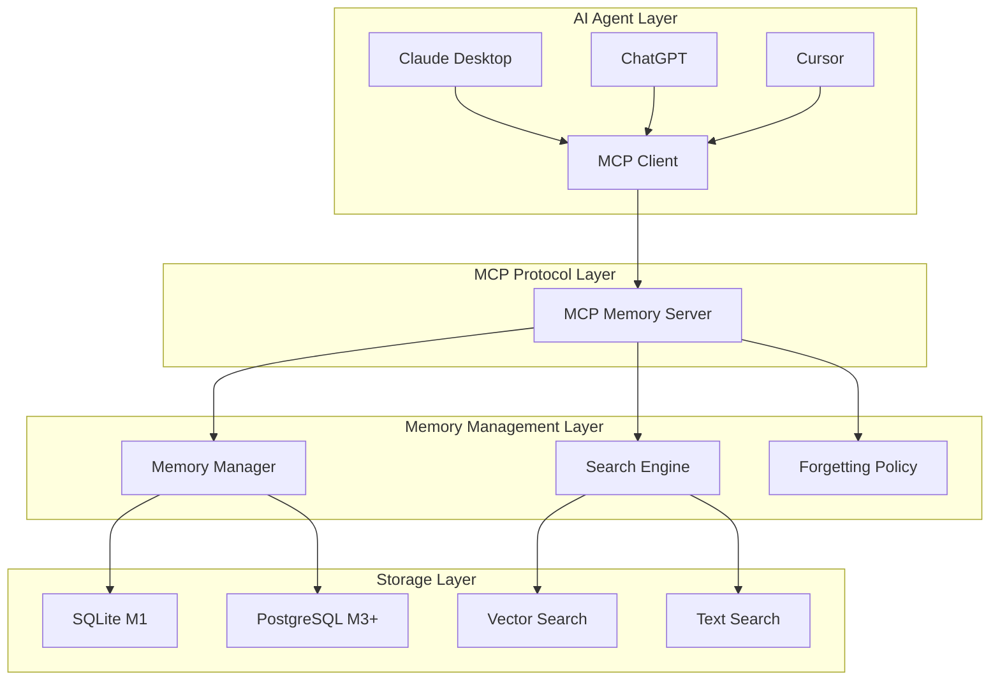

# Developer Guide

## Overview

This guide explains the development environment setup, architecture understanding, and contribution methods for Memento MCP Server.

## Table of Contents

1. [Development Environment Setup](#development-environment-setup)
2. [Project Structure](#project-structure)
3. [Architecture Understanding](#architecture-understanding)
4. [Development Workflow](#development-workflow)
5. [Test Writing](#test-writing)
6. [Contribution Methods](#contribution-methods)

## Development Environment Setup

### Prerequisites

- **Node.js**: 20.0.0 or higher (package.json standard)
- **npm**: 10.0.0 or higher

### Repository Guidelines (`AGENTS.md`)

The project includes developer guidelines:

- **Project Structure**: Module organization under `src/`
- **Build/Test Commands**: `npm run dev`, `npm run build`, `npm run test`, etc.
- **Coding Style**: Node.js ≥ 20, TypeScript ES modules, 2-space indentation
- **Testing Guidelines**: Vitest based with clear naming conventions:
  - Unit Tests (`.spec.ts`): Place in module directories (e.g., `src/algorithms/search-engine.spec.ts`)
  - E2E Tests (`test-*.ts`): Place in `src/test/` directory (e.g., `src/test/test-client.ts`)
- **Commit/PR Guidelines**: Conventional Commits, Korean context included
- **Environment/Database**: `.env` configuration, `data/` folder management
- **TypeScript**: 5.3.0 (actual implementation standard)
- **Git**: 2.30.0 or higher

### Development Tools

- **IDE**: VS Code (recommended)
- **Extensions**:
  - TypeScript and JavaScript Language Features
  - ESLint
  - Prettier
  - Vitest (actually used)
  - GitLens

### Environment Setup

#### 1. Clone Repository

```bash
git clone https://github.com/your-org/memento.git
cd memento
```

#### 2. Install Dependencies

```bash
# Install all dependencies (package.json standard)
npm install

# Actually used dependencies:
# - @modelcontextprotocol/sdk: ^0.5.0
# - better-sqlite3: ^12.4.1
# - express: ^5.1.0
# - cors: ^2.8.5
# - ws: ^8.18.3
# - zod: ^3.22.4
# - uuid: ^9.0.1
# - openai: ^4.20.1
# - dotenv: ^16.3.1
# - vitest: ^1.0.0 (test)
# - tsx: ^4.6.0 (development)
```

#### 3. Environment Variable Setup

```bash
# Copy environment variable file
cp .env.example .env

# Edit environment variables
# Edit .env file to enter necessary settings
```

#### 4. Database Initialization

```bash
# Initialize better-sqlite3 database
npm run db:init

# Database migration
npm run db:migrate
```

#### 5. Start Development Server

```bash
# MCP server development mode (hot reload)
npm run dev

# HTTP/WebSocket server development mode
npm run dev:http

# Run tests in separate terminal
npm run test -- --watch
```

### VS Code Setup

#### .vscode/settings.json

```json
{
  "typescript.preferences.importModuleSpecifier": "relative",
  "editor.formatOnSave": true,
  "editor.codeActionsOnSave": {
    "source.fixAll.eslint": true
  },
  "vitest.commandLine": "npm run test",
  "vitest.autoRun": "watch"
}
```

#### .vscode/launch.json

```json
{
  "version": "0.2.0",
  "configurations": [
    {
      "name": "Debug MCP Server",
      "type": "node",
      "request": "launch",
      "program": "${workspaceFolder}/src/server/index.ts",
      "outFiles": ["${workspaceFolder}/dist/**/*.js"],
      "env": {
        "NODE_ENV": "development"
      },
      "console": "integratedTerminal"
    },
    {
      "name": "Debug Tests",
      "type": "node",
      "request": "launch",
      "program": "${workspaceFolder}/node_modules/.bin/vitest",
      "args": ["--run"],
      "console": "integratedTerminal",
      "internalConsoleOptions": "neverOpen"
    }
  ]
}
```

## Project Structure

### New Service Layer (`src/services/`)

Memento has introduced a new service layer to separate external API integration and complex business logic.

```
src/services/
├── embedding-service.ts              # OpenAI embedding service (196 lines)
├── memory-embedding-service.ts       # Memory embedding service (237 lines)
├── lightweight-embedding-service.ts  # Lightweight hybrid embedding service (321 lines)
├── forgetting-policy-service.ts      # Forgetting policy service (335 lines)
├── async-optimizer.ts                # Async processing optimization (447 lines)
├── cache-service.ts                  # Cache service (352 lines)
├── database-optimizer.ts             # Database optimization (442 lines)
└── performance-monitor.ts            # Performance monitoring (367 lines)
```

**Service Layer Role**:
- **External API Integration**: OpenAI API, database integration
- **Business Logic**: Embedding generation, vector search, similarity calculation
- **Error Handling**: API call failures, retry logic
- **Caching**: Embedding result caching, performance optimization
- **Fallback Solution**: Lightweight hybrid embedding service as OpenAI API replacement
- **Performance Optimization**: Async processing, cache management, database optimization
- **Monitoring**: Real-time performance metrics collection and analysis

### Hybrid Search Engine (`src/algorithms/hybrid-search-engine.ts`)

Hybrid search functionality has been added to the existing search engine.

```
src/algorithms/
├── search-engine.ts        # Basic search engine (233 lines)
├── hybrid-search-engine.ts # Hybrid search engine (200 lines)
└── search-ranking.ts       # Search ranking algorithm
```

**Hybrid Search Features**:
- **FTS5 + Vector Search**: Combination of text search and vector search
- **Weight Adjustment**: Vector 60%, Text 40% (default)
- **Score Normalization**: Normalize scores to 0-1 range
- **Result Combination**: Final score integrating two search results

### Complete Project Structure

```
memento/
├── src/                          # Source code
│   ├── server/                   # MCP server
│   │   ├── index.ts             # Server entry point (521 lines)
│   │   ├── tools/               # MCP Tools implementation
│   │   │   ├── remember.ts      # remember tool
│   │   │   ├── recall.ts        # recall tool
│   │   │   ├── pin.ts           # pin/unpin tool
│   │   │   ├── forget.ts        # forget tool
│   │   │   ├── summarize-thread.ts
│   │   │   ├── link.ts          # link tool
│   │   │   ├── export.ts        # export tool
│   │   │   ├── feedback.ts      # feedback tool
│   │   │   └── index.ts         # tool exports
│   │   ├── resources/           # MCP Resources implementation
│   │   │   ├── memory.ts        # memory/{id} resource
│   │   │   ├── search.ts        # memory/search resource
│   │   │   └── index.ts
│   │   ├── prompts/             # MCP Prompts implementation
│   │   │   ├── memory-injection.ts
│   │   │   └── index.ts
│   │   ├── database/            # Database related
│   │   │   ├── sqlite.ts        # SQLite implementation
│   │   │   ├── postgres.ts      # PostgreSQL implementation
│   │   │   ├── migrations/      # Migrations
│   │   │   └── index.ts
│   │   └── middleware/          # Middleware
│   │       ├── auth.ts          # Authentication middleware
│   │       ├── logging.ts       # Logging middleware
│   │       └── error.ts         # Error handling middleware
│   ├── client/                  # MCP client
│   │   ├── index.ts             # Client entry point
│   │   ├── memory-manager.ts    # Memory manager
│   │   ├── mcp-client.ts        # MCP client wrapper
│   │   └── types.ts             # Client types
│   ├── algorithms/              # Search and forgetting algorithms
│   │   ├── search-ranking.ts    # Search ranking algorithm
│   │   ├── forgetting.ts        # Forgetting algorithm
│   │   ├── spaced-review.ts     # Spaced repetition algorithm
│   │   └── index.ts
│   └── shared/                  # Common utilities
│       ├── types.ts             # Common type definitions
│       ├── utils.ts             # Utility functions
│       ├── constants.ts         # Constant definitions
│       └── validation.ts        # Validation functions
├── tests/                       # Test code
│   ├── unit/                    # Unit tests
│   │   ├── tools/              # Tool tests
│   │   ├── algorithms/         # Algorithm tests
│   │   └── utils/              # Utility tests
│   ├── integration/            # Integration tests
│   │   ├── mcp-server.test.ts  # MCP server integration test
│   │   └── database.test.ts    # Database integration test
│   ├── e2e/                    # E2E tests
│   │   └── memory-workflow.test.ts
│   └── fixtures/               # Test data
│       ├── memories.json       # Sample memory data
│       └── test-db.sql         # Test database
├── docs/                       # Documentation
├── scripts/                    # Build and deployment scripts
│   ├── build.js               # Build script
│   ├── deploy.js              # Deployment script
│   └── db-migrate.js          # Database migration
├── docker/                     # Docker related files
│   ├── Dockerfile             # M1 Dockerfile
│   ├── Dockerfile.m3          # M3 Dockerfile
│   ├── docker-compose.dev.yml # Development environment
│   ├── docker-compose.team.yml # Team environment
│   └── docker-compose.org.yml # Organization environment
├── .cursor/rules/              # Cursor development rules
├── .github/                    # GitHub Actions
│   └── workflows/
│       ├── ci.yml             # CI pipeline
│       ├── test.yml           # Test pipeline
│       └── deploy.yml         # Deployment pipeline
├── package.json               # Project configuration
├── tsconfig.json              # TypeScript configuration
├── jest.config.js             # Jest configuration
├── .eslintrc.js               # ESLint configuration
├── .prettierrc                # Prettier configuration
└── README.md                  # Project documentation
```

## Architecture Understanding

### Overall Architecture



### Core Components

#### 1. MCP Server (`src/server/`)

The core server implementing the MCP protocol.

**Key Files**:
- `index.ts`: Server entry point, MCP server initialization
- `tools/`: MCP Tools implementation
- `resources/`: MCP Resources implementation
- `prompts/`: MCP Prompts implementation

**Example Code**:
```typescript
// src/server/index.ts
import { Server } from '@modelcontextprotocol/sdk/server';
import { rememberTool } from './tools/remember';
import { recallTool } from './tools/recall';

const server = new Server({
  name: 'memento-memory-server',
  version: '0.1.0'
});

// Register tools
server.tool('remember', rememberTool);
server.tool('recall', recallTool);

// Start server
server.start();
```

#### 2. Search Engine (`src/algorithms/`)

Implements algorithms for memory search.

**Key Files**:
- `search-ranking.ts`: Search ranking algorithm
- `forgetting.ts`: Forgetting algorithm
- `spaced-review.ts`: Spaced repetition algorithm

**Example Code**:
```typescript
// src/algorithms/search-ranking.ts
export class SearchRanking {
  calculateFinalScore(features: SearchFeatures): number {
    return this.ALPHA * features.relevance +
           this.BETA * features.recency +
           this.GAMMA * features.importance +
           this.DELTA * features.usage -
           this.EPSILON * features.duplication_penalty;
  }
}
```

#### 3. Database Layer (`src/server/database/`)

Handles data storage and retrieval.

**Key Files**:
- `sqlite.ts`: SQLite implementation (M1)
- `postgres.ts`: PostgreSQL implementation (M3+)
- `migrations/`: Database migrations

### Data Flow

#### 1. Memory Storage Flow

```
AI Agent → MCP Client → MCP Server → Memory Manager → Database
```

#### 2. Memory Search Flow

```
AI Agent → MCP Client → MCP Server → Search Engine → Database → Ranking → Results
```

## Development Workflow

### 1. Feature Development

#### Create Branch

```bash
# Create feature branch
git checkout -b feature/new-tool

# Or bug fix branch
git checkout -b fix/memory-leak
```

#### Development Progress

```bash
# Start development server
npm run dev

# Run tests (separate terminal)
npm run test:watch

# Code formatting
npm run format

# Lint check
npm run lint
```

#### Commit

```bash
# Stage changes
git add .

# Commit (conventional commit format)
git commit -m "feat: add new summarize_thread tool"

# Push
git push origin feature/new-tool
```

### 2. Test Writing

#### Unit Tests

```typescript
// tests/unit/tools/remember.test.ts
import { RememberTool } from '@/server/tools/remember';
import { MockDatabase } from '@/tests/mocks/database.mock';

describe('RememberTool', () => {
  let rememberTool: RememberTool;
  let mockDatabase: MockDatabase;

  beforeEach(() => {
    mockDatabase = new MockDatabase();
    rememberTool = new RememberTool(mockDatabase);
  });

  it('should create memory with valid parameters', async () => {
    // Given
    const params = {
      content: 'Test memory',
      type: 'episodic',
      importance: 0.8
    };

    // When
    const result = await rememberTool.execute(params);

    // Then
    expect(result.memory_id).toBeDefined();
    expect(mockDatabase.createMemory).toHaveBeenCalledWith(
      expect.objectContaining({
        content: 'Test memory',
        type: 'episodic',
        importance: 0.8
      })
    );
  });
});
```

#### Integration Tests

```typescript
// tests/integration/mcp-server.test.ts
import { MCPClient } from '@modelcontextprotocol/sdk';
import { MCPServer } from '@/server';

describe('MCP Server Integration', () => {
  let server: MCPServer;
  let client: MCPClient;

  beforeAll(async () => {
    server = new MCPServer();
    await server.start();
    
    client = new MCPClient({
      name: 'test-client',
      version: '1.0.0'
    });
    await client.connect({
      command: 'node',
      args: ['dist/server/index.js']
    });
  });

  afterAll(async () => {
    await client.close();
    await server.stop();
  });

  it('should handle remember and recall workflow', async () => {
    // Remember
    const rememberResult = await client.callTool('remember', {
      content: 'Integration test memory'
    });

    expect(rememberResult.memory_id).toBeDefined();

    // Recall
    const recallResult = await client.callTool('recall', {
      query: 'integration test'
    });

    expect(recallResult.items).toHaveLength(1);
    expect(recallResult.items[0].content).toContain('Integration test memory');
  });
});
```

### 3. Code Review

#### Create Pull Request

1. Create Pull Request on GitHub
2. Write change description
3. Link related issues
4. Assign reviewers

#### Review Checklist

- [ ] Does the code follow project style guidelines?
- [ ] Are tests sufficiently written?
- [ ] Is documentation updated?
- [ ] Does it affect performance?
- [ ] Are there any security vulnerabilities?

## Test Writing

### Test Strategy

#### 1. Unit Tests

- **Purpose**: Verify individual function/class behavior
- **Scope**: All public methods
- **Tool**: Jest
- **Location**: `tests/unit/`

#### 2. Integration Tests

- **Purpose**: Verify component interactions
- **Scope**: MCP server, database integration
- **Tool**: Jest + real database
- **Location**: `tests/integration/`

#### 3. E2E Tests

- **Purpose**: Verify complete workflows
- **Scope**: User scenarios
- **Tool**: Jest + MCP client
- **Location**: `tests/e2e/`

#### 4. Error Logging Tests

- **Purpose**: Verify error logging system normal operation
- **Scope**: ErrorLoggingService, error statistics, error resolution
- **Tool**: tsx + direct service testing
- **Location**: `src/test-error-logging.ts`

#### 5. Performance Alert Tests

- **Purpose**: Verify performance alert system normal operation
- **Scope**: PerformanceAlertService, real-time monitoring, alert management
- **Tool**: tsx + direct service testing
- **Location**: `src/test-performance-alerts.ts`

### Test Writing Guide

#### 1. Test Structure (AAA Pattern)

```typescript
describe('ComponentName', () => {
  describe('methodName', () => {
    it('should do something when condition', async () => {
      // Arrange (Setup)
      const input = createTestInput();
      const expected = createExpectedOutput();
      
      // Act (Execute)
      const result = await component.method(input);
      
      // Assert (Verify)
      expect(result).toEqual(expected);
    });
  });
});
```

#### 2. Mock Usage

```typescript
// Create mock object
const mockDatabase = {
  createMemory: jest.fn(),
  getMemory: jest.fn(),
  searchMemories: jest.fn()
};

// Mock setup
mockDatabase.createMemory.mockResolvedValue('memory-123');

// Mock verification
expect(mockDatabase.createMemory).toHaveBeenCalledWith(expectedParams);
```

#### 3. Test Data Management

```typescript
// tests/fixtures/memories.json
{
  "episodic": [
    {
      "id": "memory-1",
      "content": "Test episodic memory",
      "type": "episodic",
      "importance": 0.8
    }
  ],
  "semantic": [
    {
      "id": "memory-2",
      "content": "Test semantic memory",
      "type": "semantic",
      "importance": 0.9
    }
  ]
}
```

### Test Execution

```bash
# Run all tests (Vitest)
npm test

# Run specific tests
npm run test:client
npm run test:search
npm run test:embedding
npm run test:lightweight-embedding
npm run test:forgetting
npm run test:performance
npm run test:monitoring
npm run test:error-logging
npm run test:performance-alerts

# Tests with coverage
npm run test -- --coverage

# Watch mode
npm run test -- --watch
```

## Contribution Methods

### 1. Create Issues

#### Bug Report

```markdown
**Bug Description**
Brief and clear bug description

**Reproduction Steps**
1. Go to '...'
2. Click on '...'
3. Enter '...'
4. Error occurs

**Expected Behavior**
What should happen

**Actual Behavior**
What actually happened

**Environment**
- OS: [e.g., Windows 10]
- Node.js: [e.g., 20.0.0]
- Memento: [e.g., 0.1.0]
```

#### Feature Request

```markdown
**Feature Description**
Brief and clear description of desired feature

**Use Case**
Why this feature is needed, what problem it solves

**Proposed Solution**
Specific implementation approach (if available)

**Alternatives**
Other solutions considered
```

### 2. Code Contribution

#### Step 1: Fork Repository

1. Fork repository on GitHub
2. Clone locally

```bash
git clone https://github.com/your-username/memento.git
cd memento
```

#### Step 2: Development Environment Setup

```bash
# Add upstream repository
git remote add upstream https://github.com/your-org/memento.git

# Install dependencies
npm install

# Start development server
npm run dev
```

#### Step 3: Feature Development

```bash
# Create new branch
git checkout -b feature/your-feature

# Development progress
# ... write code ...

# Write tests
npm run test

# Commit
git add .
git commit -m "feat: add your feature"
```

#### Step 4: Create Pull Request

1. Push changes
```bash
git push origin feature/your-feature
```

2. Create Pull Request on GitHub
3. Write description according to template
4. Assign reviewers

### 3. Documentation Contribution

#### Documentation Writing Guide

- **Language**: Korean (technical terms in English)
- **Format**: Markdown
- **Structure**: Clear table of contents and section separation
- **Examples**: Real, usable code examples

#### Documentation Updates

1. Modify related documentation files
2. Describe changes
3. Request review

### 4. Commit Message Rules

#### Conventional Commit Format

```
<type>(<scope>): <description>

[optional body]

[optional footer(s)]
```

#### Types

- `feat`: New feature
- `fix`: Bug fix
- `docs`: Documentation changes
- `style`: Code formatting
- `refactor`: Code refactoring
- `test`: Test addition/modification
- `chore`: Build process or auxiliary tool changes

#### Examples

```bash
feat(tools): add summarize_thread tool
fix(database): resolve memory leak in SQLite connection
docs(api): update remember tool documentation
test(integration): add MCP server integration tests
```

## Error Logging and Performance Monitoring Development Guide

### Error Logging System

#### 1. Using Error Logging Service

```typescript
import { ErrorLoggingService, ErrorSeverity, ErrorCategory } from '../services/error-logging-service.js';

// Initialize error logging service
const errorLoggingService = new ErrorLoggingService();

// Log error
try {
  // Perform risky operation
  await riskyOperation();
} catch (error) {
  errorLoggingService.logError(
    error instanceof Error ? error : new Error(String(error)),
    ErrorSeverity.HIGH,
    ErrorCategory.TOOL_EXECUTION,
    {
      operation: 'risky_operation',
      userId: 'user123',
      timestamp: new Date().toISOString()
    }
  );
}
```

#### 2. Error Statistics Query

```typescript
// Basic error statistics
const stats = await errorLoggingService.getErrorStats();

// Filtered error statistics
const highErrors = await errorLoggingService.getErrorStats({
  severity: ErrorSeverity.HIGH,
  hours: 24
});

// Query only database-related errors
const dbErrors = await errorLoggingService.getErrorStats({
  category: ErrorCategory.DATABASE,
  limit: 10
});
```

#### 3. Error Resolution Processing

```typescript
// Resolve error
const resolved = await errorLoggingService.resolveError(
  'error-123',
  'admin',
  'Database connection issue resolved'
);
```

### Performance Alert System

#### 1. Using Performance Alert Service

```typescript
import { PerformanceAlertService, AlertLevel, AlertType } from '../services/performance-alert-service.js';

// Initialize performance alert service
const alertService = new PerformanceAlertService('./logs');

// Create alert
const alert = alertService.createAlert(
  AlertLevel.WARNING,
  AlertType.RESPONSE_TIME,
  'Average response time',
  150,
  100,
  '🟡 Response time exceeded threshold',
  { component: 'search_engine', operation: 'search' }
);

// Resolve alert
const resolvedAlert = alertService.resolveAlert(
  alert.id,
  'admin',
  'Performance optimization completed'
);
```

#### 2. Real-time Monitoring Setup

```typescript
import { PerformanceMonitoringIntegration } from '../services/performance-monitoring-integration.js';

// Initialize monitoring integration service
const monitoringIntegration = new PerformanceMonitoringIntegration(
  db,
  alertService,
  {
    enableRealTimeMonitoring: true,
    monitoringInterval: 30000, // Check every 30 seconds
    alertThresholds: {
      responseTime: { warning: 100, critical: 500 },
      memoryUsage: { warning: 100, critical: 200 },
      errorRate: { warning: 5, critical: 10 },
      throughput: { warning: 10, critical: 5 }
    }
  }
);

// Start real-time monitoring
monitoringIntegration.startRealTimeMonitoring();
```

### Test Writing

#### 1. Error Logging Tests

```typescript
// src/test-error-logging.ts
import { ErrorLoggingService, ErrorSeverity, ErrorCategory } from './services/error-logging-service.js';

async function testErrorLogging() {
  const errorService = new ErrorLoggingService();
  
  // Test error logging
  errorService.logError(
    new Error('Test error'),
    ErrorSeverity.HIGH,
    ErrorCategory.SYSTEM,
    { test: true }
  );
  
  // Test statistics query
  const stats = errorService.getErrorStats();
  console.log('Error stats:', stats);
  
  // Test error resolution
  const errors = errorService.searchErrors({ limit: 1 });
  if (errors.length > 0) {
    const resolved = errorService.resolveError(
      errors[0].id,
      'test_user',
      'Test resolution'
    );
    console.log('Error resolved:', resolved);
  }
}
```

#### 2. Performance Alert Tests

```typescript
// src/test-performance-alerts.ts
import { PerformanceAlertService, AlertLevel, AlertType } from './services/performance-alert-service.js';

async function testPerformanceAlerts() {
  const alertService = new PerformanceAlertService('./logs');
  
  // Test alert creation
  const alert = alertService.createAlert(
    AlertLevel.WARNING,
    AlertType.MEMORY_USAGE,
    'Memory usage',
    150,
    100,
    '🟡 Memory usage exceeded'
  );
  
  // Query alert statistics
  const stats = alertService.getStats();
  console.log('Alert stats:', stats);
  
  // Test alert resolution
  const resolved = alertService.resolveAlert(
    alert.id,
    'test_user',
    'Test resolution'
  );
  console.log('Alert resolved:', resolved);
}
```

## Additional Resources

- [API Reference Documentation](api-reference.md)
- [User Manual](user-manual.md)
- [Architecture Documentation](architecture.md)
- [Test Guide](testing-guide.md)
- [Cursor Rules](../.cursor/rules/)
- [GitHub Repository](https://github.com/your-org/memento)
- [Community Forum](https://github.com/your-org/memento/discussions)
