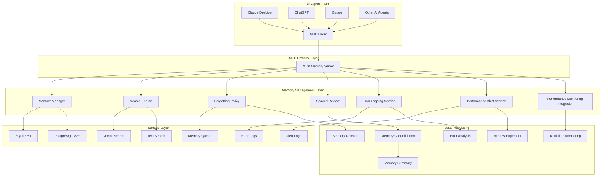
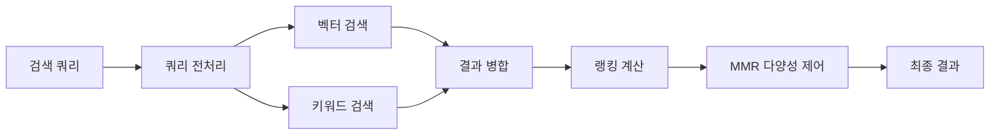
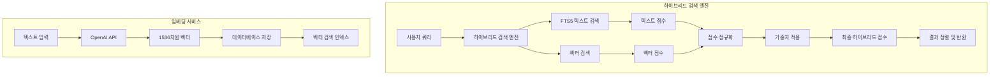
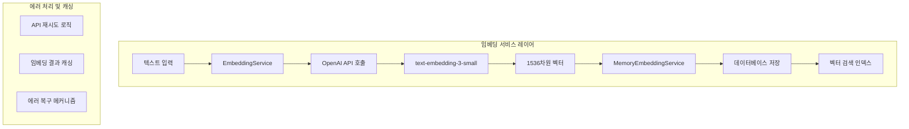
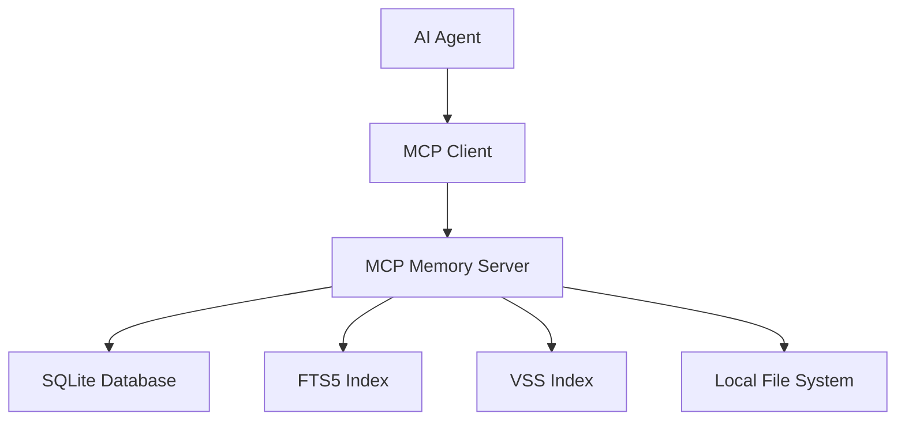
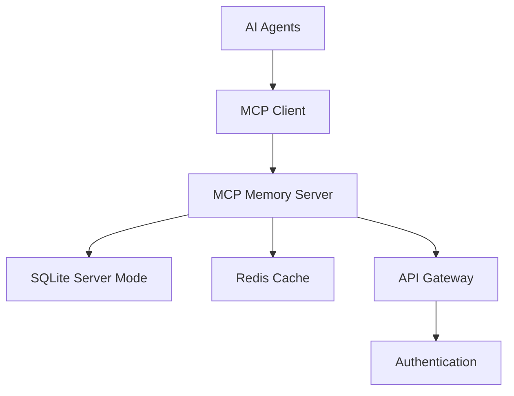
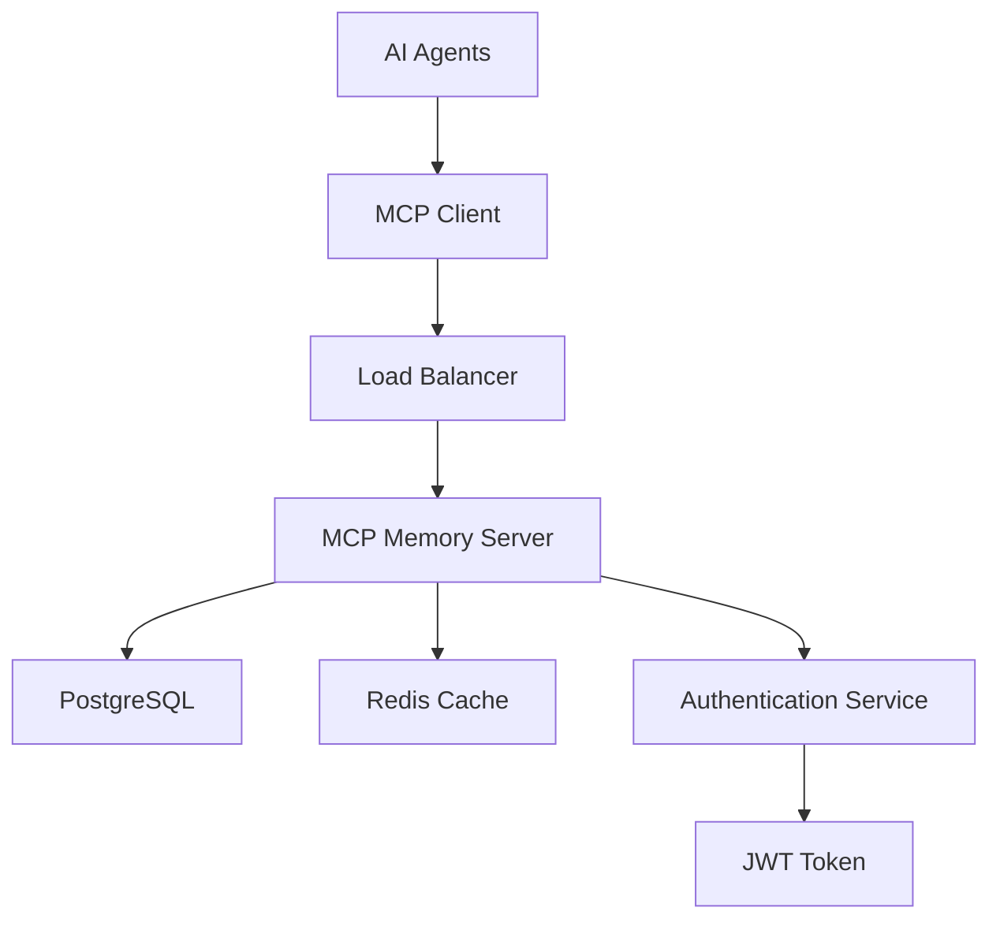
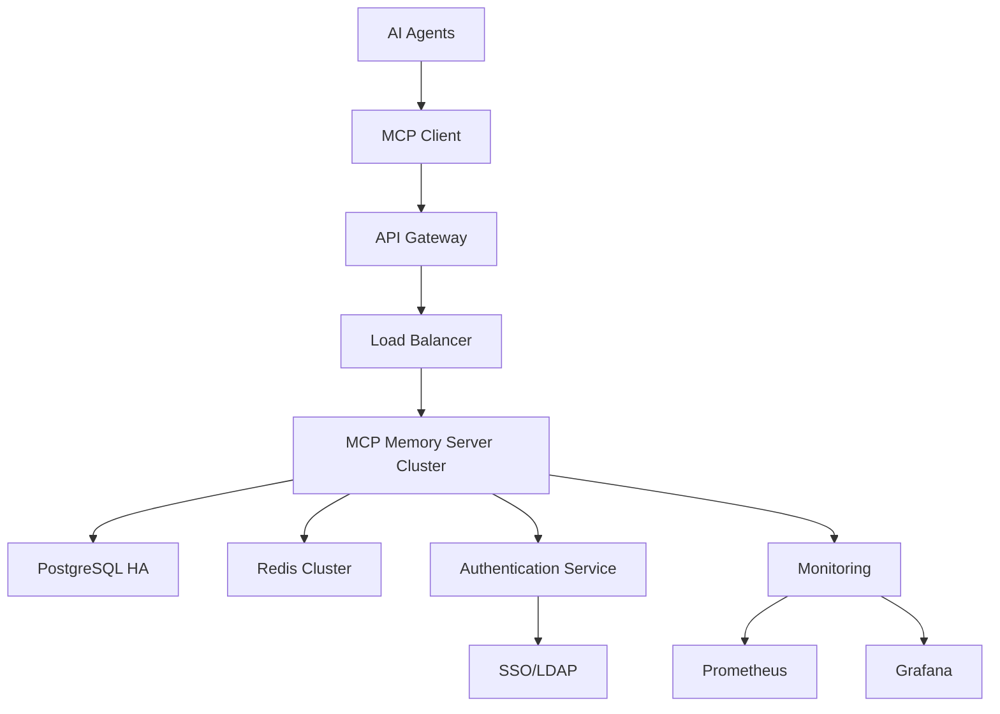

# 아키텍처 문서

## 개요

Memento MCP Server는 AI Agent의 기억을 인간의 기억 체계를 모사하여 관리하는 시스템입니다. 이 문서는 시스템의 전체 아키텍처, 컴포넌트 간 상호작용, 데이터 플로우를 상세히 설명합니다.

## 목차

1. [시스템 아키텍처](#시스템-아키텍처)
2. [핵심 컴포넌트](#핵심-컴포넌트)
3. [데이터 모델](#데이터-모델)
4. [검색 시스템](#검색-시스템)
5. [망각 시스템](#망각-시스템)
6. [마일스톤별 아키텍처](#마일스톤별-아키텍처)
7. [성능 고려사항](#성능-고려사항)
8. [보안 아키텍처](#보안-아키텍처)

## 시스템 아키텍처

### 전체 아키텍처 다이어그램



### 레이어별 역할

#### 1. AI Agent Layer
- **역할**: MCP 클라이언트를 통해 기억 시스템과 상호작용
- **구성요소**: Claude Desktop, ChatGPT, Cursor 등
- **특징**: 다양한 AI Agent가 동일한 MCP 프로토콜 사용

#### 2. MCP Protocol Layer
- **역할**: 표준화된 통신 프로토콜 제공
- **구성요소**: MCP Memory Server
- **특징**: Tools, Resources, Prompts를 통한 기능 제공

#### 3. Memory Management Layer
- **역할**: 기억의 생성, 검색, 관리, 삭제 및 시스템 모니터링
- **구성요소**: Memory Manager, Search Engine, Forgetting Policy, Spaced Review, Error Logging Service, Performance Alert Service, Performance Monitoring Integration
- **특징**: 인간의 기억 체계를 모사한 관리 및 실시간 시스템 모니터링

#### 4. Storage Layer
- **역할**: 데이터 영구 저장 및 검색
- **구성요소**: SQLite/PostgreSQL, Vector Search, Text Search
- **특징**: 마일스톤별 다른 저장소 사용

## 핵심 컴포넌트

### 1. MCP Memory Server

#### 구조

```typescript
interface MCPServer {
  // Tools
  tools: {
    remember: RememberTool;
    recall: RecallTool;
    pin: PinTool;
    unpin: UnpinTool;
    forget: ForgetTool;
    summarize_thread: SummarizeThreadTool;
    link: LinkTool;
    export: ExportTool;
    feedback: FeedbackTool;
  };
  
  // Resources
  resources: {
    memory: MemoryResource;
    search: SearchResource;
  };
  
  // Prompts
  prompts: {
    memory_injection: MemoryInjectionPrompt;
  };
}
```

#### 주요 기능

- **Tool 처리**: MCP Tools 실행 및 응답
- **Resource 제공**: 캐시된 데이터 제공
- **Prompt 생성**: 컨텍스트 주입용 프롬프트 생성
- **인증/권한**: 사용자 인증 및 권한 관리 (M2+)

### 2. Memory Manager

#### 구조

```typescript
interface MemoryManager {
  // 기억 생성
  createMemory(params: CreateMemoryParams): Promise<MemoryItem>;
  
  // 기억 조회
  getMemory(id: string): Promise<MemoryItem | null>;
  
  // 기억 업데이트
  updateMemory(id: string, updates: Partial<MemoryItem>): Promise<MemoryItem>;
  
  // 기억 삭제
  deleteMemory(id: string, hard?: boolean): Promise<boolean>;
  
  // 기억 고정
  pinMemory(id: string): Promise<boolean>;
  unpinMemory(id: string): Promise<boolean>;
}
```

#### 주요 기능

- **CRUD 작업**: 기억의 생성, 조회, 수정, 삭제
- **타입 관리**: 작업기억, 일화기억, 의미기억, 절차기억 구분
- **메타데이터 관리**: 태그, 중요도, 출처 등 관리
- **관계 관리**: 기억 간의 관계 설정 및 관리

### 3. Search Engine

#### 구조

```typescript
interface SearchEngine {
  // 2단계 검색
  search(query: string, filters?: SearchFilters): Promise<SearchResult>;
  
  // 벡터 검색
  vectorSearch(query: string, limit: number): Promise<VectorSearchResult>;
  
  // 키워드 검색
  keywordSearch(query: string, filters?: SearchFilters): Promise<KeywordSearchResult>;
  
  // 랭킹 계산
  calculateRanking(results: SearchResult[]): Promise<RankedResult[]>;
}
```

#### 검색 파이프라인



#### 랭킹 알고리즘

```typescript
interface SearchRanking {
  calculateFinalScore(features: SearchFeatures): number {
    return this.ALPHA * features.relevance +           // 0.50
           this.BETA * features.recency +              // 0.20
           this.GAMMA * features.importance +          // 0.20
           this.DELTA * features.usage -               // 0.10
           this.EPSILON * features.duplication_penalty; // 0.15
  }
}
```

### 4. Forgetting Policy

#### 구조

```typescript
interface ForgettingPolicy {
  // 망각 점수 계산
  calculateForgetScore(memory: MemoryItem): number;
  
  // 삭제 후보 선정
  getDeletionCandidates(): Promise<MemoryItem[]>;
  
  // 소프트 삭제
  softDelete(memory: MemoryItem): Promise<boolean>;
  
  // 하드 삭제
  hardDelete(memory: MemoryItem): Promise<boolean>;
}
```

#### 망각 알고리즘

```typescript
interface ForgetScore {
  calculate(memory: MemoryItem): number {
    const age = this.calculateAge(memory.created_at);
    const importance = memory.importance;
    const usage = this.calculateUsage(memory);
    
    return this.baseForgetScore * 
           Math.exp(-this.importanceWeight * importance) *
           Math.exp(-this.usageWeight * usage) *
           Math.exp(this.ageWeight * age);
  }
}
```

### 5. Spaced Review

#### 구조

```typescript
interface SpacedReview {
  // 리뷰 스케줄 계산
  calculateReviewSchedule(memory: MemoryItem): Date;
  
  // 리뷰 대상 선정
  getReviewCandidates(): Promise<MemoryItem[]>;
  
  // 리뷰 실행
  executeReview(memory: MemoryItem): Promise<ReviewResult>;
  
  // 간격 조정
  adjustInterval(memory: MemoryItem, performance: number): void;
}
```

### 6. Error Logging Service

#### 구조

```typescript
interface ErrorLoggingService {
  // 에러 로깅
  logError(error: Error, severity: ErrorSeverity, category: ErrorCategory, context?: Record<string, any>): void;
  
  // 에러 통계 조회
  getErrorStats(filters?: ErrorFilters): Promise<ErrorStats>;
  
  // 에러 해결
  resolveError(errorId: string, resolvedBy: string, resolution?: string): Promise<boolean>;
  
  // 에러 검색
  searchErrors(filters: ErrorSearchFilters): Promise<ErrorLog[]>;
}

enum ErrorSeverity {
  LOW = 'LOW',
  MEDIUM = 'MEDIUM', 
  HIGH = 'HIGH',
  CRITICAL = 'CRITICAL'
}

enum ErrorCategory {
  UNKNOWN = 'UNKNOWN',
  DATABASE = 'DATABASE',
  NETWORK = 'NETWORK',
  TOOL_EXECUTION = 'TOOL_EXECUTION',
  VALIDATION = 'VALIDATION',
  SYSTEM = 'SYSTEM'
}
```

#### 주요 기능

- **구조화된 에러 로깅**: 심각도, 카테고리, 컨텍스트 정보 포함
- **에러 통계 수집**: 심각도별, 카테고리별 에러 분석
- **에러 해결 추적**: 에러 해결 상태 및 해결 방법 기록
- **실시간 모니터링**: 에러 발생 패턴 분석 및 알림

### 7. Performance Alert Service

#### 구조

```typescript
interface PerformanceAlertService {
  // 알림 생성
  createAlert(level: AlertLevel, type: AlertType, metric: string, value: number, threshold: number, message: string, context?: Record<string, any>): PerformanceAlert;
  
  // 알림 해결
  resolveAlert(alertId: string, resolvedBy: string, resolution?: string): PerformanceAlert | null;
  
  // 활성 알림 조회
  getActiveAlerts(): PerformanceAlert[];
  
  // 알림 검색
  searchAlerts(filters: AlertSearchFilters): PerformanceAlert[];
  
  // 알림 통계
  getStats(): AlertStats;
}

enum AlertLevel {
  INFO = 'INFO',
  WARNING = 'WARNING',
  CRITICAL = 'CRITICAL'
}

enum AlertType {
  RESPONSE_TIME = 'response_time',
  MEMORY_USAGE = 'memory_usage',
  ERROR_RATE = 'error_rate',
  THROUGHPUT = 'throughput',
  CUSTOM = 'custom'
}
```

#### 주요 기능

- **임계값 기반 알림**: 성능 메트릭이 임계값을 초과할 때 자동 알림
- **알림 관리**: 알림 생성, 해결, 검색, 통계 기능
- **로그 파일 저장**: 알림을 JSONL 형식으로 파일에 저장
- **콘솔 출력**: 심각도별 색상 구분된 콘솔 알림

### 8. Performance Monitoring Integration

#### 구조

```typescript
interface PerformanceMonitoringIntegration {
  // 실시간 모니터링 시작
  startRealTimeMonitoring(): void;
  
  // 실시간 모니터링 중지
  stopRealTimeMonitoring(): void;
  
  // 성능 체크
  private checkPerformance(): Promise<void>;
  
  // 임계값 확인
  private checkResponseTime(avgResponseTime: number): void;
  private checkMemoryUsage(heapUsedMB: number): void;
  private checkErrorRate(errorRate: number): void;
  private checkThroughput(throughput: number): void;
}

interface AlertThresholds {
  responseTime: { warning: number; critical: number }; // ms
  memoryUsage: { warning: number; critical: number }; // MB
  errorRate: { warning: number; critical: number }; // %
  throughput: { warning: number; critical: number }; // ops/sec
}
```

#### 주요 기능

- **실시간 모니터링**: 30초마다 자동 성능 체크
- **임계값 기반 알림**: 설정된 임계값 초과 시 자동 알림 생성
- **통합 모니터링**: PerformanceMonitor와 PerformanceAlertService 연동
- **자동 복구**: 심각한 문제 발생 시 자동 복구 작업 수행

#### 간격 반복 알고리즘

```typescript
interface SpacedRepetition {
  calculateNextReview(memory: MemoryItem, performance: number): Date {
    const currentInterval = memory.review_interval || 1;
    const newInterval = this.calculateInterval(currentInterval, performance);
    
    return new Date(Date.now() + newInterval * 24 * 60 * 60 * 1000);
  }
}
```

## 데이터 모델

### 1. 메모리 아이템

```typescript
interface MemoryItem {
  id: string;                       // 고유 식별자
  content: string;                  // 기억 내용
  type: 'working' | 'episodic' | 'semantic' | 'procedural';  // 기억 타입
  importance: number;               // 중요도 (0-1)
  created_at: Date;                 // 생성 시간
  last_accessed: Date;              // 마지막 접근 시간
  access_count: number;             // 접근 횟수
  pinned: boolean;                  // 고정 여부
  source?: string;                  // 출처
  tags: string[];                   // 태그
  privacy_scope: 'private' | 'team' | 'public';  // 공개 범위
  project_id?: string;              // 프로젝트 ID (M2+)
  user_id?: string;                 // 사용자 ID (M3+)
  metadata: Record<string, any>;    // 추가 메타데이터
}
```

### 2. 검색 결과

```typescript
interface SearchResult {
  items: MemoryItem[];              // 검색된 기억 목록
  total_count: number;              // 전체 결과 수
  query_time: number;               // 검색 소요 시간 (ms)
  search_metadata: {
    vector_matches: number;         // 벡터 검색 매치 수
    keyword_matches: number;        // 키워드 검색 매치 수
    ranking_time: number;           // 랭킹 계산 시간
  };
}
```

### 3. 기억 관계

```typescript
interface MemoryLink {
  id: string;                       // 링크 ID
  source_id: string;                // 소스 기억 ID
  target_id: string;                // 대상 기억 ID
  relation_type: 'cause_of' | 'derived_from' | 'duplicates' | 'contradicts';
  created_at: Date;                 // 생성 시간
  strength: number;                 // 관계 강도 (0-1)
}
```

### 4. 피드백

```typescript
interface Feedback {
  id: string;                       // 피드백 ID
  memory_id: string;                // 기억 ID
  helpful: boolean;                 // 유용성 여부
  score?: number;                   // 점수 (0-1)
  comment?: string;                 // 코멘트
  created_at: Date;                 // 생성 시간
  user_id?: string;                 // 사용자 ID (M3+)
}
```

## 검색 시스템

### 하이브리드 검색 아키텍처

Memento는 FTS5 텍스트 검색과 벡터 검색을 결합한 하이브리드 검색 시스템을 제공합니다.



### 임베딩 서비스 아키텍처



### 1. 2단계 검색 파이프라인

#### 1단계: 벡터 검색 (ANN)

```typescript
interface VectorSearch {
  // 임베딩 생성
  generateEmbedding(text: string): Promise<number[]>;
  
  // 벡터 검색
  search(embedding: number[], limit: number): Promise<VectorSearchResult>;
  
  // 인덱스 업데이트
  updateIndex(memory: MemoryItem): Promise<void>;
}
```

**특징**:
- 의미적 유사도 검색
- 빠른 검색 속도 (O(log n))
- 다국어 지원

#### 2단계: 키워드 검색 (BM25)

```typescript
interface KeywordSearch {
  // 텍스트 인덱싱
  indexText(memory: MemoryItem): Promise<void>;
  
  // BM25 검색
  search(query: string, filters?: SearchFilters): Promise<KeywordSearchResult>;
  
  // 인덱스 최적화
  optimizeIndex(): Promise<void>;
}
```

**특징**:
- 정확한 키워드 매칭
- 가중치 기반 랭킹
- 필터링 지원

### 2. 랭킹 알고리즘

#### 복합 점수 계산

```typescript
interface SearchRanking {
  calculateFinalScore(features: SearchFeatures): number {
    const relevance = this.calculateRelevance(features);
    const recency = this.calculateRecency(features);
    const importance = this.calculateImportance(features);
    const usage = this.calculateUsage(features);
    const duplication = this.calculateDuplicationPenalty(features);
    
    return this.ALPHA * relevance +           // 0.50
           this.BETA * recency +              // 0.20
           this.GAMMA * importance +          // 0.20
           this.DELTA * usage -               // 0.10
           this.EPSILON * duplication;        // 0.15
  }
}
```

#### 관련성 계산

```typescript
interface RelevanceCalculation {
  calculate(features: SearchFeatures): number {
    const vectorSimilarity = features.vector_similarity;
    const bm25Score = features.bm25_score;
    const tagMatch = features.tag_match_score;
    const titleHit = features.title_hit_score;
    
    return (vectorSimilarity * 0.4) +
           (bm25Score * 0.3) +
           (tagMatch * 0.2) +
           (titleHit * 0.1);
  }
}
```

### 3. MMR 다양성 제어

```typescript
interface MMRDiversity {
  selectDiverseResults(results: SearchResult[], lambda: number = 0.7): SearchResult[] {
    const selected: SearchResult[] = [];
    const remaining = [...results];
    
    while (remaining.length > 0 && selected.length < this.maxResults) {
      let bestIndex = 0;
      let bestScore = -Infinity;
      
      for (let i = 0; i < remaining.length; i++) {
        const relevance = remaining[i].score;
        const diversity = this.calculateDiversity(remaining[i], selected);
        const score = lambda * relevance + (1 - lambda) * diversity;
        
        if (score > bestScore) {
          bestScore = score;
          bestIndex = i;
        }
      }
      
      selected.push(remaining[bestIndex]);
      remaining.splice(bestIndex, 1);
    }
    
    return selected;
  }
}
```

## 망각 시스템

### 1. TTL 기반 자동 삭제

#### 기억 타입별 TTL

```typescript
interface MemoryTTL {
  WORKING_MEMORY: 48 * 60 * 60 * 1000;    // 48시간
  EPISODIC_MEMORY: 90 * 24 * 60 * 60 * 1000;  // 90일
  SEMANTIC_MEMORY: Infinity;              // 무기한
  PROCEDURAL_MEMORY: Infinity;            // 무기한
}
```

#### 삭제 스케줄링

```typescript
interface DeletionScheduler {
  scheduleDeletion(memory: MemoryItem): void {
    const ttl = this.getTTL(memory.type);
    if (ttl === Infinity) return;
    
    const deletionTime = new Date(memory.created_at.getTime() + ttl);
    this.scheduleTask(deletionTime, () => this.deleteMemory(memory));
  }
}
```

### 2. 중요도 기반 망각

#### 망각 점수 계산

```typescript
interface ForgetScore {
  calculate(memory: MemoryItem): number {
    const age = this.calculateAge(memory.created_at);
    const importance = memory.importance;
    const usage = this.calculateUsage(memory);
    const recency = this.calculateRecency(memory.last_accessed);
    
    return this.baseForgetScore *
           Math.exp(-this.importanceWeight * importance) *
           Math.exp(-this.usageWeight * usage) *
           Math.exp(-this.recencyWeight * recency) *
           Math.exp(this.ageWeight * age);
  }
}
```

### 3. 간격 반복 시스템

#### 리뷰 스케줄 계산

```typescript
interface SpacedRepetition {
  calculateNextReview(memory: MemoryItem, performance: number): Date {
    const currentInterval = memory.review_interval || 1;
    const newInterval = this.calculateInterval(currentInterval, performance);
    
    return new Date(Date.now() + newInterval * 24 * 60 * 60 * 1000);
  }
  
  calculateInterval(currentInterval: number, performance: number): number {
    if (performance >= 0.8) {
      return Math.min(currentInterval * 2.5, 365);  // 성공 시 간격 증가
    } else if (performance >= 0.6) {
      return Math.max(currentInterval * 1.2, 1);    // 보통 시 약간 증가
    } else {
      return 1;  // 실패 시 다시 1일 후
    }
  }
}
```

## 마일스톤별 아키텍처

### M1: 개인용 (MVP)

#### 아키텍처



#### 특징

- **스토리지**: better-sqlite3 임베디드
- **검색**: FTS5 + sqlite-vss
- **인증**: 없음 (로컬 전용)
- **배포**: 로컬 실행
- **추가 기능**: 경량 임베딩, 성능 모니터링, 캐시 시스템
- **확장성**: 단일 사용자

#### 기술 스택

- **데이터베이스**: better-sqlite3 12.4+
- **벡터 검색**: sqlite-vss
- **텍스트 검색**: FTS5
- **웹 서버**: Express 5.1+
- **WebSocket**: ws 8.18+
- **테스트**: Vitest 1.0+
- **런타임**: Node.js 20+

### M2: 팀 협업

#### 아키텍처



#### 특징

- **스토리지**: SQLite 서버 모드 (WAL)
- **캐싱**: Redis
- **인증**: API Key
- **배포**: Docker
- **확장성**: 팀 단위 (10-50명)

#### 기술 스택

- **데이터베이스**: SQLite Server Mode
- **캐시**: Redis 7+
- **컨테이너**: Docker
- **인증**: API Key

### M3: 조직 초입

#### 아키텍처



#### 특징

- **스토리지**: PostgreSQL + pgvector
- **검색**: pgvector + tsvector
- **인증**: JWT
- **배포**: Docker Compose
- **확장성**: 조직 단위 (100-1000명)

#### 기술 스택

- **데이터베이스**: PostgreSQL 15+ + pgvector
- **검색**: pgvector, tsvector
- **캐시**: Redis 7+
- **인증**: JWT
- **배포**: Docker Compose

### M4: 엔터프라이즈

#### 아키텍처



#### 특징

- **스토리지**: PostgreSQL 고가용성
- **캐싱**: Redis 클러스터
- **인증**: JWT + RBAC + SSO/LDAP
- **배포**: Kubernetes
- **확장성**: 엔터프라이즈 (1000명+)

#### 기술 스택

- **데이터베이스**: PostgreSQL HA + pgvector
- **캐시**: Redis Cluster
- **인증**: JWT + RBAC + SSO/LDAP
- **배포**: Kubernetes
- **모니터링**: Prometheus + Grafana

## 성능 고려사항

### 1. 검색 성능

#### 하이브리드 검색 최적화

```typescript
interface HybridSearchOptimization {
  // FTS5 + 벡터 검색 결합
  optimizeHybridSearch(): void {
    this.createFTSIndex('memory_item_fts', 'content');
    this.createVectorIndex('memory_embedding', 'embedding', 'ivfflat');
    this.analyzeTable('memory_item');
  }
  
  // 배치 처리
  batchUpdateEmbeddings(memories: MemoryItem[]): void {
    const batchSize = 100;
    for (let i = 0; i < memories.length; i += batchSize) {
      const batch = memories.slice(i, i + batchSize);
      this.updateEmbeddingsBatch(batch);
    }
  }
}
```

#### 경량 임베딩 최적화

```typescript
interface LightweightEmbeddingOptimization {
  // TF-IDF 벡터화
  optimizeTFIDF(): void {
    this.updateVocabulary();
    this.calculateIDF();
    this.normalizeVectors();
  }
  
  // 다국어 지원
  preprocessText(text: string): string {
    return this.removeStopWords(text)
      .normalizeUnicode()
      .tokenize()
      .stem();
  }
}
```

#### 캐싱 전략

```typescript
interface CachingStrategy {
  // LRU 캐시 구현
  cacheSearchResult(query: string, result: SearchResult): void {
    const key = `search:${this.hashQuery(query)}`;
    this.lruCache.set(key, result, 3600); // 1시간 TTL
  }
  
  // 임베딩 캐싱
  cacheEmbedding(text: string, embedding: number[]): void {
    const key = `embedding:${this.hashText(text)}`;
    this.lruCache.set(key, embedding, 86400); // 24시간 TTL
  }
  
  // 인기 검색어 캐싱
  cachePopularQueries(): void {
    const popular = this.getPopularQueries(100);
    this.lruCache.set('popular_queries', popular, 86400); // 24시간 TTL
  }
}
```

### 2. 메모리 사용량

#### 성능 모니터링

```typescript
interface PerformanceMonitoring {
  // 메모리 사용량 모니터링
  monitorMemoryUsage(): void {
    const usage = process.memoryUsage();
    this.metrics.record('memory.heapUsed', usage.heapUsed);
    this.metrics.record('memory.heapTotal', usage.heapTotal);
    this.metrics.record('memory.rss', usage.rss);
  }
  
  // 캐시 성능 모니터링
  monitorCachePerformance(): void {
    this.metrics.record('cache.hitRate', this.cache.getHitRate());
    this.metrics.record('cache.size', this.cache.getSize());
    this.metrics.record('cache.memoryUsage', this.cache.getMemoryUsage());
  }
}
```

#### 메모리 풀 관리

```typescript
interface MemoryPool {
  private pool: Buffer[] = [];
  private maxSize: number = 100;
  
  getBuffer(size: number): Buffer {
    const buffer = this.pool.find(b => b.length >= size);
    if (buffer) {
      return buffer;
    }
    return Buffer.alloc(size);
  }
  
  returnBuffer(buffer: Buffer): void {
    if (this.pool.length < this.maxSize) {
      this.pool.push(buffer);
    }
  }
}
```

#### 가비지 컬렉션 최적화

```typescript
interface GCOptimization {
  // 메모리 사용량 모니터링
  monitorMemoryUsage(): void {
    const usage = process.memoryUsage();
    if (usage.heapUsed > this.threshold) {
      this.triggerGC();
    }
  }
  
  // 불필요한 객체 정리
  cleanup(): void {
    this.clearExpiredCache();
    this.clearUnusedConnections();
    this.optimizeIndexes();
  }
}
```

### 3. 데이터베이스 성능

#### better-sqlite3 최적화

```sql
-- 인덱스 최적화
CREATE INDEX idx_memory_type_created ON memory_item(type, created_at);
CREATE INDEX idx_memory_importance ON memory_item(importance DESC);
CREATE INDEX idx_memory_tags ON memory_item USING GIN(tags);

-- 벡터 검색 인덱스
CREATE INDEX idx_memory_embedding ON memory_embedding 
USING ivfflat (embedding vector_cosine_ops) WITH (lists = 100);

-- FTS 인덱스
CREATE VIRTUAL TABLE memory_fts USING fts5(
  content, 
  tags, 
  source,
  content='memory_item',
  content_rowid='id'
);
```

#### 데이터베이스 최적화 서비스

```typescript
interface DatabaseOptimization {
  // 자동 인덱스 추천
  recommendIndexes(): IndexRecommendation[] {
    const slowQueries = this.analyzeSlowQueries();
    return slowQueries.map(query => this.generateIndexRecommendation(query));
  }
  
  // 쿼리 성능 분석
  analyzeQueryPerformance(): QueryAnalysis {
    return {
      averageQueryTime: this.getAverageQueryTime(),
      slowQueries: this.getSlowQueries(),
      indexUsage: this.getIndexUsage(),
      recommendations: this.generateRecommendations()
    };
  }
}
```

#### 연결 풀 관리

```typescript
interface ConnectionPool {
  private pool: DatabaseConnection[] = [];
  private maxConnections: number = 20;
  
  async getConnection(): Promise<DatabaseConnection> {
    if (this.pool.length > 0) {
      return this.pool.pop()!;
    }
    
    if (this.activeConnections < this.maxConnections) {
      return await this.createConnection();
    }
    
    return await this.waitForConnection();
  }
  
  releaseConnection(conn: DatabaseConnection): void {
    if (this.pool.length < this.maxConnections) {
      this.pool.push(conn);
    } else {
      conn.close();
    }
  }
}
```

## 보안 아키텍처

### 1. 인증 및 권한

#### JWT 기반 인증 (M3+)

```typescript
interface JWTAuthentication {
  generateToken(user: User): string {
    const payload = {
      sub: user.id,
      email: user.email,
      role: user.role,
      exp: Math.floor(Date.now() / 1000) + (60 * 60 * 24) // 24시간
    };
    
    return jwt.sign(payload, this.secretKey, { algorithm: 'HS256' });
  }
  
  verifyToken(token: string): UserPayload {
    return jwt.verify(token, this.secretKey) as UserPayload;
  }
}
```

#### RBAC 권한 관리 (M4)

```typescript
interface RBAC {
  hasPermission(user: User, resource: string, action: string): boolean {
    const role = this.getRole(user.role);
    return role.permissions.some(p => 
      p.resource === resource && p.actions.includes(action)
    );
  }
  
  checkMemoryAccess(user: User, memory: MemoryItem): boolean {
    if (memory.privacy_scope === 'public') return true;
    if (memory.privacy_scope === 'team' && user.team_id === memory.team_id) return true;
    if (memory.privacy_scope === 'private' && user.id === memory.user_id) return true;
    return false;
  }
}
```

### 2. 데이터 암호화

#### 민감한 데이터 암호화

```typescript
interface DataEncryption {
  encryptSensitiveData(data: string): string {
    const cipher = crypto.createCipher('aes-256-gcm', this.encryptionKey);
    let encrypted = cipher.update(data, 'utf8', 'hex');
    encrypted += cipher.final('hex');
    return encrypted;
  }
  
  decryptSensitiveData(encryptedData: string): string {
    const decipher = crypto.createDecipher('aes-256-gcm', this.encryptionKey);
    let decrypted = decipher.update(encryptedData, 'hex', 'utf8');
    decrypted += decipher.final('utf8');
    return decrypted;
  }
}
```

#### 전송 중 암호화

```typescript
interface TransportEncryption {
  // HTTPS 강제
  enforceHTTPS(): void {
    this.app.use((req, res, next) => {
      if (!req.secure && req.get('x-forwarded-proto') !== 'https') {
        return res.redirect(`https://${req.get('host')}${req.url}`);
      }
      next();
    });
  }
  
  // HSTS 헤더 설정
  setHSTS(): void {
    this.app.use((req, res, next) => {
      res.setHeader('Strict-Transport-Security', 'max-age=31536000; includeSubDomains');
      next();
    });
  }
}
```

### 3. 감사 로깅

#### 보안 이벤트 로깅

```typescript
interface SecurityAudit {
  logSecurityEvent(event: SecurityEvent): void {
    const logEntry = {
      timestamp: new Date().toISOString(),
      event_type: event.type,
      user_id: event.user_id,
      ip_address: event.ip_address,
      user_agent: event.user_agent,
      details: event.details,
      severity: event.severity
    };
    
    this.auditLogger.info(logEntry);
  }
  
  detectAnomalies(): void {
    // 비정상적인 접근 패턴 감지
    const recentEvents = this.getRecentEvents(5 * 60 * 1000); // 5분
    const suspiciousEvents = this.analyzePatterns(recentEvents);
    
    if (suspiciousEvents.length > 0) {
      this.alertSecurityTeam(suspiciousEvents);
    }
  }
}
```

## 모니터링 및 관측성

### 1. 메트릭 수집

#### Prometheus 메트릭

```typescript
interface Metrics {
  // 메모리 관련 메트릭
  memoryCounter: Counter<string>;
  memorySize: Gauge<string>;
  
  // 검색 관련 메트릭
  searchDuration: Histogram<string>;
  searchResults: Counter<string>;
  
  // 에러 관련 메트릭
  errorCounter: Counter<string>;
  errorRate: Gauge<string>;
  
  // 성능 관련 메트릭
  responseTime: Histogram<string>;
  throughput: Counter<string>;
}
```

### 2. 로깅

#### 구조화된 로깅

```typescript
interface StructuredLogging {
  logMemoryOperation(operation: string, memoryId: string, userId?: string): void {
    this.logger.info({
      operation,
      memory_id: memoryId,
      user_id: userId,
      timestamp: new Date().toISOString(),
      level: 'info'
    });
  }
  
  logSearchQuery(query: string, resultCount: number, duration: number): void {
    this.logger.info({
      event: 'search_query',
      query,
      result_count: resultCount,
      duration_ms: duration,
      timestamp: new Date().toISOString()
    });
  }
}
```

### 3. 헬스 체크

#### 서비스 상태 모니터링

```typescript
interface HealthCheck {
  async checkHealth(): Promise<HealthStatus> {
    const checks = await Promise.allSettled([
      this.checkDatabase(),
      this.checkRedis(),
      this.checkSearchIndex(),
      this.checkMemoryUsage()
    ]);
    
    return {
      status: checks.every(c => c.status === 'fulfilled') ? 'healthy' : 'unhealthy',
      checks: checks.map((check, index) => ({
        name: this.checkNames[index],
        status: check.status === 'fulfilled' ? 'ok' : 'error',
        details: check.status === 'fulfilled' ? check.value : check.reason
      }))
    };
  }
}
```

## 확장성 고려사항

### 1. 수평적 확장

#### 샤딩 전략

```typescript
interface ShardingStrategy {
  getShard(memoryId: string): string {
    const hash = this.hash(memoryId);
    return `shard_${hash % this.shardCount}`;
  }
  
  routeQuery(query: string): string[] {
    // 쿼리를 모든 샤드에 전송
    return this.shards.map(shard => `${shard}/search`);
  }
}
```

### 2. 캐싱 전략

#### 다층 캐싱

```typescript
interface MultiLevelCache {
  async get(key: string): Promise<any> {
    // L1: 메모리 캐시
    let value = this.memoryCache.get(key);
    if (value) return value;
    
    // L2: Redis 캐시
    value = await this.redis.get(key);
    if (value) {
      this.memoryCache.set(key, value);
      return value;
    }
    
    // L3: 데이터베이스
    value = await this.database.get(key);
    if (value) {
      this.memoryCache.set(key, value);
      await this.redis.setex(key, 3600, value);
      return value;
    }
    
    return null;
  }
}
```

이 아키텍처 문서는 Memento MCP Server의 전체적인 구조와 설계 원칙을 설명합니다. 각 컴포넌트의 상세한 구현은 개별 개발 문서를 참조하세요.
